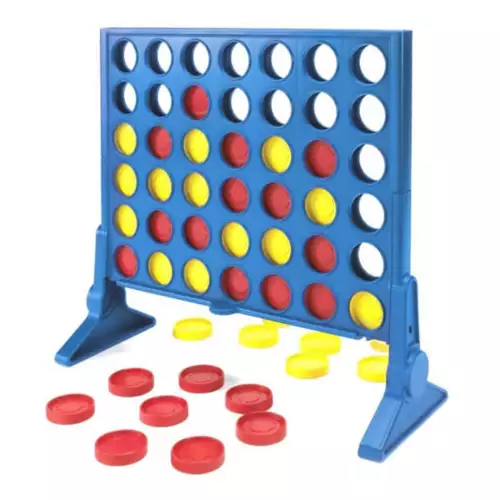

## The C++ Times: Class Introduction

Hello! Welcome to the semester's first edition of the _C++ Times_. The _Times_ is a semi-regular publication from Curie, Inc., the publishing house that brings you such periodicals and newspapers as _Reinforced Concrete: A Journal of Civil Engineering Research_, the _Organic Chemistry Crier_ and the _ENED Enquirer_.

You can contact the _Times_' editorial department any time at [hawkinwh@ucmail.uc.edu](hawkinwh@ucmail.uc.edu).

## What's News

Student athletes who play fall sports are returning to their craft this week. They are working out in preseason training and competitions to make sure that they have nailed the basics. Thanks to NIL, athletes aren't the only ones who need to focus on the fundamentals -- computer scientists learning C++ can now become Tik Tok stars and earn enough cash to leave college debt free.

## Nail the Basics

I love programming. I love sail boat racing. In fact, there are lots of things that I love. The problem I have is that I get caught up in the excitement and forget to deal with the details. That means that I sometimes find myself with no Internet, or even electricity.

So, to prevent a blackout in the future, it is important that we have a shared understanding of the goals of computer programming and some fundamental vocabulary. Without a shared understanding of the goal and a good grasp of the terms commonly used to describe the processes by which we will accomplish our goal, we can easily talk past one another -- never good.

## Connect (4) the Dots

Connect 4 is a really, really simple, but fun game. I am _sure_ you know how to play it and I am sure that you know how to identify when a player has won or lost. It's intuitive, right? Something that you just "know". 

I am not very good at games (of any kind!). I tend to try to find the obscure hole in the rules of the game in order to improve my chances of winning. When you play a game with me, it's definitely good to make sure that you know the limits of the rules and the mechanics of how to play.

We can easily codify and formalize the rules for playing Connect 4 and increase the likelihood that you and I will have fun playing the game together. First, let's describe briefly how you play Connect 4:

> Two players take turns making a play until someone wins.

Great. That's very succinct and encompasses the entirety of the game. It's a good place to start. However, there are lots of unanswered questions: What is a "play"? What does that it mean to "win"? When does a turn end and control of the board switch between the players?

In order to answer those questions, we repeatedly refine our initial description and add more and more detail:

1. Decide between Player A and B who goes first.
2. Take turns making a play until someone wins.

Good. Let's add additional refinement:

1. Decide between Player A and B who goes first.
   - Refer to the player who goes first as Player 1.
   - Refer to the other player as Player 2.
2. Player 1 makes a play.
3. Check whether Player 1 won (say _that_ five times fast).
   - If yes, game is over and Player 1 wins.
   - Otherwise, continue...
4. Player 2 makes a play.
5. Check whether Player 2 won.
   - If yes, game is over and Player 2 wins.
   - Otherwise, continue...
6. Player 1 makes a play.
7. Check whether Player 1 won.
   - If yes, game is over and Player 1 wins.
   - Otherwise, continue...

Okay, this is starting to get repetitive. But, by adding details to our description of the game play, we are making progress.

## Fake Programming is *Real*ly Important 

Although we are not yet programming in the truest sense of the word, we are completing a very important part of the software engineering and design process: writing _pseudocode_. Pseudocode is a type of programming language that looks like a combination of natural language and _actual_ programming language. We use pseudocode when designing a programming solution the same way that we use an outline when writing an essay -- to organize our thoughts.

> You _do_ write an outline for all your essays, right?

Writing pseudocode is a very important part of the programming process. Using a programming language is very complex and requires you to dedicate a significant amount of mental energy to the nuts and bolts of the work. If you are attempting to think about the [forest _and_ the trees](https://en.wikipedia.org/wiki/Simultanagnosia) at the same time, it becomes very difficult to fully focus on either. The more you focus on the _how_ (e.g., putting each `;` and `(` in the right spot), the more you lose track of the _why_ (e.g., writing a program that will beat me at Connect 4). On the other hand, the more you focus on the _why_, the harder it is to remember the answer to important questions like, "Do I capitalize `if`?"

## Call Me Al(gorithm)

We have written something down and it seems to do a decent job of capturing the mechanics of how to play Connect 4 -- albeit at a very high level. In fact, what we have actually accomplished is the creation of an algorithm for playing Connect 4. 

I love new words!

> Note: The word algorithm comes from a person's name. It is a Westernized pronunciation/adaption of the name of a very, very smart Persian mathematician named [Muhammad ibn Musa al-Khwarizmi](https://en.wikipedia.org/wiki/Muhammad_ibn_Musa_al-Khwarizmi). Not only is he the namesake of the algorithm, he is also credited with inventing (or discovering, depending on your philosophical perspective) algebra!

An algorithm, technically, is just a "well-defined set of steps for performing a task or solving a problem." Many programmers believe that writing code is their primary purpose or objective. They want to be graded on the quality of their code. However, programmers are really well-paid Algorithm Factories. Always remember: A good algorithm will beat a good implementation any day of the week!

What we generate by turning an algorithm (usually written in pseudocode) into source code is known as a _program_. A program and algorithm are similar, but not exactly the same. Be on the lookout for the definition of program in future issues of the C++ Times.

## Shout From the Rooftops

Although our solution is still very broad and, in some ways, very vague, we are slowly chipping away at the details. Each time we return and massage the algorithm, we are adding more details -- we are refining the description step by step. We are doing something that professional programmers do all the time -- _stepwise refinement_.

This technique is really important. When we start thinking about solving a problem, we focus as much as possible on the big picture. In the case of Connect 4, we talk about players, taking turns, winning, losing. We pretended that we had good definitions for those terms and good ways to determine who won and lost. We wrote our algorithm as if they exist. 

That seems like we are just kidding ourselves and setting ourselves up for failure later. But, no! What we are doing is really important. We are thinking abstractly (we will define that term later in the semester) and its really cool!

So, when you work on your programs or labs, start at the high level when thinking about your solution and slowly refine the pseudocode from there.

## Ready, Player 1

In the current state of our algorithm's development, I think something is probably annoying you -- it's annoying me, I know that.

We have written down _almost_ the same subset of three steps over and over. However, if we blocked out a little bit of those three steps, we would notice that they are _exactly_ the same!

So,
2. Player 1 makes a play.
3. Check whether Player 1 won.
   - If yes, game is over and Player 1 wins
   - Otherwise, continue...
4. Player 2 makes a play.
5. Check whether Player 2 won.
   - If yes, game is over and Player 2 wins
   - Otherwise, continue...
6. Player 1 makes a play.
7. Check whether Player 1 won.
   - If yes, game is over and Player 1 wins
   - Otherwise, continue...

becomes

2. __________ makes a play.
3. check whether ____________ won.
   - if yes, game is over and ____________ wins
   - otherwise, continue...
4. ____________ 2 makes a play.
5. check whether ____________ 2 won.
   - if yes, game is over and ____________ 2 wins
   - otherwise, continue...
6. ____________ makes a play.
7. check whether ____________ won.
   - if yes, game is over and ____________ wins
   - otherwise, continue...

We could take advantage of that repetitiveness if only we had an easy way to define what that blank "thing" really is really is and what should go in them. What we need is something (it will definitely need a name -- we have to write down that thing, after all!) that will stand in for the current player. Let's say that _Active Player_ stands for the current player -- either Player 1 or Player 2.

Now we can write out Connect 4 algorithm like this ...
2. _Active Player_ makes a play.
3. check whether _Active Player_ won.
   - if yes, game is over and _Active Player_ wins
   - otherwise, swap the _Active Player_ and continue at Step 2.

Woah! Much simpler. 

What did we just do? Well, we deployed something that all good programmers use -- a variable. A _variable_ is the name of a place in memory that holds a value that can change over time. While we are playing our game, the "memory" is just our brain (until I fool you into thinking that it's actually my turn twice in a row!). When we are programming in C++, that memory will be _(non)volatile_ storage.

## Abstract Art

Earlier we discussed a very important term, abstraction, but I failed to give you a good definition. And I'm still not going to spell it out precisely!

I will say that there are myriad ways that computer scientists use abstraction and C++ supports many of them. We've seen hints of one type of abstraction already: We used a variable to strip away repetition and come up with a small kernel of code that really defines the steps necessary to play the game:

2. _Active Player_ makes a play.
3. check whether _Active Player_ won.
   - if yes, game is over and _Active Player_ wins
   - otherwise, swap the _Active Player_ and continue at Step 2.

Doing Steps (2) and (3) repeatedly will (basically) give you a close approximation of a complete Connect 4 game. We could even give those two statements a name -- something like _make a play and check for winner_. Then, in a loop, our code for Connect 4 would be:

```
While there is no winner, do the statements in *make a play and check for winner*.
```

Whether you like it or not, you just defined your first function, a type of abstraction! A _function_ is a set of statements with a name (note: a name is not _always_ required) that perform some specific, high-level task.

When you use a function you say that you _call_ the function (sometimes people say that they _invoking_ the function, and that's fine, too!).

It's important to realize what a function can and cannot do on its own. It _can_ wrap up a bunch of statements into a group so that the group performs some not-so-trivial task. It _can_ make it easier to reuse the statements in the group over and over again. A function _cannot_, however, do its work without some additional input. For the function above, for instance, when we call it we have to tell it who is _Active Player_. We also need to tell it what to reference when determining whether _Active Player_ has won. What's really cool, though, is that every time we call _make a play and check for winner_, the value of those inputs can be different.

A function is good at _abstracting_ process but needs a boost when it comes to data. This point is very important.

One of the very common ways that programmers structure the code for entire programs is by using functions. The programmers break down each part of the solution into individual functions. Those functions call other functions in order to complete tasks. There are all sorts of great reasons _why_ you would want to structure your code in terms of functions and during the class we will talk about them all. For now, it's enough to know that a program that is built using functions as the building block is written in a _procedural_ style. 

> Note: Procedure is a synonym (almost!) for function.

But, before you get too excited, that's not the only way that programmers can structure their creations.

## I'm Game ~~Bored~~ Board

Let's think about what we could do, as programmers, if we organized our program around the gameboard.



Let's pretend (wild, I know) that we can talk to the Connect 4 board and it can talk back to us. If we had an anthropomorphized Connect 4 board and we were trying to code the game, there are several questions that we might want to ask it:

- Can the Yellow Player put a piece in this column?
- Is the Red Player the winner?
- Are there any other possible moves that could be made?

What's amazing is that our human game board has enough self awareness to be able to answer each of those questions. To put it another way, our walking/talking gameboard has the process and the data (_together_) to be able to answer those queries.

Programmers use another form of abstraction, _objects_, that is similar to our Frankensteinien gameboard. An object is a grouping of functions (statements, code) with the data that those functions need to execute. When you have an object, you can ask it to do things or ask it for information about itself!

This concept is really powerful and is (yet) another way that programmers structure their programs. When programmers build their solutions using objects, they are doing _object-oriented programming_. 

Each of these two ways of structuring programs are known as _paradigms_. C++ is a unique programming language because it is a multi paradigm language. You can write solutions in C++ using either procedural or object-oriented programming.

Don't worry if the last few sections were a blur. We will revisit these topics throughout the semester.