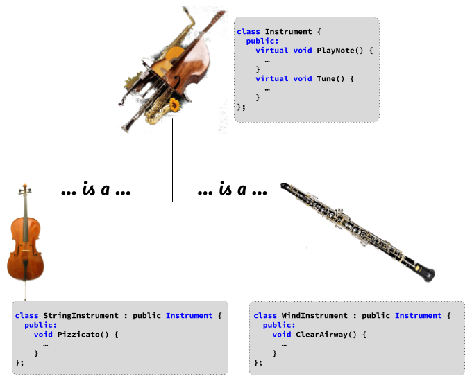

# Object-Oriented Programming - Inheritance Special Issue

## What's News

After years of work, advances in computing power and an increased collaboration of scientists sponsored by the International Network of Human Epidemiology Research (INHER), scientists presented their findings that seem to answer the age-old question: Why does everyone turn into their parents?

## The Power of Opposites

Singers and their vocal power make a compelling example of the power of inheritance in object-oriented programming:

```C++
#include <iostream>

class Singer {
  public:
    virtual void BeltItOut() {
      std::cout << "I am a singer of songs.\n";
    }
};

class SopranoVoice: public Singer {
  public:
    void BeltItOut() {
      std::cout << "I can even sing falsetto.\n";
    }
};

class BassVoice: public Singer {
  public:
    void BeltItOut() {
      std::cout << "I have a very deep voice and add rhythm.\n";
    }
};

void make_duo(Singer &melody, Singer &harmony) {
  melody.BeltItOut();
  harmony.BeltItOut();
}

int main() {
  SopranoVoice lead{};
  BassVoice follow{};
  make_duo(lead, follow);

  return 0;
}
```

When executed, that program will print

```console
I can even sing falsetto.
I have a very deep voice and add rhythm.
```

The code in this application is making exemplary use of inheritance! The function, `make_duo`, is written perfectly to use the power of OOP. Everything starts out normally: the function accepts two parameters, both instances of the `Singer` class. But, and here's what's cool, the caller of the function can give it arguments that are instances of any class that is derived from `Singer`! In other words, the `make_duo` function does not care specifically about whether its arguments are instances of a "regular" singer, a singer with a deep voice or a singer that can hit the high note.

How is that possible? How is it safe to pass an instance of a `Singer` or anything derived from `Singer`? We chose C++ for its safety -- what is this backdoor loophole?

The compiler guarantees that any class that derives from `Singer` implements all its member functions. And, because `make_duo` only uses member functions that are guaranteed to exist for a `Singer`, it is guaranteed that instances of any class derived from `Singer` also have those member functions! If a user were to pass an argument to `make_duo` that is an instance of a class derived from `Singer`, that's fine -- no harm no fould. `make_duo` doesn't care because it is only using functionality from `Singer`. If the class from which the argument is derived from `Singer` and contains additional functionality, that's great but it doesn't change what features `make_duo` can safely use.

How cool is that?

## I Go Walking, After Midnight

The application above is so elegant and works so intuitively that it hides some really neat power of inheritance in C++. Let's consider what happens when singers hurt their voices: They gargle saltwater. It's the surefire way to get back on the stage quickly. Because gargling saltwater is something that _all_ singers do, we will want to make it a member function in the base class, `Singer`.


```C++
#include <iostream>

class Singer {
  public:
    virtual void BeltItOut() {
      std::cout << "I am a singer of songs.\n";
    }
    virtual void HealMyVoice() {
      std::cout << "I am gargling saltwater to heal my voice.\n";
    }
};

class SopranoVoice: public Singer {
  public:
    void BeltItOut() {
      std::cout << "I can even sing falsetto.\n";
    }
};

class BassVoice: public Singer {
  public:
    void BeltItOut() {
      std::cout << "I have a very deep voice and add rhythm.\n";
    }
};

void make_duo(Singer &melody, Singer &harmony) {
  melody.BeltItOut();
  harmony.BeltItOut();
}

int main() {
  SopranoVoice lead{};
  BassVoice follow{};

  lead.HealMyVoice();

  make_duo(lead, follow);

  return 0;
}
```

Huh. Something fishy is happening here ... or is it? Well, no, nothing especially odd is happening other than your _expert_ use of inheritance. We have an instance of a `SopranoVoice` who is singling lead. But, there is something wrong with their voice. So, they choose to attempt to heal their voice by invoking the `HealMyVoice` member function. There is _no_ `HealMyVoice` member function defined by the `SopranoVoice` class, though! So how does the program run without a problem?

Well, remember the [_is-a_ relationship](./OOPIntro2.md)? That has an effect on how the code for member functions is found -- beginning with the actual class of the instance, C++ will look for a member function matching the one invoked. If none is found, C++ will continue the search in the current class' base class. The first matching member function as the walk up the [inheritance hierarchy](./OOPIntro2.md) continues is the one that is executed. If there are none found, an error occurs:

```C++
int main() {
  SopranoVoice lead{};
  BassVoice follow{};

  lead.EalMyVoice();

  make_duo(lead, follow);

  return 0;
}
```

```
11.cpp: In function ‘int main()’:
11.cpp:43:8: error: ‘class SopranoVoice’ has no member named ‘EalMyVoice’; did you mean ‘HealMyVoice’?
   43 |   lead.EalMyVoice();
```

We did some nifty software engineering by putting the `HealMyVoice` implementation in the base class. As a result, derived classes get some default voice-healing functionality for free. What happens, though, if a derived class, say the low-register basses want to customize the way that they heal their voices? Well, they could simply override the member function and customize it's behavior!

```C++
class BassVoice: public Singer {
  public:
    void BeltItOut() {
      std::cout << "I have a very deep voice and add rhythm.\n";
    }
    void HealMyVoice() {
      std::cout << "Soothing Ludens cough drops are the way I recover.\n";
    }
};
```

If we run, 

```C++
int main() {
  SopranoVoice lead{};
  BassVoice follow{};

  follow.HealMyVoice();

  return 0;
}
```

we get the following output:

```console
Soothing Ludens cough drops are the way I recover.
```

After two singers make music, they are definitely going to want to heal their voices. So, let's write a function that will take the two members of the duo and heal their voices for them:


```C++
void recover_postshow(Singer &melody, Singer &harmony) {
  melody.HealMyVoice();
  harmony.HealMyVoice();
}
```

Then, we will call that function from within `make_duo` once the performance has ended:

```C++
void make_duo(Singer &melody, Singer &harmony) {
  melody.BeltItOut();
  harmony.BeltItOut();

  recover_postshow(melody, harmony);
}
```

Notice how the `HealMyVoice` function is `virtual`? Notice how the parameters to the `recover_postshow` and `make_duo` are taken by reference? That's the key to unlocking the power of _runtime polymorphism_. Runtime polymorphism is a really powerful OOP feature that makes it possible for the proper version of an overridable (sorry, it's an awkward word) member function to be found and executed at runtime even when a variable's type indicates a class higher in the inheritance hierarchy.

That wordy description will become much clearer with an example:

```C++
int main() {
  SopranoVoice lead{};
  BassVoice follow{};

  make_duo(lead, follow);

  return 0;
}
```

will produce the following output:

```console
I can even sing falsetto.
I have a very deep voice and add rhythm.
I am gargling saltwater to heal my voice.
Soothing Ludens cough drops are the way I recover.
```

The output in the first line is generated by the implementation of the `BeltItOut` member function that is overridden by `SopranoVoice` _even though the variable's type is `Singer`_. The compiler emitted code that made it possible to decide at runtime the actual type of the instance and find the right member function implementation.

What happens in the case when a derived class does _not_ customize the behavior of a member function? Initially, C++ does the same thing as in the case above (where there is an overridden implementation) and turns to the class definition of the actual type.

C++ won't find one there, though. So, after coming up empty handed, C++ will continue the search in the base class. That process will repeat until an implementation is found!

## Learn By Doing The Opposite

Now that we have a good feeling for how to use inheritance correctly, let's explore its power by seeing how badly it can go wrong!

Let's consider instruments. No matter the instrument, you can always play a note -- electric guitar, fiddle, cello or trumpet, they can all play notes. What's more, no matter the instrument, it can always be tuned. So, the base class, the `Instrument`, will have member functions `Tune` and `PlayNote`.

```C++
class Instrument {
  public:
    virtual void PlayNote() {
      std::cout << "An instrument can play a note.\n";
    }

    virtual void Tune() {
      std::cout << "Instruments sound better when they are in tune.\n";
    }
};
```

Excellent. Let's make a distinction among instruments: some are stringed instruments and some are wind instruments. Stringed instruments are instruments -- you can play notes on the them and you can tune them, but you can also pluck them. So, our `StringInstrument` class will inherit from `Instrument` and add a `Pizzicato` member function:

```C++
class StringInstrument : public Instrument {
public:
  void Pizzicato() {
    std::cout << "A stringed instrument can always be plucked.\n";
  }
};
```

Wind instruments are instruments -- you can play notes on the them and you can tune them, but you can also clear their airways. So, our `WindInstrument` class will inherit from `Instrument` and add a `ClearAirway` member function:

```C++
class WindInstrument : public Instrument {
public:
  void CleanAirway() {
    std::cout << "The airways on wind instruments can get clogged.\n";
  }
};
```


Let's make a function that will play a symphony that takes two instances of the `Instrument` class. Why? Because in an orchestra (a group that plays Symphonies), all instruments are present:

```C++
void play_symphony(Instrument &insta, Instrument &instb) {
  insta.Tune();
  instb.Tune();
  insta.PlayNote();
  instb.PlayNote();
} 
```

A program with a main like

```C++
int main() {
  StringInstrument cello{};
  WindInstrument trumpet{};

  play_symphony(cello, trumpet);
}
```

will print


```console
Instruments sound better when they are in tune.
Instruments sound better when they are in tune.
An instrument can play a note.
An instrument can play a note.
```

Great!

The instances of a `StringInstrument` and a `WindInstrument` that we passed as arguments to the `play_symphony` function are guaranteed to be able to be tuned and played because they _is-a_ `Instrument` (and instances of `Instrument`s can be played and tuned!).

Let's say that we instead want to play a bad rock song. There is no bad rock song that includes winds, so, to play a bad rock song we only accept instance of `StringInstruments` (i.e., guitars!):

```C++
void play_bad_rock_song(StringInstrument &sinta, StringInstrument &sintb) {
  sinta.Tune();
  sintb.Tune();

  sinta.Pizzicato();
  sintb.Pizzicato();

  sinta.PlayNote();
  sintb.PlayNote();
}
```

Calling `Tune`, `Pizzicato` and `PlayNote` on instances of `StringInstruments` is always okay! From the declaration of the `StringInstrument` class, we know that instances of that class will always have those member functions available. Therefore, the code in the body of that function will compile and the following program

```C++
int main() {
  StringInstrument les_paul{};
  StringInstrument steinway{};
  WindInstrument trombone{};

  play_bad_rock_song(les_paul, steinway);
}
```

will print

```console
Instruments sound better when they are in tune.
Instruments sound better when they are in tune.
A stringed instrument can always be plucked.
A stringed instrument can always be plucked.
An instrument can play a note.
An instrument can play a note.
```

Let's change the `play_bad_rock_song` function slightly:

```C++
void play_bad_rock_song(Instrument &sinta, Instrument &sintb) {
  sinta.Tune();
  sintb.Tune();

  sinta.Pizzicato();
  sintb.Pizzicato();

  sinta.PlayNote();
  sintb.PlayNote();
}
```

Notice that the function accepts as arguments instances of `Instrument` but the function continues to attempt to invoke the `Pizzicato` member function on those instances. Well, the compiler cannot guarantee that instances of the `Instrument` class have a `Pizzicato` member function -- it can only guarantee that instances of an `Instrument` have `Tune` and `PlayNote` member functions. So, we get a compiler error:

```console
10.cpp: In function ‘void play_bad_rock_song(Instrument&, Instrument&)’:
10.cpp:45:9: error: ‘class Instrument’ has no member named ‘Pizzicato’
   45 |   sinta.Pizzicato();
      |         ^~~~~~~~~~
10.cpp:46:9: error: ‘class Instrument’ has no member named ‘Pizzicato’
   46 |   sintb.Pizzicato();
      |    
```

Logically, this error makes perfect sense: Depending on your perspective (as the caller of the function or the implementer of the function), the type of the parameter sets a ceiling or a floor on the valid member functions that can be invoked.

Let's say that you are the person implementing a function that has parameters that are compound types (i.e., they are classes). From that perspective the type of the parameter sets a floor on what you can assume about any argument that a caller gives your function. The only valid assumptions you can make about an argument given by a caller is that member functions from the class that names the type _or any that are base classes_. Any member functions beneath that floor (i.e., those in derived classes), cannot be called! That's the error that we just saw!

From the perspective of the person using a function that attempts to use inheritance, the type sets a ceiling. The user must pass arguments to the functions that are either instances of the specified class in the parameter or derivatives of it. 

To see how such an error can occur, let's go back to the original definition of the `play_bad_rock_song` function:

```C++
void play_bad_rock_song(StringInstrument &sinta, StringInstrument &sintb) {
  sinta.Tune();
  sintb.Tune();

  sinta.Pizzicato();
  sintb.Pizzicato();

  sinta.PlayNote();
  sintb.PlayNote();
}
```

From the perspective of the caller of the `play_bad_rock_song`, the fact that the parameters are instances of `StringInstrument` serves as a notice to any caller that the arguments must be instances of `StringInstrument` or a class that derives from it (to repeat, that sets a sort of floor for the caller). Let's try to compile

```C++
int main() {
  Instrument fife{};
  Instrument hihat{};

  play_bad_rock_song(fife, hihat);
}
```


We expect that will not compile. Why? Because `fife` and `hihat` are instances of `Instrument`, a class in the inheritance hierarchy that exceeds the floor set by `StringInstrument` for the parameters of `play_bad_rock_song`. Again, that makes sense logically: The function `play_bad_rock_song` requires the ability to `Pizzicato` its arguments and there is no such member function in an `Instrument`.

```C++
0.cpp: In function ‘int main()’:
10.cpp:56:22: error: invalid initialization of reference of type ‘StringInstrument&’ from expression of type ‘Instrument’
   56 |   play_bad_rock_song(fife, hihat);
      |                      ^~~~
10.cpp:41:43: note: in passing argument 1 of ‘void play_bad_rock_song(StringInstrument&, StringInstrument&)’
   41 | void play_bad_rock_song(StringInstrument &sinta, StringInstrument &sintb) {
      |   
```

By looking at inheritance from the perspective of successful and unsuccessful uses, I hope that you get a better sense for the power that it provides!