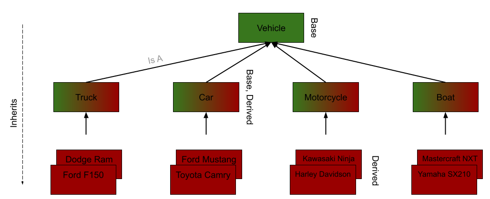

# Object-Oriented Programming: ADTs to OOP

### What's News

HBO's hit comedy/drama _Succession_ has put estate planners in the spotlight. These once-obscure legal professionals are gearing up for an influx in cases thanks to the show's glamorous portrayal of the way that children can inherit their family's wealth.


### Just What Is Object-Oriented Programming, Really?

Now that we are talking about abstract data types (ADTs) we are starting to get in to the pieces of C++ that make it really shine! Because ADTs meet C++'s definition of a type (they define the range of valid values and the range of valid operations, right?), the language's support for ADTs gives programmers the power to create _their own types_ in the language. In other words, C++ treats the classes that we write (that implement ADTs!) just like the fundamental types built in to the language! How cool is that?

Object-oriented programming (OOP) is a style of programming (a _paradigm_) where programs are designed around a series of objects that interact with one another programmatically. Well, what are objects? Objects are _instances_ of classes which are, themselves, a way to operationalize ADTs! In other words, OOP is a programming paradigm that relies on the data and process abstraction of ADTs.

OOP is powerful because we humans are good at organizing our thoughts and algorithms the way that we organize our daily communications and behaviors. In real life, we manipulate objects and communicate with one another to accomplish tasks. In OOP, we write our algorithms the same way -- by specifying how to manipulate objects and directing communication between and among them. The only difference? Are the objects physical (real life) or logical (programming)?

The objects that object-oriented programmers manipulate are clearly *not* real, tangible things. However, some of the objects are instances of classes that implement ADTs that _do_ model things that exist in the real world -- a car on a dealer's lot, a Frosty (there is _only_ one flavor) on the Wendy's menu, a blouse on Rent the Runway, etc. But, some of the objects are instances of classes that implement ADTs that model things that only exist in the computer -- files, the windows of an application, the button that launches the web browser, etc. In both cases, computer programs written in the OOP paradigm models rely on the fact that these objects are instances of classes that implement ADTs that have associated behaviors (their range of valid operations) and characteristics (their range of valid values). 

We already know the name for the data that an object contains -- it's members (in C++ they are specifically called member variables). We have not talked about actions, yet, though. The actions are specified like the other process abstraction we have seen (the function) but they have additional special powers. They are special because they are "attached" to objects. The attachment means that those special functions have access to an object and its member variables without requiring a user of the function to specify the object as an argument. These special functions are called _member functions_.

Let's consider an ADT that holds information about a Mercedes AMG:

```C++
struct AMG {
  int model_year;
  int doors;
  int wheels;
  int horsepower;
  double price;
};
```

Great. Now, let's write a program that instantiates a variable of that type (in other words, we'll make an _object_ of that type):

```C++
        AMG wills_amg{};
```

To be clear (again!), `AMG` is the type (in the same way that `int` is the type or `char` is the type). `wills_amg` is the object (or instance) of that type. It's the difference between the script for a play and the actual performance. It's the difference between a house's blueprint and the house itself (or houses, if you think of a planned community). It's the difference between the rubber stamp and the imprints it leaves on the paper. I think that you get the point!

Take a second to think about the values of each of the members of `wills_amg` at this point in the program. Do they have values? Why, or why not?

We'll assign some values to each member variable of the ADT that are specific to my AMG (`wills_amg`, the _instance_):

```C++
  wills_amg.model_year = 2020;
  wills_amg.doors = 2;
  wills_amg.wheels = 4;
  wills_amg.horsepower = 577;
  wills_amg.price = 162900;
```

Remember: Because we are manipulating the values of the member variables of a particular instance of the AMG ADT, the values of member variables of other _instances_ of this type are completely unaffected.

What if I wanted to write a function that prints out all the information about an AMG? I have two options:

1.  I could write a function that has a parameter for each of the different values that characterize an AMG, or
2.  I could write a function that has a single parameter -- the AMG ADT.

I choose the latter, because I am lazy! So, we will write a function that looks like this:

```C++
void printAMG(const AMG &amg) {
  std::cout << "A " << amg.model_year << " AMG "
            << "with " << amg.wheels << " wheels, " << amg.doors
            << " doors and " << amg.horsepower << " horsepower, costs $"
            << amg.price << ".\n";
}
```

Brilliant. (Notice that we are using the `.`, the _member access operator_).

What if I wanted to write the same program, but this time for a Tesla?

```C++
#include <iostream>

struct Tesla {
  int model_year;
  int doors;
  int wheels;
  int horsepower;
  double price;
};

void printTesla(const Tesla &tesla) {
  std::cout << "A " << tesla.model_year << " Tesla "
            << "with " << tesla.wheels << " wheels, " << tesla.doors
            << " doors and " << tesla.horsepower << " horsepower, costs $"
            << tesla.price << ".\n";
}

int main() {
        Tesla wills_tesla{};
        printTesla(wills_tesla);
        return 0;
}
```

I am sure that you see what I see -- lots of nearly identical code!

### Is A

What is common between a Tesla and an AMG? That's right, they are both vehicles: A Tesla _is a_ vehicle; An AMG _is a_ vehicle. As we dig into our discussion on OOP, we will return to the _Is-A_ relationship!

According to our ADTs a Tesla and an AMG both have some of the same characteristics. I think that we should combine them into a single ADT so that we can save some typing! Let's call this ADT a Vehicle and implement it with a `struct`:

```C++
struct Vehicle {
  int model_year;
  int doors;
  int wheels;
  int horsepower;
  double price;
};
```

Now, how can we write out the _Is A_ relationship in C++? Simple, with the `:` :

```C++
struct Tesla : Vehicle {};
```

With that, we have programmatically stated that a Tesla _is a_ Vehicle and declared an ADT named Tesla that _inherits_ all the Vehicle's attributes (member variables) without having to rewrite them all! In C++ we say that the Tesla ADT _derives_ from the Vehicle ADT. Furthermore, we say that Tesla is a _derived_ ADT and that Vehicle is a _base_ ADT. These are important terms to remember as we continue through our exploration of OOP.

But, Teslas are no ordinary vehicles -- they are EVs which means that they have a special attribute that not every vehicle has -- a range. We could write

```C++
struct Tesla : Vehicle {
  int range;
};
```

which will add a `range` member variable on top of the member variables that it inherits from Vehicle. As a result, the Tesla ADT now has 6 member variables instead of just the 5 of a Vehicle. Be especially careful -- just because we augment the Tesla ADT with an extra member variable does not mean that we are dismissing all the member variables that we have inherited from the Vehicle ADT.

All that with so little typing! Pretty cool!

### Member Functions

In both programs, our "print" function required a parameter -- the car to print! What if we could somehow associate a print function with an instance of a Vehicle ADT so that the function could use the Vehicle ADT's member variables without needing the Vehicle ADT object to be passed as a parameter? We would like this special type of function, one which is associated with an instance of the ADT, to have access to that ADT's attributes. If this sounds like a job for a special type of function that is a member of the implementation of the ADT (what is called a _member function_ in C++),  that's because it is!

Declaring/defining a member function is just like declaring/defining a function, except that you do it _inside_ the declaration of the `struct`/`class` implementing the ADT:

```C++
struct Vehicle {
  int model_year;
  int doors;
  int wheels;
  int horsepower;
  double price;

  void print() {
    std::cout << "A " << model_year << " vehicle "
              << "with " << wheels << " wheels, " << doors << " doors and "
              << horsepower << " horsepower, costs $" << price << ".\\n";
  }
};
```

Seeing a use of the `Vehicle::print` (yes, that's how you write its name!), member function before dissecting its implementation will help clarify some haziness:

Though member functions are declared like ordinary functions, invoking them requires a special syntax.

```C++
#include <iostream>

struct Vehicle {
  int model_year;
  int doors;
  int wheels;
  int horsepower;
  double price;

  void print() {
    std::cout << "A " << model_year << " vehicle "
              << "with " << wheels << " wheels, " << doors << " doors and "
              << horsepower << " horsepower, costs $" << price << ".\n";
  }
};

struct Tesla : Vehicle {
  int range;
};

int main() {
  Tesla wills_tesla{};

  wills_tesla.model_year = 2020;
  wills_tesla.doors = 2;
  wills_tesla.wheels = 4;
  wills_tesla.horsepower = 577;
  wills_tesla.price = 162900;

  wills_tesla.print();
}
```

`wills_tesla.print()` is read as "calling the member function `print` on the object `wills_tesla`". When the `print` member function is invoked this way, the member variables used in the implementation hold the values of those variables in `wills_tesla`. In other words, the program above will print:

```
A 2020 vehicle with 4 wheels, 2 doors and 577 horsepower, costs $162900.
```

Pretty cool!

Now, let's turn our attention quickly back to the implementation of the `Vehicle::print` member function. There are a few important things to notice about the `print` member function:

1.  We changed the name to `print` from `printTesla` or `printAMG`. Why?
    1.  Because this print member function applies to _all_ vehicles and not just Teslas or AMGs; and
    2.  Because this member function can only be "called on" a vehicle -- repeating that semantic information in the member function's name would be redundant.
2.  `model_year`, `wheels`, `doors`, `horsepower` and `price` do not need any indirection through an instance of a Vehicle ADT. Their appearance in this code refers to the values of those member variables on which the member function is called.

### There's A Problem

Okay, two.

First, we have that awkward bit in the output about "vehicle" -- our program does not tell the user the specific vehicle model. Second, the member function cannot print information about the Tesla's range because only the derived Tesla ADT (and not the Vehicle ADT in which this member function is declared/defined) contains a member variable named `range`. What's cool is that the solution to these two problems is the same: _member function overriding_.

C++ gives the programmer the power to _override_ a member function defined in a base class in a derived class. When the programmer overrides a member function from a base ADT in a derived ADT, it is like they are customizing the behavior of the member function in a certain way. Let's see how we could customize the `print` member function of the Tesla ADT to fix both the problems we outlined above:

```C++
struct Vehicle {
  int model_year;
  int doors;
  int wheels;
  int horsepower;
  double price;

  void print() {
    std::cout << "A " << model_year << " vehicle "
              << "with " << wheels << " wheels, " << doors << " doors and "
              << horsepower << " horsepower, costs $" << price << ".\\n";
  }
};

struct Tesla : Vehicle {
  int range;
  void print() {
    std::cout << "A " << model_year << " Tesla "
              << "with " << wheels << " wheels, " << doors << " doors, "
              << horsepower << " horsepower and " << range << " costs $"
              << price << ".\\n";
  }
};
```

Now, when we run the program

```C++
int main() {
  Tesla wills_tesla{};

  wills_tesla.model_year = 2020;
  wills_tesla.doors = 2;
  wills_tesla.wheels = 4;
  wills_tesla.horsepower = 577;
  wills_tesla.price = 162900;
  wills_tesla.range = 320;

  wills_tesla.print();
}
```

we get

```
A 2020 Tesla with 4 wheels, 2 doors, 577 horsepower and 320 costs $162900.
```

as output! Very cool.

### An Inheritance Hierarchy

Finally, let's see how we can visually describe the _Is-A_ relationship between ADTs. When you put together base ADTs with derived ADTs, you form an _inheritance hierarchy_. Here's what an inheritance hierarchy might look like for a Vehicle ADT:



Notice one very interesting thing, here: an ADT can be both a base and a derived ADT. Woah.