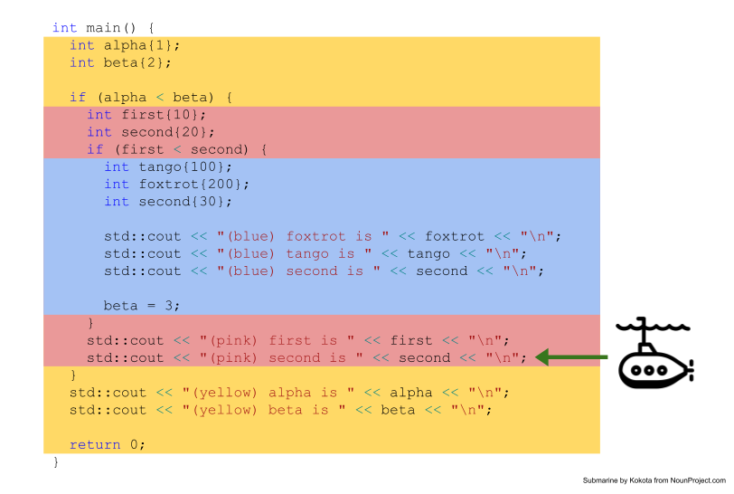

Welcome to a special supplement to the C++ Times! On occasion, Curie, Inc., the publisher of the C++ Times, entices its customers who buy their publications off the rack in the Kroger checkout lanes with inserts. 

### Getting Healthy C++ in 2022 With Scopes
As we discussed in class, a _scope_ is the "part of the program where a variable may be used." A variable is _local_ to the scope where it is declared/defined. A scope is created at every `{` and destroyed at every `}`. 

We take advantage of scopes in order to limit the possibility that other developers writing code in other parts of the same program create/use variables with the same name as ours in ways that conflict. 

If our compiler has taught us anything in the first few weeks of class, it's that we _cannot_ declare two variables with exactly the same name. So, what happens when we are writing a really big program and we have two variables in different parts of the code and both represent time. In both cases it would be ideal if we could call that variable `time`. But, doesn't C++ prevent that? 

No, not at all! It is the rule only that you cannot declare two (or more) variables _in the same scope_ that have the same name. In your program, as long as you need two variables to represent time in different scopes, you can name them both `time` without worrying about conflicts. 

This is incredibly powerful (from a software-engineering perspective), but can cause some problems. We will see an example of that type of problem (shadowing) later in this insert. 

### The Scopes Are Coming ... One If By Land, Two If By See (pun intended)
Scopes are like many other things in C++ -- they nest. One scope can be nested within another scope. Programmers refer to layers of nesting as _depth_. Let's assume that we can name scopes. If there is a scope named _A_ that contains a scope named _B_ we will say that scope _B_ is more _deeply nested_ than scope _A_. It has a greater depth. We will play on this metaphor of depths and puns on see/sea in the remainder of this insert.

Consider the following, relatively simple C++ program:
<pre><font color="#5FD7FF">#include </font><font color="#AD7FA8">&lt;iostream&gt;</font>

<font color="#87FFAF">int</font> main() {
  <font color="#87FFAF">int</font> alpha{<font color="#AD7FA8">1</font>};
  <font color="#87FFAF">int</font> beta{<font color="#AD7FA8">2</font>};

  <font color="#FCE94F">if</font> (<font color="#AD7FA8">true</font>) {
    <font color="#87FFAF">int</font> first{<font color="#AD7FA8">10</font>};
    <font color="#87FFAF">int</font> second{<font color="#AD7FA8">20</font>};

    <font color="#FCE94F">if</font> (<font color="#AD7FA8">true</font>) {
      <font color="#87FFAF">int</font> tango{<font color="#AD7FA8">100</font>};
      <font color="#87FFAF">int</font> foxtrot{<font color="#AD7FA8">200</font>};
      <font color="#87FFAF">int</font> second{<font color="#AD7FA8">30</font>};

      std::cout &lt;&lt; <font color="#AD7FA8">&quot;(blue) foxtrot is &quot;</font> &lt;&lt; foxtrot &lt;&lt; <font color="#AD7FA8">&quot;</font><font color="#FFD7D7">\n</font><font color="#AD7FA8">&quot;</font>;
      std::cout &lt;&lt; <font color="#AD7FA8">&quot;(blue) tango is &quot;</font> &lt;&lt; tango &lt;&lt; <font color="#AD7FA8">&quot;</font><font color="#FFD7D7">\n</font><font color="#AD7FA8">&quot;</font>;
      std::cout &lt;&lt; <font color="#AD7FA8">&quot;(blue) second is &quot;</font> &lt;&lt; second &lt;&lt; <font color="#AD7FA8">&quot;</font><font color="#FFD7D7">\n</font><font color="#AD7FA8">&quot;</font>;

      beta = <font color="#AD7FA8">3</font>;
    }
    std::cout &lt;&lt; <font color="#AD7FA8">&quot;(pink) first is &quot;</font> &lt;&lt; first &lt;&lt; <font color="#AD7FA8">&quot;</font><font color="#FFD7D7">\n</font><font color="#AD7FA8">&quot;</font>;
    std::cout &lt;&lt; <font color="#AD7FA8">&quot;(pink) second is &quot;</font> &lt;&lt; second &lt;&lt; <font color="#AD7FA8">&quot;</font><font color="#FFD7D7">\n</font><font color="#AD7FA8">&quot;</font>;
  }
  std::cout &lt;&lt; <font color="#AD7FA8">&quot;(yellow) alpha is &quot;</font> &lt;&lt; alpha &lt;&lt; <font color="#AD7FA8">&quot;</font><font color="#FFD7D7">\n</font><font color="#AD7FA8">&quot;</font>;
  std::cout &lt;&lt; <font color="#AD7FA8">&quot;(yellow) beta is &quot;</font> &lt;&lt; beta &lt;&lt; <font color="#AD7FA8">&quot;</font><font color="#FFD7D7">\n</font><font color="#AD7FA8">&quot;</font>;
  <font color="#FCE94F">return</font> <font color="#AD7FA8">0</font>;
}
</pre>

Let's add some color to improve our vision. These colors will represent each of the three scopes in the `main` function. 


There are three scopes in the `main` function -- the yellow scope, the pink scope and the blue scope. The yellow scope contains the pink scope. The pink scope contains the blue scope. Scopes can be infinitely nested and the scoping relationship is transitive (i.e., if scope _A_ contains scope _B_ and scope _B_ contains scope _B_, then scope A contains scope _C_.)! 

`alpha`, and `beta` are local to the yellow scope. `tango` and `foxtrot` are local to the blue scope. Which variables are local to the pink scope? 

Take special note of the fact that there is a `second` local to both the yellow _and_ the blue scope. Interesting! What are the semantics of this type of arrangement? Wait and see!

### Dive, Dive, Dive

Let's take a submarine 20,000 leagues under the C++ and make some observations using its periscope. 


Variables in a C++ program are either _in scope_ or _out of scope_. Variables that are _in scope_ are the ones that can be seen from the periscope of our submarine. It is an error to attempt to access/update a variable that is out of scope. 

When using a physical periscope, you can only view in one direction. The same thing is true in C++. If you think about scopes increasing in depth from left-to-right, variables in the enclosing scopes are to the left. 


This image demonstrates visually that `alpha`, `beta`, `first`, `tango`, and `foxtrot` are all in scope, even though only a subset of those variables are local. At the time when the program is executing the code at the green arrow in the image above, the values of all of those variables may be accessed or modified.

What is there to make of the situation of the variable named `second`? Well, it's clear that the presence of the variable named `second` in the blue scope blocks the submarine's view of the variable named `second` in the pink scope! So, if the program accesses (reads or writes) `second` from inside the blue scope, it is the `second` in the blue scope whose value will be retrieved or updated. Two variables that have the same name that are both in scope at the same time are said to _shadow_ one another. The variable whose local scope is closest to the position of the program's execution will always (with a certain caveat) be the one that is accessed/updated. 

The program's output so far is:

```
(blue) foxtrot is 200
(blue) tango is 100
(blue) second is 30
```

The program execution advances.


The programmer here is updating the `beta` variable. But, `beta` is not local. Is this update legal? Yes, it is! `beta` is not local but it sure is in scope! 


The program execution continues. 



The value retrieved when the program accesses the variable `first` when it is paused at the line annotated in green in the figure above is relatively easy to calculate. There is, after all, only one `first` and it is local to the scope where execution is paused (pink). The value retrieved is `10`. 

The situation is slightly more complicated with the `second` variable.


As we begin to resurface in our submarine, the scopes (and the variables and the space needed to store values in those variables contained therein) that we left below us (or to the right of us) no longer exist. Their vanishing act makes it easier to determine the value retrieved when `second` is accessed by the program as it executes the line of code annotated in green in the figure above. It is `20`! How could it be otherwise? The "other" `second` went up in a puff of smoke (to determine how smoke exists underwater is an exercise left to the reader!). 

At this point, the program's output is

```
(blue) foxtrot is 200
(blue) tango is 100
(blue) second is 30
(pink) first is 10
(pink) second is 20
```

The program execution advances.


The value retrieved when the program accesses the variable `alpha` when it is paused at the line annotated in green in the figure above is relatively easy to calculate. There is, after all, only one `alpha` and it is local to the scope where execution is paused (yellow). The value retrieved is `1`.


When we rose another several feet toward the surface, we left behind yet another scope. Those variables and the storage allotted to them are now gone! Parting (variables) is such sweet sorrow.

The disappearance of the pink and (earlier) blue scopes does not undo the (much) earlier change to the value of `beta`. Even though the scopes that existed when the code that made the update from 2 to 3 have since been vanquished, the value of `beta` remains `3`. The final output of the program is:

```
(blue) foxtrot is 200
(blue) tango is 100
(blue) second is 30
(pink) first is 10
(pink) second is 20
(yellow) alpha is 1
(yellow) beta is 3
```

Our three hour ocean tour in a submarine has (hopefully) exposed many of the quirks of variables and scopes in C++. The concepts that you are learning about scopes in C++ are generally applicable to other imperative and object-oriented programming languages (e.g., JavaScript, Python, Go, etc.). Obviously each language has its own take on the rules, the broad outlines are the same. Knowledge is power.

### Take a Global Perspective on C++ Travel in 2022
There is such a thing as a _global_ scope in C++. It is a scope that exists entirely outside any `{`, `}` blocks. Every single other scope in your program exists within the global scope. 

In other words, variables in the global scope are always in scope. As a result of their omnipresence, variables in the global scope can be can be accessed/modified from any position in your code. Taking advantage of the reach of global variables may seem tempting. But, do not fall victim to their siren song. It is almost always wrong to use a global variable.

Don't believe me? Think about this situation: You are writing a program that calculates the amount of money in a user's bank account. Their assets are stored in a variable named, er, `assets`. Your code needs to access the users assets throughout the program so you make it a global variable. No problems so far.

Your colleague takes over ownership of your pristine code several months later. They write some new code that is buggy -- _you_ are the only one who writes perfect code, of course! Their code is intended to determine whether a user is eligible for a loan depending on whether they have access to a liquid asset. They, however, make a typo in their code and write something like the following:

<pre>  <font color="#87FFAF">bool</font> asset{<font color="#AD7FA8">false</font>};

  <font color="#FCE94F">if</font> (ownsAHouse) {
    assets = <font color="#AD7FA8">true</font>;
  }
</pre>

They clearly meant to update `asset` to `true` but instead they updated `assets`. There is no reason for the C++ compiler to alert the user about this mistake, is there?

1. `assets` is in scope -- variables in the global scope are _always_ in scope.
2. Though a semantically questionable operation, C++ will dutifully convert the value of `false` to `0` (remember _promotion_?) and, to put it euphemistically) reset your customer's assets. 

I can imagine that you do not want to answer to a boss who wonders why suddenly the bank's customers have lost all their money!

Paradoxically, there is a single case where using global variables is almost required: when you can write the definition of a global variable 

1. as one whose value never changes, and
2. where using a name instead of a literal value makes the code more readable.

For example, if you are writing code that makes calculations based on the value of pi (yummy!), it makes sense to declare a global variable:

<pre><font color="#87FFAF">const</font> <font color="#87FFAF">double</font> PI = <font color="#AD7FA8">3.14159</font>;
</pre>

Using a constant global variable in these cases has several advantages:

1. Typing that literal everywhere in your code is going to get really old really fast;
2. Each time that you retype the literal is another opportunity for you to make a typo;
3. Not everyone will know that 3.14159 is the value of pi; and
4. Updating its value throughout your application (to increase the precision of your program's calculations) is as simple as changing a single line of code.

If you are truly a nautical nut, you can think of the scope of global variables as the salty air above the ocean -- I love the smell of the beach.

