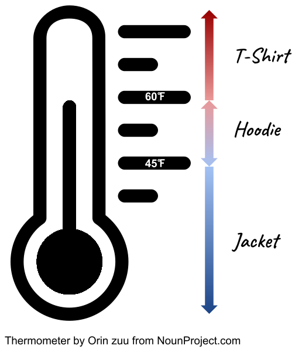

## What's News

Brought to you by one of our trusted brand advertisers, the C++ Times is proud to present a skills supplement to today's edition. Trusted Ternary Advisors, a company dedicated to talent management for companies recruiting software developers, brings you this advertorial on developing with selective execution.

## Weathering the Storm: Whether to Carry an Umbrella or Not?

One of the toughest decisions that we make in our lives, right after determining whether to attend college, move or buy a house, marry our partner or have children, is the decision about whether to take an umbrella with us as we leave the house every day. If you take an umbrella, you know it will annoy you all day and won't rain. If you don't take an umbrella, then you are guaranteed it will rain. 

Only slightly less important on a day-to-day basis is the choice of top to wear. Do I need a jacket? Should I wear a hoodie? Or, am I safe with a t-shirt? Just pondering the answer to these questions will put you in the same mental state as Prince Hamlet or Descartes.

C++ can get you out of a bind. Our program will act on the value of some given parameters (`temperature`, `is_dry` and `precipitation`) to give helpful advice about how to leave our condo prepared for the climate.

### The (Weather) Conditions

There are a pretty clear set of criteria for choosing whether to take a jacket, throw on a hoodie or wear a t-shirt.



If the temperature is less than 45 degrees, then we wear a jacket. If the temperature is between 45 degrees and 60 degrees, then we will wear a hoodie (*the best* article of clothing ever invented). Finally, if it is above 60 degrees we will wear a t-shirt. Pretty straightforward.

Because I am a relatively cold-blooded person (not that kind of cold blooded!), we will say that the day is "warm" if the temperature is above 60 degrees.

### Coding the Top

Given those parameters, let's write a piece of code that will calculate the proper value for the `top_to_wear` string variable. The `top_to_wear` value should contain:

1. `"jacket"` when the temperature is less than or equal to 45 degrees;
2. `"hoodie`" when the temperature is between 45 and 60 degrees (inclusive); and
3. `"t-shirt"` when the temperature is at least 60 degrees.

Given the values that we want to store in the `top_to_wear` variable, what should be its type? I think that a `std::string` seems appropriate. What other type could we use to store sequences of characters? Really, there's no other choice!

We can assume that we are performing our calculations based on the value of the `temperature` variable that contains the ambient temperature. We'll leave it as an exercise of the imagination to determine how that variable is set. Perhaps our program reads the value from a sensor attached to the computer or perhaps our program reads the value from the internet. Either way, the temperature may not be a whole number. Because that's the case, we will want to make `temperature` a `double`.

The program should print:

```
It's _______ degrees outside; wear a _______.
```

with the appropriate values filling the `________`s. Later we will add functionality to alert the user when they should take an umbrella.

Here's what our program looks like so far:

<html><head></head><body><pre>
 1 #include &lt;iostream&gt;
 2 
 3 <font color=green>int</font> main() {
 4   std::string top_to_wear{<font color=red>""</font>};
 5   <font color=green>double</font> temperature{<font color=red>48.0</font>};
 6 
 7   std::cout << <font color=red>"It's "</font> << temperature << <font color=red>" degrees outside; wear a "</font>
 8             << top_to_wear << <font color=red>".\n"</font>;
 9 
10   <font color=green>return</font> <font color=red>0</font>;
11 }
</pre></body></html>

and it's output is

```
It's 48 degrees outside; wear a .
```

We're off to a pretty good start.

We can use an `if` statement to _conditionally_ set the value of `top_to_wear` to the proper value. Let's tackle the conditions from coolest to hottest. We wear a jacket when the temperature is less than 45 degrees. 

<html><body><pre>
 1 #include &lt;iostream&gt;
 2 
 3 <font color=green>int</font> main() {
 4   std::string top_to_wear{<font color=red>""</font>};
 5   <font color=green>double</font> temperature{<font color=red>48.0</font>};
 6 
 7   <font color=green>if</font> (temperature &lt; <font color=red>45.0</font>) {
 8     top_to_wear = <font color=red>"jacket"</font>;
 9   } <font color=green>else</font> {
10 
11   }
12 
13   std::cout << <font color=red>"It's "</font> << temperature << <font color=red>" degrees outside; wear a "</font>
14             << top_to_wear << <font color=red>".\n"</font>;
15 
16   <font color=green>return</font> <font color=red>0</font>;
17 }
</pre></body></html>

and it's output is

```
It's 48 degrees outside; wear a .
```

There's no change despite the additional code! Why not? Because the `temperature` is `48` -- not less than 45; line 8 does not execute.

Thanks to the combination of the `bool`ean expression in the `if` statement on line 7 and the `else` on line 9, if the program executes code that we put on line 10 (or really anywhere between the `{` on line 9 and the `}` on line 11), we can assume that what is true? Exactly! That the `temperature` is greater than 45 degrees. 

Therefore, to determine whether it is hoodie weather, all we need to add is an `if` statement whose `bool`ean expression determines whether the temperature is less than or equal to 60 degrees! 

<html><head></head><body><pre>
 1 #include &lt;iostream&gt;
 2 
 3 <font color=green>int</font> main() {
 4   std::string top_to_wear{<font color=red>""</font>};
 5   <font color=green>double</font> temperature{<font color=red>48.0</font>};
 6 
 7   <font color=green>if</font> (temperature &lt; <font color=red>45.0</font>) {
 8     top_to_wear = <font color=red>"jacket"</font>;
 9   } <font color=green>else</font> {
10     <font color=green>if</font> (temperature <= <font color=red>60.0</font>) {
11       top_to_wear = <font color=red>"hoodie"</font>;
12     } <font color=green>else</font> {
13
14     }
15   }
16 
17   std::cout << <font color=red>"It's "</font> << temperature << <font color=red>" degrees outside; wear a "</font>
18             << top_to_wear << <font color=red>".\n"</font>;
19 
20   <font color=green>return</font> <font color=red>0</font>;
21 }
</pre></body></html>

Can you see how we are using what we know about the state of a variable at a current position in the code to limit the complexity of the `bool`ean expression in a conditional? Of course we could have written a more complicated expression to check that the temperature is greater than 45 _and_ less than or equal to 60 at line 60, but we didn't need to!

The program prints

```
It's 48 degrees outside; wear a hoodie.
```

Awesome! Now we are getting somewhere. Because we are _testing_ with the `temperature` set to 48 degrees, the output is correct and tells us that we should wear a hoodie.

### Testing

Great. Our program performs as expected. Let's test it before we send it to our users. If it is a cold day and the temperature is freezing, our `temperature` variable contains the value `32`. The program outputs:

```
It's 32 degrees outside; wear a jacket.
```

Great! And, if it is an early Spring day, the `temperature` might be 59:

```
It's 59 degrees outside; wear a hoodie.
```

So far we are on track to ship the application to our customer! 

If it's a hot Midwest day in August, the `temperature` is `95` (with 100% humidity, of course):

```
It's 95 degrees outside; wear a .
```

Uh oh. Our program failed to give good advice to the user. It looks like we forgot to handle a case!

### Coding to the Top (a reprise)

Remember the code that we currently have:

<html><head></head><body><pre>
 1 #include &lt;iostream&gt;
 2 
 3 <font color=green>int</font> main() {
 4   std::string top_to_wear{<font color=red>""</font>};
 5   <font color=green>double</font> temperature{<font color=red>95.0</font>};
 6 
 7   <font color=green>if</font> (temperature &lt; <font color=red>45.0</font>) {
 8     top_to_wear = <font color=red>"jacket"</font>;
 9   } <font color=green>else</font> {
10     <font color=green>if</font> (temperature <= <font color=red>60.0</font>) {
11       top_to_wear = <font color=red>"hoodie"</font>;
12     } <font color=green>else</font> {
13       //
14     }
15   }
16 
17   std::cout << <font color=red>"It's "</font> << temperature << <font color=red>" degrees outside; wear a "</font>
18             << top_to_wear << <font color=red>".\n"</font>;
19 
20   <font color=green>return</font> <font color=red>0</font>;
21 }
</pre></body></html>

What are we able to assume about the value of `temperature` if the program were executing code on line 13 (or really anywhere between the `{` on line 12 and the `}` on line 14)? That the temperature is greater than 60 degrees. That's awesome because it matches exactly the conditions for recommending that the user wear a t-shirt! We can fix the bug without writing too much extra code!

<html><head></head><body><pre>
 1 #include &lt;iostream&gt;
 2 
 3 <font color=green>int</font> main() {
 4   std::string top_to_wear{<font color=red>""</font>};
 5   <font color=green>double</font> temperature{<font color=red>95.0</font>};
 6 
 7   <font color=green>if</font> (temperature &lt; <font color=red>45.0</font>) {
 8     top_to_wear = <font color=red>"jacket"</font>;
 9   } <font color=green>else</font> {
10     <font color=green>if</font> (temperature <= <font color=red>60.</font>) {
11       top_to_wear = <font color=red>"hoodie"</font>;
12     } <font color=green>else</font> {
13       top_to_wear = <font color=red>"t-shirt"</font>;
14     }
15   }
16 
17   std::cout << <font color=red>"It's "</font> << temperature << <font color=red>" degrees outside; wear a "</font>
18             << top_to_wear << <font color=red>".\n"</font>;
19 
20   <font color=green>return</font> <font color=red>0</font>;
21 }
</pre></body></html>


```
It's 95 degrees outside; wear a t-shirt.
```

The program works perfectly! Again, we could have written more complicated logic to determine when to set the variable `top_to_wear` to have the `"t-shirt"` value but, by process of elimination, we didn't need to. If the program is executing the code at line 13 we know that the only option for the top for the user to wear is a t-shirt!

### Refactoring Our Code

Programmers often refactor their code. When you refactor code, you rewrite it so that it is more readable, more compact, more efficient -- you take a step back from the details and look at how you can make the code "better". To do that, we will learn a feature of C++ that is a blessing and a curse!

In general, there are two forms of `if` statements in C++. The first is used when you have a set of code that you want to optionally execute under certain conditions:

<html><head></head><body><pre>
 1 #include &lt;iostream&gt;
 2 
 3 <font color=green>int</font> main() {
 4 
 5   <font color=green>if</font> (expression) {
 6     // Code to execute when expression is true.
 7   }
 8 
 9   <font color=green>return</font> <font color=red>0</font>;
10 }

</pre></body></html>

The code on line 6 (or really anywhere between the `{` on line 5 and the `}` on line 7) will execute when `expression` evaluates to `true`.

Here's where we learn the power and pain of C++. The actual, precise form of the `if` statement in a case like this is actually

<html><head></head><body><pre>
1 #include &lt;iostream&gt;
2 
3 <font color=green>int</font> main() {
4 
5   <font color=green>if</font> (expression)
6     statement
7 
8   <font color=green>return</font> <font color=red>0</font>;
9 }

</pre></body></html>

`statement` can be anything that we want. For instance, we could assign a variable:

<html><head></head><body><pre>
 1 #include &lt;iostream&gt;
 2 
 3 <font color=green>int</font> main() {
 4   <font color=green>int</font> v{<font color=red>0</font>};
 5 
 6   <font color=green>if</font> (expression)
 7     v = <font color=red>5</font>;
 8 
 9   <font color=green>return</font> <font color=red>0</font>;
10 }

</pre></body></html>

That's great and I am sure that you are glad that we are wasting all this time on the minutiae of C++ syntax (remember the definition of that term?). So, why are we worried about these nits? C++ defines the `if` statement in that way because of the way that C++ defines the term _statement_. Trust me, there is a payoff here!

Remember we defined statement a long time ago! We said that a statement was a complete instruction that defined an operation. Sometimes it requires more than one instruction to complete a _logical_ operation. For instance, a complete logical operation might entail changing the value of two variables (adjusting the hours and minutes of a clock, say). C++ lets us combine two (or more) operations to define a complete complete logical operation by grouping them in a pair of `{` and `}`. Then, anything inside that pair C++ considers a statement! To distinguish between the different types of statements, C++ subdivides statements into categories: _expression_ statements and _compound_ statements.Don't worry, there are other types of statements, just wait!

So, by playing games with semantics, we get some really cool power!

C++ is like living in a funhouse and compound statements are like mirrors facing one another. Compound statements may themselves contain any kind of statement. In other words, compound statements may contain compound statements which may contain compound statements ... and so on!

Why is this important? I'll tell you: `if` statements are ... wait for it ... just another category of statements (they are technically called _selection_ statements). So, in

<html><head></head><body><pre>
1 #include &lt;iostream&gt;
2 
3 <font color=green>int</font> main() {
4 
5   <font color=green>if</font> (expression)
6     statement
7 
8   <font color=green>return</font> <font color=red>0</font>;
9 }

</pre></body></html>

we can replace `statement` with another `if` statement:

<html><head></head><body><pre>
 1 #include &lt;iostream&gt;
 2 
 3 <font color=green>int</font> main() {
 4 
 5   <font color=green>if</font> (expression)
 6     <font color=green>if</font> (expression)
 7       statement
 8 
 9   <font color=green>return</font> <font color=red>0</font>;
10 }

</pre></body></html>

In code like the above, the `statement` on line 7 will only execute when both of the expressions are `true`. That's pretty cool! (We'll see how to refactor code that follows that form below!)

We've talked about just one of the two forms of `if` statements so far. What's the other? It's the form where you want to choose between executing two different sets of operations depending on a condition:

<html><head></head><body><pre>
 1 #include &lt;iostream&gt;
 2 
 3 <font color=green>int</font> main() {
 4 
 5   <font color=green>if</font> (expression) {
 6     //
 7   } <font color=green>else</font> {
 8     //
 9   }
10 
11   <font color=green>return</font> <font color=red>0</font>;
12 }

</pre></body></html>

When the `expression` is `true`, we execute the code between the `{` on line 5 and the `}` on line 7. When the `expression` is `false`, we execute the code between the `{` on line 7 and the `}` on line 9. Again, this description is slightly misleading. The actual, precise format of such `if` statements is

<html><head></head><body><pre>
1  #include &lt;iostream&gt;
2 
3  <font color=green>int</font> main() {
4 
5    <font color=green>if</font> (expression)
6      statement1
7    <font color=green>else</font>
8      statement2
9 
10   <font color=green>return</font> <font color=red>0</font>;
11  }
</pre></body></html>

Now, here's where we'll blow your mind! Combine our knowledge that an `if` statement is just a statement like any other with the above format of the `if` statement and you can see how we get the valid `if`-`else if` that is so familiar. Replace `statement2` with an `if` statement:

<html><head></head><body><pre>
1  #include &lt;iostream&gt;
2 
3  <font color=green>int</font> main() {
4 
5    <font color=green>if</font> (expression)
6      statement1
7    <font color=green>else</font>
9      <font color=green>if</font> (expression)
10       statement3
11 
12   <font color=green>return</font> <font color=red>0</font>;
13  }
</pre></body></html>

and remember that C++ does not care about the breaks between lines and we get

<html><head></head><body><pre>
1  #include &lt;iostream&gt;
2 
3  <font color=green>int</font> main() {
4 
5    <font color=green>if</font> (expression)
6      statement1
7    <font color=green>else if</font> (expression)
10     statement3
11 
12   <font color=green>return</font> <font color=red>0</font>;
13  }
</pre></body></html>

and we can do a little cleanup and we get

<html><head></head><body><pre>
1  #include &lt;iostream&gt;
2 
3  <font color=green>int</font> main() {
4 
5    <font color=green>if</font> (expression)
6      statement1
7    <font color=green>else if</font> (expression)
10     statement2
11 
12   <font color=green>return</font> <font color=red>0</font>;
13  }
</pre></body></html>

Woah!! An amazing outcome -- the `else if` that is sometimes considered a special case syntax in other programming languages is built right in to C++! Amazing!

*** [Danger, Will Robinson](https://en.wikipedia.org/wiki/Lost_in_Space) ***

Remember we saw code above that looked like this:

<html><head></head><body><pre>
 1 #include &lt;iostream&gt;
 2 
 3 <font color=green>int</font> main() {
 4   <font color=green>int</font> v{<font color=red>0</font>};
 5 
 6   <font color=green>if</font> (expression)
 7     v = <font color=red>5</font>;
 8 
 9   <font color=green>return</font> <font color=red>0</font>;
10 }

</pre></body></html>

? Never, _ever_ write that code! Yes, you are saving yourself two keystrokes, but I promise you that it will eventually bite you! How do I know? Glance quickly (you are on your honor) at the following and tell me what it prints.

<html><head></head><body><pre>
 1 #include &lt;iostream&gt;
 2 
 3 <font color=green>int</font> main() {
 4   <font color=green>int</font> a{<font color=red>0</font>};
 5   <font color=green>int</font> b{<font color=red>1</font>};
 6   <font color=green>int</font> c{<font color=red>0</font>};
 7   <font color=green>int</font> d{<font color=red>0</font>};
 8 
 9   <font color=green>if</font> (b &lt; a)
10     c = <font color=red>1</font>;
11     d = <font color=red>1</font>;
12   std::cout << <font color=red>"c: "</font> << c << <font color=red>"; d: "</font> << d << <font color=red>"\n"</font>;
13   <font color=green>return</font> <font color=red>0</font>;
14 }

</pre></body></html>

Did you guess that it will print:

```
c: 0; d: 1
```

Yeah, I didn't think so! C++ does not care about indentation. You had good intentions, but ultimately the code is wrong. If you always enclose the statements conditionally executed in `{` and `}` pairs, you will never have this problem. (Obviously this advice does not apply when you are writing an `else if` construction but that is an exception, not the rule.)

You've been warned!

What a long digression. Where were we? Oh, yeah, we were refactoring. Okay, so we have

<html><head></head><body><pre>
 1 #include &lt;iostream&gt;
 2 
 3 <font color=green>int</font> main() {
 4   std::string top_to_wear{<font color=red>""</font>};
 5   <font color=green>double</font> temperature{<font color=red>95.0</font>};
 6 
 7   <font color=green>if</font> (temperature &lt; <font color=red>45.0</font>) {
 8     top_to_wear = <font color=red>"jacket"</font>;
 9   } <font color=green>else</font> {
10     <font color=green>if</font> (temperature <= <font color=red>60.</font>) {
11       top_to_wear = <font color=red>"hoodie"</font>;
12     } <font color=green>else</font> {
13       top_to_wear = <font color=red>"t-shirt"</font>;
14     }
15   }
16 
17   std::cout << <font color=red>"It's "</font> << temperature << <font color=red>" degrees outside; wear a "</font>
18             << top_to_wear << <font color=red>".\n"</font>;
19 
20   <font color=green>return</font> <font color=red>0</font>;
21 }
</pre></body></html>

Now that we know how to write `else if`s in a cool way, I think it might be more readable if we make our code use that syntax:

<html><head></head><body><pre>
 1 #include &lt;iostream&gt;
 2 
 3 <font color=green>int</font> main() {
 4   std::string top_to_wear{<font color=red>""</font>};
 5   <font color=green>double</font> temperature{<font color=red>95.0</font>};
 6 
 7   <font color=green>if</font> (temperature &lt; <font color=red>45.0</font>) {
 8     top_to_wear = <font color=red>"jacket"</font>;
 9   } <font color=green>else</font> <font color=green>if</font> (temperature <= <font color=red>60.0</font>) {
10     top_to_wear = <font color=red>"hoodie"</font>;
11   } <font color=green>else</font> {
12     top_to_wear = <font color=red>"t-shirt"</font>;
13   }
14 
15   std::cout << <font color=red>"It's "</font> << temperature << <font color=red>" degrees outside; wear a "</font>
16             << top_to_wear << <font color=red>".\n"</font>;
17 
18   <font color=green>return</font> <font color=red>0</font>;
19 }
</pre></body></html>

Ah, yes! Not only is that more compact, it is also more like what we would expect to say in natural language. Great refactoring!

### About That Umbrella

Now we know what goes on above the waist. We still need to add code that helps our user determine whether or not to lug around their umbrella all day. The user only wants to carry their umbrella when it isn't dry outside, the form of precipitation is rain and it is warm. We will add to the list of variables of which our code has access to include a `bool`ean, `is_dry` that is `true` if it is dry outside and a `std::string`, `precipitation` that describes the form of precipitation. `precipitation` will contain the value `"snow"` when it is snowing and `"rain"` when it is raining.

Let's work on a case-by-case basis. The first case to consider is that we want to do if it is dry. Well, if it is dry, then we certainly don't need to tell the user to take an umbrella. But, if it isn't dry, then we may want to alert the user about the need for their handheld roof. 

<html><head></head><body><pre>
 1 #include &lt;iostream&gt;
 2 
 3 <font color=green>int</font> main() {
 4   std::string top_to_wear{<font color=red>""</font>};
 5   <font color=green>double</font> temperature{<font color=red>95.0</font>};
 6   bool is_dry{false};
 7   std::string precipitation { <font color=red>"snow"</font> }
 8 
 9   <font color=green>if</font> (temperature &lt; <font color=red>45.0</font>) {
10     top_to_wear = <font color=red>"jacket"</font>;
11   } <font color=green>else</font> <font color=green>if</font> (temperature <= <font color=red>60.</font>) {
12     top_to_wear = <font color=red>"hoodie"</font>;
13   } <font color=green>else</font> {
14     top_to_wear = <font color=red>"t-shirt"</font>;
15   }
16 
17   std::cout << <font color=red>"It's "</font> << temperature << <font color=red>" degrees outside; wear a "</font>
18             << top_to_wear << <font color=red>".\n"</font>;
19 
20   <font color=green>if</font> (is_dry) {
21     // No need to do anything.
22   } <font color=green>else</font> {
23
24   }
25   <font color=green>return</font> <font color=red>0</font>;
26 }
</pre></body></html>

When our program gets to the code between the `{` on line 22 and the `}` on line 24, we can assume what? Well, we can assume that it is not dry! Before telling the user that they need to take an umbrella, we need to check two more conditions! First, we need to check whether the form of precipitation is rain:

<html><head></head><body><pre>
 1 #include &lt;iostream&gt;
 2 
 3 <font color=green>int</font> main() {
 4   std::string top_to_wear{<font color=red>""</font>};
 5   <font color=green>double</font> temperature{<font color=red>95.0</font>};
 6   bool is_dry{false};
 7   std::string precipitation { <font color=red>"snow"</font> }
 8 
 9   <font color=green>if</font> (temperature &lt; <font color=red>45.0</font>) {
10     top_to_wear = <font color=red>"jacket"</font>;
11   } <font color=green>else</font> <font color=green>if</font> (temperature <= <font color=red>60.</font>) {
12     top_to_wear = <font color=red>"hoodie"</font>;
13   } <font color=green>else</font> {
14     top_to_wear = <font color=red>"t-shirt"</font>;
15   }
16 
17   std::cout << <font color=red>"It's "</font> << temperature << <font color=red>" degrees outside; wear a "</font>
18             << top_to_wear << <font color=red>".\n"</font>;
19 
20   <font color=green>if</font> (is_dry) {
21     // No need to do anything.
22   } <font color=green>else</font> {
23     <font color=green>if</font> (precipitation == <font color=red>"rain"</font>) {
24     }
25   }
26   <font color=green>return</font> <font color=red>0</font>;
27 }
</pre></body></html>

Yes, it may sound like a broken record, but think about the assumptions we can make when code between the `{` on line 23 and the `}` on line 24 are executing! Bingo! We know that it is not dry and that it is raining. The last thing to check before recommending an umbrella is whether it is warm. Our definition for warm (remember it?) is that the temperature is greater than 60:

<html><head></head><body><pre>
 1 #include &lt;iostream&gt;
 2 
 3 <font color=green>int</font> main() {
 4   std::string top_to_wear{<font color=red>""</font>};
 5   <font color=green>double</font> temperature{<font color=red>95.0</font>};
 6   bool is_dry{false};
 7   std::string precipitation {<font color=red>"snow"</font>};
 8 
 9   <font color=green>if</font> (temperature &lt; <font color=red>45.0</font>) {
10     top_to_wear = <font color=red>"jacket"</font>;
11   } <font color=green>else</font> <font color=green>if</font> (temperature <= <font color=red>60.</font>) {
12     top_to_wear = <font color=red>"hoodie"</font>;
13   } <font color=green>else</font> {
14     top_to_wear = <font color=red>"t-shirt"</font>;
15   }
16 
17   std::cout << <font color=red>"It's "</font> << temperature << <font color=red>" degrees outside; wear a "</font>
18             << top_to_wear << <font color=red>".\n"</font>;
19 
20   <font color=green>if</font> (is_dry) {
21     // No need to do anything.
22   } <font color=green>else</font> {
23     <font color=green>if</font> (precipitation == <font color=red>"rain"</font>) {
24       <font color=green>if</font> (temperature &gt; <font color=red>60.0</font>) {
25         std::cout << <font color=red>"Take an umbrella with you when you leave the house!\n"</font>;
26       }
27     }
28   }
29   <font color=green>return</font> <font color=red>0</font>;
30 }
</pre></body></html>

Well done! Let's check our work:

```
It's 95 degrees outside; wear a t-shirt.
```

Perfect! We are wearing a t-shirt and not taking an umbrella! Although it's not dry, we are experiencing a rare summer snow storm! Let's make the data a little more realistic and make sure that our program works:

<html><head></head><body><pre>
 1 #include &lt;iostream&gt;
 2 
 3 <font color=green>int</font> main() {
 4   std::string top_to_wear{<font color=red>""</font>};
 5   <font color=green>double</font> temperature{<font color=red>95.0</font>};
 6   bool is_dry{false};
 7   std::string precipitation{<font color=red>"rain"</font>};
 8 
 9   <font color=green>if</font> (temperature &lt; <font color=red>45.0</font>) {
10     top_to_wear = <font color=red>"jacket"</font>;
11   } <font color=green>else</font> <font color=green>if</font> (temperature <= <font color=red>60.</font>) {
12     top_to_wear = <font color=red>"hoodie"</font>;
13   } <font color=green>else</font> {
14     top_to_wear = <font color=red>"t-shirt"</font>;
15   }
16 
17   std::cout << <font color=red>"It's "</font> << temperature << <font color=red>" degrees outside; wear a "</font>
18             << top_to_wear << <font color=red>".\n"</font>;
19 
20   <font color=green>if</font> (is_dry) {
21     // No need to do anything.
22   } <font color=green>else</font> {
23     <font color=green>if</font> (precipitation == <font color=red>"rain"</font>) {
24       <font color=green>if</font> (temperature &gt; <font color=red>60.0</font>) {
25         std::cout << <font color=red>"Take an umbrella with you when you leave the house!\n"</font>;
26       }
27     }
28   }
29   <font color=green>return</font> <font color=red>0</font>;
30 }
</pre></body></html>

```
It's 95 degrees outside; wear a t-shirt.
Take an umbrella with you when you leave the house!
```

Excellent!

### Re-refactor

There's something incredibly unsightly about this code but I can't put my finger on it!

Oh yes, I see two things that bother me! No, make that three!

#### A Statement That Does Nothing

First, there is the code on line 21 that doesn't do anything! It would be nice if we could flip around the code and bring the code that we execute in the `else` to the top -- that's really where the business gets done, after all! We know that the code between the `{` on line 22 and the `}` on line 28 gets executed when it is _not_ dry. Is there an operator that we can apply to `is_dry` that will tell us when it is _not_ dry? YES! The `!` operator. So, we could rewrite our code like

<html><head></head><body><pre>
 1 #include &lt;iostream&gt;
 2 
 3 <font color=green>int</font> main() {
 4   std::string top_to_wear{<font color=red>""</font>};
 5   <font color=green>double</font> temperature{<font color=red>95.0</font>};
 6   bool is_dry{false};
 7   std::string precipitation{<font color=red>"rain"</font>};
 8 
 9   <font color=green>if</font> (temperature &lt; <font color=red>45.0</font>) {
10     top_to_wear = <font color=red>"jacket"</font>;
11   } <font color=green>else</font> <font color=green>if</font> (temperature <= <font color=red>60.</font>) {
12     top_to_wear = <font color=red>"hoodie"</font>;
13   } <font color=green>else</font> {
14     top_to_wear = <font color=red>"t-shirt"</font>;
15   }
16 
17   std::cout << <font color=red>"It's "</font> << temperature << <font color=red>" degrees outside; wear a "</font>
18             << top_to_wear << <font color=red>".\n"</font>;
19 
20   <font color=green>if</font> (!is_dry) {
21     <font color=green>if</font> (precipitation == <font color=red>"rain"</font>) {
22       <font color=green>if</font> (temperature &gt; <font color=red>60.0</font>) {
23         std::cout << <font color=red>"Take an umbrella with you when you leave the house!\n"</font>;
24       }
25     }
26   }
27   <font color=green>return</font> <font color=red>0</font>;
28 }
</pre></body></html>

and get the same behavior without that empty line! More importantly, the code reads more naturally!

#### Speaking of Speakable

There is really only one case where the user needs to take their umbrella: When it is not dry _and_ it is raining _and_ when it is warm. Under any other circumstances, we can leave home without it. Hmm. Is there a C++ way to write an _and_ that we could use? Why, yes, there is! Let's clean up the code with some `&&`s and watch its elegance increase:

<html><head></head><body><pre>
 1 #include &lt;iostream&gt;
 2 
 3 <font color=green>int</font> main() {
 4   std::string top_to_wear{<font color=red>""</font>};
 5   <font color=green>double</font> temperature{<font color=red>95.0</font>};
 6   bool is_dry{false};
 7   std::string precipitation{<font color=red>"rain"</font>};
 8 
 9   <font color=green>if</font> (temperature &lt; <font color=red>45.0</font>) {
10     top_to_wear = <font color=red>"jacket"</font>;
11   } <font color=green>else</font> <font color=green>if</font> (temperature <= <font color=red>60.0</font>) {
12     top_to_wear = <font color=red>"hoodie"</font>;
13   } <font color=green>else</font> {
14     top_to_wear = <font color=red>"t-shirt"</font>;
15   }
16 
17   std::cout << <font color=red>"It's "</font> << temperature << <font color=red>" degrees outside; wear a "</font>
18             << top_to_wear << <font color=red>".\n"</font>;
19 
20   <font color=green>if</font> (!is_dry && precipitation == <font color=red>"rain"</font> && temperature &gt; <font color=red>60.0</font>) {
21     std::cout << <font color=red>"Take an umbrella with you when you leave the house!\n"</font>;
22   }
23   <font color=green>return</font> <font color=red>0</font>;
24 }
</pre></body></html>

Oh my! That looks *so* much better.

#### Let's Take the Checkered Flag

We are one step away from just amazing code. This final form of refactoring may not seem entirely necessary in this case, but you may find the technique useful in the future -- hint, hint. 

Sometimes it is better to do all the calculation together and then all the output together rather than mixing the two together. After all, that's how we describe programs in general: input, processing, output.

To do that, we can use _flags_. Flags are `bool`ean variables whose value represents some state. In this case, let's use a flag to represent whether or not to take an umbrella. To do that, we will add a `bool`ean variable named `take_an_umbrella`. Because taking an umbrella represents the exception and not the rule, we will start by setting `take_an_umbrella` to the _default_ value of `false`. Under most circumstances the user will not need to take an umbrella so it makes sense that we should set the default value accordingly:

<html><head></head><body><pre>
 1 #include &lt;iostream&gt;
 2 
 3 <font color=green>int</font> main() {
 4   std::string top_to_wear{<font color=red>""</font>};
 5   <font color=green>double</font> temperature{<font color=red>95.0</font>};
 6   bool is_dry{false};
 7   std::string precipitation{<font color=red>"rain"</font>};
 8   bool take_an_umbrella{false};
 9 
10   <font color=green>if</font> (temperature &lt; <font color=red>45.0</font>) {
11     top_to_wear = <font color=red>"jacket"</font>;
12   } <font color=green>else</font> <font color=green>if</font> (temperature <= <font color=red>60.0</font>) {
13     top_to_wear = <font color=red>"hoodie"</font>;
14   } <font color=green>else</font> {
15     top_to_wear = <font color=red>"t-shirt"</font>;
16   }
17 
18   std::cout << <font color=red>"It's "</font> << temperature << <font color=red>" degrees outside; wear a "</font>
19             << top_to_wear << <font color=red>".\n"</font>;
20 
21   <font color=green>if</font> (!is_dry && precipitation == <font color=red>"rain"</font> && temperature &gt; <font color=red>60.0</font>) {
22     std::cout << <font color=red>"Take an umbrella with you when you leave the house!\n"</font>;
23   }
24   <font color=green>return</font> <font color=red>0</font>;
25 }
</pre></body></html>


Now, we want to print our advice to the user about their umbrella toting depending on the value of the flag `take_an_umbrella`:

<html><head></head><body><pre>
 1 #include &lt;iostream&gt;
 2 
 3 <font color=green>int</font> main() {
 4   std::string top_to_wear{<font color=red>""</font>};
 5   <font color=green>double</font> temperature{<font color=red>95.0</font>};
 6   bool is_dry{false};
 7   std::string precipitation{<font color=red>"rain"</font>};
 8   bool take_an_umbrella{false};
 9 
10   <font color=green>if</font> (temperature &lt; <font color=red>45.0</font>) {
11     top_to_wear = <font color=red>"jacket"</font>;
12   } <font color=green>else</font> <font color=green>if</font> (temperature <= <font color=red>60.</font>) {
13     top_to_wear = <font color=red>"hoodie"</font>;
14   } <font color=green>else</font> {
15     top_to_wear = <font color=red>"t-shirt"</font>;
16   }
17 
18   std::cout << <font color=red>"It's "</font> << temperature << <font color=red>" degrees outside; wear a "</font>
19             << top_to_wear << <font color=red>".\n"</font>;
20 
21   <font color=green>if</font> (take_an_umbrella == true) {
22     std::cout << <font color=red>"Take an umbrella with you when you leave the house!\n"</font>;
23   }
24   <font color=green>return</font> <font color=red>0</font>;
25 }
</pre></body></html>

That's good, but it could be better! How? We wrote `take_an_umbrella == true` so that the expression in the `if` statement was a `bool` (by using the equality operator). But, that's really redundant (just like "really redundant"). After all, `take_an_umbrella` is already a `bool`ean! We can just drop the `== true` part and get the same result. In fact, that's how you will write these type of statements in industry:

<html><head></head><body><pre>
 1 #include &lt;iostream&gt;
 2 
 3 <font color=green>int</font> main() {
 4   std::string top_to_wear{<font color=red>""</font>};
 5   <font color=green>double</font> temperature{<font color=red>95.0</font>};
 6   bool is_dry{false};
 7   std::string precipitation{<font color=red>"rain"</font>};
 8   bool take_an_umbrella{false};
 9 
10   <font color=green>if</font> (temperature &lt; <font color=red>45.0</font>) {
11     top_to_wear = <font color=red>"jacket"</font>;
12   } <font color=green>else</font> <font color=green>if</font> (temperature <= <font color=red>60.</font>) {
13     top_to_wear = <font color=red>"hoodie"</font>;
14   } <font color=green>else</font> {
15     top_to_wear = <font color=red>"t-shirt"</font>;
16   }
17 
18   std::cout << <font color=red>"It's "</font> << temperature << <font color=red>" degrees outside; wear a "</font>
19             << top_to_wear << <font color=red>".\n"</font>;
20 
21   <font color=green>if</font> (take_an_umbrella) {
22     std::cout << <font color=red>"Take an umbrella with you when you leave the house!\n"</font>;
23   }
24   <font color=green>return</font> <font color=red>0</font>;
25 }
</pre></body></html>

And it just reads so well: "If `take_an_umbrella` then print the message for the user". 

What have we forgotten? Ah, yes, we need to set `take_an_umbrella` to `true` under a certain set of conditions. The good news is that we already figured out how to write that:

<html><head></head><body><pre>
 1 #include &lt;iostream&gt;
 2 
 3 <font color=green>int</font> main() {
 4   std::string top_to_wear{<font color=red>""</font>};
 5   <font color=green>double</font> temperature{<font color=red>95.0</font>};
 6   bool is_dry{false};
 7   std::string precipitation{<font color=red>"rain"</font>};
 8   bool take_an_umbrella{false};
 9 
10   <font color=green>if</font> (temperature &lt; <font color=red>45.0</font>) {
11     top_to_wear = <font color=red>"jacket"</font>;
12   } <font color=green>else</font> <font color=green>if</font> (temperature <= <font color=red>60.</font>) {
13     top_to_wear = <font color=red>"hoodie"</font>;
14   } <font color=green>else</font> {
15     top_to_wear = <font color=red>"t-shirt"</font>;
16   }
17 
18   <font color=green>if</font> (!is_dry && precipitation == <font color=red>"rain"</font> && temperature &gt; <font color=red>60.0</font>) {
19     take_an_umbrella = true;
20   }
21 
22   std::cout << <font color=red>"It's "</font> << temperature << <font color=red>" degrees outside; wear a "</font>
23             << top_to_wear << <font color=red>".\n"</font>;
24 
25   <font color=green>if</font> (take_an_umbrella) {
26     std::cout << <font color=red>"Take an umbrella with you when you leave the house!\n"</font>;
27   }
28   <font color=green>return</font> <font color=red>0</font>;
29 }
</pre></body></html>

Notice:

1. There are `{` `}`s around `take_an_umbrella = true;` even though they aren't strictly necessary;
2. All the input is together, all the calculations are together and all the output is together -- nice!

We just can't resist one final tweak. If you write code like the following, you are in Pro Mode!

Think carefully about the answer to the following question: When is line 19 going to get executed? Thought about it? Good! Line 19 is executed when the expression `!is_dry && precipitation == "rain" && temperature > 60.0` is `true`. As a result, `take_an_umbrella` is `true` when `!is_dry && precipitation == "rain" && temperature > 60.0` is `true`.

Hmm. Coincidence? I think not! `take_an_umbrella` is a `bool`ean. The type of the value of the expression `!is_dry && precipitation == "rain" && temperature > 60.0` is a `bool`ean. Can you assign a `bool`ean value to a `bool`ean variable? You bet! 

<html><head></head><body><pre>
 1 #include &lt;iostream&gt;
 2 
 3 <font color=green>int</font> main() {
 4   std::string top_to_wear{<font color=red>""</font>};
 5   <font color=green>double</font> temperature{<font color=red>95.0</font>};
 6   bool is_dry{false};
 7   std::string precipitation{<font color=red>"rain"</font>};
 8   bool take_an_umbrella{false};
 9 
10   <font color=green>if</font> (temperature &lt; <font color=red>45.0</font>) {
11     top_to_wear = <font color=red>"jacket"</font>;
12   } <font color=green>else</font> <font color=green>if</font> (temperature <= <font color=red>60.</font>) {
13     top_to_wear = <font color=red>"hoodie"</font>;
14   } <font color=green>else</font> {
15     top_to_wear = <font color=red>"t-shirt"</font>;
16   }
17 
18   take_an_umbrella = !is_dry && precipitation == <font color=red>"rain"</font> && temperature &gt; <font color=red>60.0</font>;
19 
20   std::cout << <font color=red>"It's "</font> << temperature << <font color=red>" degrees outside; wear a "</font>
21             << top_to_wear << <font color=red>".\n"</font>;
22 
23   <font color=green>if</font> (take_an_umbrella) {
24     std::cout << <font color=red>"Take an umbrella with you when you leave the house!\n"</font>;
25   }
26   <font color=green>return</font> <font color=red>0</font>;
27 }
</pre></body></html>

Now *that* is some awesome looking code!