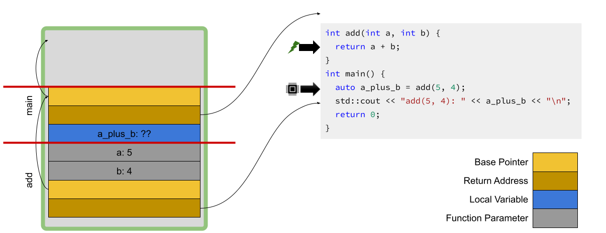
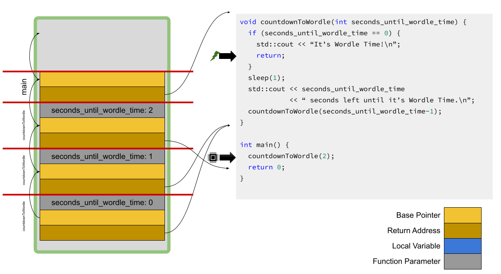

### What's News

State and city officials in New Paradigm, NY are considering deploying _dynamic_ pricing to set the fees levied on all drivers who _pass_ into C++ueens during rush hour. Commuters _argue_ that it will hurt their pocketbooks. The administration says that the revenue generated from the fees will be used to fixup the already _overloaded_ subway system.

### Variables and Memory

By way of refresher, all variables are associated with space in memory where the variables store their current value(s) while the program is running. The format and interpretation of the contents of the memory associated with a variable is based on the variable’s type.

### Stack Or Heap

Before beginning, I want to be very clear: The _stack_ that we are discussing here is very different than the _stack data structure_ that we are going to cover later in this course; The _heap_ that we are discussing here is very different than the _heap data structure_ that we are going to cover later in this course. You _will_ get asked about the difference between stacks and heaps in professional interviews. Be sure to clarify about which the interviewer is asking.

All volatile memory, a.k.a RAM, is the same _from a hardware perspective_. However, the operating system (OS) and applications break the single (logical) blob of bytes into two (logical) areas: the _stack_ and the _heap_. The stack contains the storage space for _automatically_ allocated variables.[^why] Colloquially, such variables are known as automatic variables. The heap contains the storage space for _dynamically_ allocated variables. Those are called _dynamic_ variables. 

[^why]: You will realize why it is called the stack before the end of this issue.

Automatic variables are variables whose management (allocation, deallocation, creation, destruction) is handled, well, _automatically_ by the compiler. Local variables are the best example of an automatic variable. Function parameters are also automatic variables. Allocation of memory for local and parameter variables is done by the compiler when they come into scope (see below!) and that memory is automatically deallocated when they go out of scope. All the storage for automatic variables is on the stack.

Manual or dynamic variables are variables whose management is handled explicitly by the programmer. The programmer is responsible for explicitly allocating, deallocating, constructing and destructing (or destroying) dynamic variables. All the storage for dynamic variables is in the heap. We will learn more about dynamic variables in future lectures.

### Scope, Lifetime, Allocation and Deallocation

There are several programming concepts that are interrelated and together define important attributes of variables.

The _scope_ of an identifier (usually a variable) is the range of statements in a program where that identifier is accessible. In C++, a good rule of thumb is that a scope is created everywhere you encounter a `{` and a scope is ended everywhere you encounter a `}`.

An attribute of a variable that we did not discuss in class (and one that is not normally considered when discussing these sorts of things) is _lifetime_. The lifetime of a variable is the period of program execution where a variable is associated with storage. _Usually_ the scope and lifetime of a variable are the same, but `static` variables throw a wrench in the works. Read more about `static` variables at [CPP Reference](https://en.cppreference.com/w/cpp/language/storage_duration#Static_local_variables).

When space in memory is allocated for the storage of a value of an object or a user-defined type (either automatically by the compiler or manually by the programmer), the constructor of that user-defined type may be invoked (as part of the variable's initialization). Once there is space for a variable and it has been initialized, that variable's lifetime has started. 

Of course, if there is a constructor for user-defined types then there must be a destructor. We will see below the syntax for a destructor. When the space in memory for a variable of a user-defined type is deallocated, its destructor may be invoked. When space for a variable has been deallocated and it has been destroyed, the variable's lifetime has ended.

### What Compiler Magic Can We Thank For Automatic Variables?

To a first approximation, C++ code can only execute in the contents of a function. That function might only be `main`, but we know that there is at least one. Therefore, the compiler can associate the storage space for all automatic variables with the function in which they are declared.

What are the fundamental characteristics of a function that the compiler must manage?

1.  Space for the function's local variables;
2.  Space for the function's parameters;
3.  A way to handle the allocation and deallocation of that space; and
4.  A pointer to the place in the program to continue execution after the function exits.

The compiler handles all that in a single data structure known as the _activation record_. This is also referred to as a _stack frame_. The "stack" in "stack frame" comes from two places:

1.  The fact that these data structures are "stacked" one on another during program execution (we will talk about this below); and
2.  The fact that these data structures are placed in stack memory.

For every function that is executed, the compiler allocates a stack frame. When a function is called, the compiler creates a new stack frame and tacks it on to the list of the stack frames of the other so-called active functions. A function is active as long as it has started executing but not yet finished executing (yes, that includes the time that it is "paused" waiting for a function that it calls to finish!). The compiler manipulates stack frames as if they were a stack. The result is that the compiler can only change the most recently added stack frame.

Yes, I know that earlier I said that stack memory and the stack data structure are completely separate. They are, but they do share conceptual similarities! Sorry, some things are just complex!



In the diagram above, both `main` and `add` are active and, therefore, both have a stack frame. As we said above, `main` is still active even though it is not currently running. It has started but has not finished -- it is paused waiting for `add` to finish! Notice that the stack frame for the invocation of the `add` function is below the stack from for the invocation of the `main` function. Remember earlier how we said that the compiler manipulates stack frames as if they were a stack? Well, we can draw on that knowledge to infer that a stack frame for `main` must _always_ exist when `add` is executing (assuming that `add` is called from the `main` function.) If you take further classes in computer science and C++ programming, this relationship will play a key role in software engineering.

Let's break down the components of an actual stack frame and see how they compare to the conceptual set of attributes that the compiler tracks for each function.

The _base pointer_ in the stack frame is the tool the compiler uses to handle the allocation and deallocation of automatic variables in the function.

The space for local variables come after the base pointer. The space for the function parameters come before the base pointer. The _return address_ is the element of the stack frame that helps the compiler redirect program flow to the next point of execution when the function completes.

Things get a little crazier when we consider what the stack looks like when the CPU is in the process of executing a recursive function!



Because `countdownToWordle` was initially invoked with a `seconds_until_wordle_time` of 2, there will be three activation records for `countdownToWordle` when the program reaches the point marked by the green arrow. The three activation records on the stack correspond to the three invocations of `countdownToWordle` that are active.

Think through the reason why there need to be three different copies of the activation record even though it is the same function executing. Pay attention to what would happen if we had local variables in `countdownToWordle` and reused stack frames. Could we have different values for those variables? Or would the compiler's reuse of the same space for the local variables cause a conflict?[^hint]

[^hint]: Yes, it _would_ cause a conflict and would make it impossible to have local variables in a function that calls itself recursively.

### Deallocation and Destructors

Remember earlier that we talked about how constructors for user-defined types may be called when objects of that type come in to scope and destructors for user-defined types may be called when objects of that type go out of scope?

We did not specify, then, the syntax for writing a destructor. Like a constructor has a very specific syntax, the syntax for defining a destructor in C++ is similar and specific:

```C++
    ~ClassName() {
        // actions that will execute when an object of ClassName 
        // type goes out of scope.
    }
```    

For an automatic variable (declared in a block -- e.g., in a function or the body of a loop or the `if` (or `else`) clause of a an if state), the destructor is guaranteed to be executed when the object of type `ClassName` is deallocated. That makes it a perfect place to put any code that frees "resources" opened by the class' member functions.

For example, it might be useful to write a `FileAccess` class that provides random access to a file on disk. Rather than open and close the file every time it is accessed, the constructor of `FileAccess` may open a file handle to the file from which to read and leave it open. To prevent data loss, `FileAccess` must safely close that file handle. But, it can only close the file handle when it will never be used again. When can that happen? When can `FileAccess` assume that its user will never access it again?

Exactly! When the instance goes out of scope -- or when the destructor executes! Therefore, the author of the `FileAccess` class would write the destructor to contain the code to free the resource – in this case that means closing the file handle!

The pattern of using constructors and destructors for managing the access to resources is so common in C++ that it has a name – _Resource Acquisition Is Initialization (RAII)_. You can read more about this pattern [online](https://en.cppreference.com/w/cpp/language/raii)

But, does this really improve our ability to write code that is correct? I would argue that the answer is yes. Let's continue to work with the `FileAccess` class above. Consider this function:

```C++
bool file_contains_credentials(const std::string &filename) {
    auto fa{open(filename.c_str(), O_RDONLY)};

    char username_buf[10]{0, };

    // Read the username from the file.
    if (read(fa, username_buf, 10) < 0) {
        // There was an error reading the first ten bytes (the username)
        close(fa);
        return false;
    }


    // Read the password from the file.
    if (read(fa, password_buf, 10) < 0) {
        // There was an error reading the second ten bytes (the password)
        return false;
    }

    close(fa);
    return authenticate(username_buf, password_buf);
}
```

Do you see the mistake? That's right, in the case when there was an error reading the password from the file there is a missing call to `close`. In that case, the function would terminate without closing the file handle which could leave data vulnerable to corruption. If we used the RAII pattern, the destructor would get called when the function terminated, _no matter how that termination comes about_:

```C++
bool file_contains_credentials(const std::string &filename) {
    auto fa{FileAccess{filename.c_str()}};

    char username_buf[10]{0, };

    // Read the username from the file.
    if (fa.read(username_buf, 10) < 0) {
        // There was an error reading the first ten bytes (the username)
        return false;
    }


    // Read the password from the file.
    if (fa.read(password_buf, 10) < 0) {
        // There was an error reading the second ten bytes (the password)
        return false;
    }
    return authenticate(username_buf, password_buf);
}
```

Now, no matter how it happens, when the function terminates, the destructor for `FileAccess` will get called and the underlying file handle will be properly closed! So, so cool!

```C++
int main() {
  FlexibleOrder forder{};
  Item item1{"banana"}, item2{"natural peanut butter"};
  forder.add(item1);
  forder.add(item2);
...
  return 0;
}
```