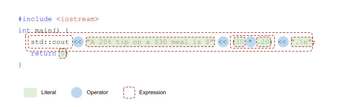

## What's News

California Psychics' business has grown to great heights by giving unsolicited tips to their clients on how to live their lives. The one thing that the groups of seers could not C++ coming? How AI-powered Ouija boards were going to disrupt their industry.

## Start Smart

Let's start with a basic C++ application that calculates the amount of tip that a nice, thoughtful diner will leave on a meal at **UC**hilis. 

If the famished philanthroper and their dining date spend $30.10, we would expect that they would tip %20 and add 

$$ 30.00(0.20) = 6$$

dollars to their bill.

Great, let's write that into a C++ program:

```C++
#include <iostream>

int main() {
    std::cout << "A %20 tip on a $30 meal is $" << 30 * 0.20 << ".\n";
    return 0;
}
```

From previous issues of the [C++ Times](./ProgramComponents.md) we know that each of the parts of a C++ program have names. Let's review the names of each of the components of this little program.



_Expression_ is a very, very important vocabulary word in C++. Anything in a C++ program that has a value is an expression.

Let me repeat: An _expression_ in C++ is _anything_ with a value.

In our tip program, what is the most obvious expression? That's right, `30 * 0.20`. When we _evaluate_ that expression, we absolutely get a value.

However, there are a ton of other expressions in just that little bit of C++ code: 

1. `30` is an expression (it's value is `30`).
2. `0.20` is an expression (it's value is `0.20`).
3. `"A %20 tip ..."` is an expression (weird, right?).
4. `0` is an expression.

We could go on, but I think that you get the idea!

One final time: Any expression in C++ is anything with a value. To get the value from the expression, C++ evaluates the expression.

If you and I were talking to other programmers, we could say something like, "The result of C++'s evaluation of the expression `30 * 0.20` is $6$."

Nice!

## Play To Its Strength

Besides its reputation as a language that allows us programmers to write very powerful programs in just a little bit of code, C++ is also known for its _type system_. That's a fancy term that simply describes the restrictions that a language places on how a programmer can use expressions based on their type.

Expressions have values _and_ types? What next? Rain and sun?

Every. Single. Value. In C++ has a type and C++, as a _strongly-typed language_ makes very sure that you know if you ever violate the rules that it places on the way that you can use values with different types.[^1]

[^1]: Just to be clear, a strongly-typed programming language is a programming language that always detects type errors.

Wait, _type_? What's that?? The type of a variable defines the

- range of valid values of a value and
- range of valid operations for a value.

In this class we will learn the five most important types in C++:

| Name | Valid Values | Valid Operations (examples) | Example |
| -- | -- | -- | -- |
| `int` | whole numbers | addition, subtraction |  `5`, `9` |
| `double` | decimal numbers | division, multiplication |  `5.45`, `3.14` |
| `char` | single character | |  `'a'`, `'B'`, `'1'` (YES!) |
| `bool` | true or false |  and, or | `true`, `false` |
| `std::string` | text |  concatenation | `"Hello, World."`, `"Go Cats!"` |

There are a few very important things to recognize in this table:

- `'c'` is a character and `"c"` is a string, even though they both contain a single c. The `'` is used to enclose a `char` and `"` is used to enclose a `std::string`.
- `'\n'` is a character, even though it looks like it contains two characters. Remember escape sequences?
- `double`s can hold whole numbers (i.e., `int`s are a subset of `double`s) but `int`s cannot hold decimal numbers.

The first four rows of the table above describe [_fundamental_](https://en.cppreference.com/w/cpp/language/types) (you may use the word primitive in place of fundamental if you'd like) types. Fundamental types are types built in to the programming language. The ability for the programmer to define their own types is another one of the incredible features of C++ -- and one that we are going to learn how to harness. Any types that we define using a combination of fundamental types (or other types that we wrote ourselves), are known as [compound types](https://eel.is/c++draft/basic.compound)!

Given the chart above, what are the types of some of the expressions that we have in our application?

- `"A 20% tip on a $30 meal is $"`: `std::string`
- `30`: `int`
- `0.2`: `double`

Here's something to think about as we progress further: `(30 * 0.2)` is an expression and, therefore, is a value and, (again) therefore, has a type. Just what type is that and does it matter?

We will see that it is not always easy to answer the first question but there is no doubt about the answer to the second: It matters very much.