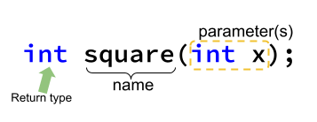

## What's News

Union organizers at the Federation of Aligned C++ Programmers (FOACP), have demanded that more of their statements work together in solidarity. The C++ language designers agreed to their negotiating demands and added a feature to the language.

## Functions

When statements in C++ program work together to accomplish a particular task that none of them could accomplish on their own, it makes sense to group those statements together in a unit and give them a name. We call the unit a _function_ and the name, if it's a good one, usually describes the action or task that those statements are performing.

Precisely, a _function_ is a combination of

1.  A set of statements
2.  A name for those statements.

Names of functions must follow the same rules as the names for variables.

Just like you have to declare a variable before you use it, programmers have to declare a function before they can use it. A function _declaration_ is a way to communicate to other programmers how to use a function.

Some functions calculate a _result_, some functions perform side effects (see below) and some do a combination of both. We use a function by _calling_ it (sometimes developers sometimes use the term _invoke_ as a synonym for _call_). A function call (or invocation) is just like any ordinary expression. The value of the function call expression is the function's result.

One of the really cool things about functions is that we can use them and take advantage of their calculations _without having to know how they do the work_! For instance, although we have no idea how to perform number-theoretic calculations, if another programmer defined a function that performed factorization of a very large number into two primes, we could still use their work![^crypto]

[^crypto]: If a programmer _did_ do that, they would be [worth a ton of money](https://en.wikipedia.org/wiki/RSA_(cryptosystem)#Integer_factorization_and_the_RSA_problem)!.

Working with something (like a function) without worrying about its details is called _abstraction_. Abstraction is the process of removing the detail to simplify and focus attention on the essence.[^abstr] There's another way to say the same thing that is a little pithier: Abstraction is the process of remembering what is important in a given context and forgetting what's not.

[^abstr]: (J. Kramer, ``Is abstraction the key to computing?,'' Communications of the ACM, vol. 50, no. 4, pp. 37–42, Apr. 2007, doi: 10.1145/1232743.1232745.)

To reiterate, abstraction is just a fancy term for hiding details. The person who writes a function that we use knows the details of how the function does its work but we, the users, do not. We (again, the users) only care about _what_ the function does and not _how_ it does it.

#### Functional Side Effects

If I take medicine to control my headaches but it makes me dizzy, I would say that medicine has a side effect. Side effects from medicine are physical effects on your body that are unrelated to the medicine's purpose. But medicines aren't the only things that can have side effects -- functions can have side effects, too.

To understand side effects in programming languages (especially C++), we have to recognize that programs have _state_ when they are executing. A program's _state_ at a certain point of execution consists of the value of all the variables in memory at the time. In other words, a program's state is a combination of
1. a point of execution in a program, and
2. the contents of the program's variables at that point.

Any change to the state of the program that may affect the user of the function is known as a _side effect_. When we learn about global variables and defining functions, we will see an actual example of a function that has a side effect -- it will be perfectly clear then.

The term "side effects" has a negative connotation in programming and computer science but they don't have to be all bad. If it were not for side effects, we could not write programs that display data on the screen, print papers on the printer or connect to webservers over the Internet.

Side effects _are_ bad when it makes it hard for you to reason about the correctness of a program.

#### Reading Function Declarations

In "Math World" we could write a function that squares a number. We would write that like $f(x) = x^2$. The function _evaluates_ to the square of the value of $x$, _a parameter_. A _parameter_ is a variable defined by the function for use in the implementation. A parameter goes with the function declaration.

Like $f$ (above) evaluates to the square of its parameter $x$, functions in C++ evaluate to values, too.[^void]

[^void]: There are such things as `void` functions in C++ but we will skip past those for the moment.

We could declare the function $f$ in C++ like

```C++
int f(int x);
```

But, that really leaves something to be desired: What does `f` do? Because we aren't charged by the character, programmers usually give our functions name that describe their utility. In this case, the function $f$ calculates the square of its parameter. The person implementing the function, then, probably calls the function `square`:

```C++
int square(int x);
```

The function's name is `square`. Inside the `(` and `)` are the function's parameters. In this case, there is one parameter named `x` and its type is `int`. The `square` function _returns_ a value whose type is `int` (we can tell because of the `int` to the left of the function name). 



As we have said before, it is really important that as we become better C++ programmers and grow as computer scientists, we learn how to communicate with our peers. How do we talk about function declarations? Well, when you are talking to other programmers, you would _speak_ the function declaration above as "The `square` function takes a single parameter (whose type is an `int`) and returns an `int`."

Here's another example:

```C++
double pow(double base, double exp);
```

The function's name is `pow`. This function has two parameters and they are both `double`s. The `pow` function returns a value whose type is `double` (or "The `pow` function returns a `double`.").


#### Using Functions

Again, in order to use a function, we have to _call_ it (or _invoke_ it -- these terms are synonymous). We can call a function that returns a value anywhere that we could write an expression. Wait, that's cool: calling a function that returns a value is an expression just like any other expression! For example, we could assign the result of a call to `square` to a variable:


```C++
#include <iostream>

int square(int x);

int main() {
    int two{2};
    int square_of_two{square(two)};
    return 0;
}
```

In this call to `square`, we are passing an _argument_ of `two`. Arguments are part of the invocation of a function and pair up with parameters. As we said above, the parameters are the variables that the person implementing the function gets to use. They have to get their value from somewhere, don't they?! In this case we are pairing the argument `two` with the parameter `x`. _Notice that the type of the argument and the type of the parameters have to match. This is very important!_ After this line of code executes, the variable `square_of_two` will hold the value `4`.

Or,

```C++
#include <iostream>

double pow(double base, double exp);

int main() {
  double three{3};
  double three_cubed{pow(three, three)};
  return 0;
}
```
In the invocation of `pow` in this snippet we are passing arguments of `three` and `three`. The first `three` is paired with the `base` parameter and the second `three` is paired with the `exp` parameter. 

Notice that the `base` and `three` are only tangentially and temporarily related? The same is true for `three` and `exp`? What do I mean? The relationship between the arguments and the parameters is fleeting (at least according to what we know so far). When we invoke a function, the value of the parameter is given its initial value for that execution based on a _copy_ of the initial value of the argument! That's really key -- at an invocation, the value of the argument is _copied_ into the parameter. When we start to talk about how we can implement our functions, we will see why this is so profound and see ways to change the parameters (pun _absolutely_ intended) of that connection.

After the line of code with the function invocation executes, the variable `three_cubed` will hold the value 27. But wait, 3 and 3 are `int`s and `base` and `exp` are `double`s. Didn't I just say that the types of the arguments must match the type of the parameters?! Yes, I did. In this case, C++ coerces the `int`s to the higher rank of `double` (just the way that it would when it coerces `2` to `2.0` in `3.0/2` -- what we learned last class!).

But, we can do more with function calls than just assign their results to values. We can use them as part of an expression that is assigned to another variable:

```C++
#include <iostream>

double pow(double base, double exp);

int main() {
  double three{3};
  double v{8.0 + pow(three, three)};
  return 0;
}
```

Upon initialization of `v` its value is `35`. We can also use function calls in `std::cout` statements:

```C++
#include <iostream>

double pow(double base, double exp);

int main() {
  double three{3};
  std::cout << "Three cubed: " << pow (three, three) << "\n";
  return 0;
}
```

which prints

```
Three cubed: 27
```

Solidarity.

## Declaration or Definition?

There's something curious in the language we have used so far when talking about functions in this edition of the _C++ Times_. Did you notice it? We have referred to function _declarations_ and not _definitions_. Like variables, we know that functions have to be declared before they are used. We normally say, though, _declaration/definition_ for variables. Why the difference?

There is an important, but subtle, difference in C++ between the _declaration_ and _definition_ of a variable/function. The point of doing either is so that we can use that function or variable in our code. The _declaration_ gives only enough information for the programmer to write that name in their source code and for the compiler to generate code that uses that name. A _definition_, on the other hand, is what the compiler needs in order to make such an entity exist. A variable needs some space in memory to exist and a function needs some code to execute -- just what the definition of a variable and function provide, respectively.

While it is possible to declare a variable separately from its definition, it is not common. That's why we typically say declaration/definition when we refer to declaring/defining (sorry!) a variable.

It _is_ very common to declare a function separately from its definition. And that is just what we have been doing in this edition of the _Times_. The ability to keep the declaration and definition separate improves our code by keeping up the abstraction -- the programmer does not know (nor can they know) how the function does what it does if they only have access to the declaration! No [Lyin' Eyes](https://www.youtube.com/watch?v=2PTEqZURh4o) here.