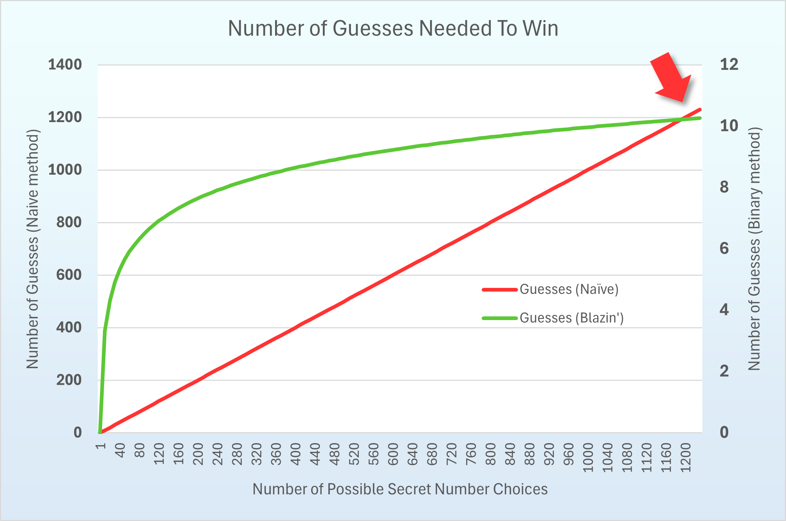

## Do you want to play a game?

There are so many fun things that we can do as programmers -- one of the really neat things that we can do is write games.

What's better than a game? Well, a game that can help you learn something new, obviously! And that is exactly what we are going to
do today. In writing our game, we have three goals:

1. Practice calling functions;
2. Practice using selective execution; and
3. Learn binary search.

### Simple Game? Hours of Fun!

One of the first games that we learn how to play as a child is one where only mindreaders can win: we get to secretly choose a number and then we ask another player to guess that secret number. The best part about this game is that we are almost _always_ the winner. There are just so many numbers in the world and (_usually_) the other player is not [Carnac](https://en.wikipedia.org/wiki/Carnac_the_Magnificent). So, we have a distinct advantage.

- _Us_: I am thinking of a number. Can you guess it?
- _Them_: $5$?
- _Us_: No! I win!

See how easy that is? Well, let's try to make the game a little more fair. If we don't give the other player at least a fighting chance,
then we are likely to be very lonely. Let's give the other player the chance to make more than one guess before we declare ourselves the winner. If any of their guesses is correct, then we will say that they win. We'll give them another advantage. Instead of just telling the other player whether their guess is correct,
we will tell them whether their guess is too high or too low.

- _Us_: I am thinking of a number. Can you guess it?
- _Them_: $5$?
- _Us_: No, you are too low.
- _Them_: $6$?
- _Us_: No, you are still too low.

...

- _Us_: Well, I've given you all the chances I am willing to give you. I win!

We will make one more concession: We will tell the other player the range containing the number we choose. 

- _Us_: I am thinking of a number between 1 and 100. Can you guess it?
- _Them_: $5$?
- _Us_: No, you are too low.
- _Them_: $6$?
- _Us_: No, you are still too low.

...

- _Us_: Well, I've given you all the chances I am willing to give you. I win!

Obviously we are not going to give our competitor the same number of guesses as there are numbers within the range that we choose. That would make it possible for them to simply guess

1, then 2, then 3, and so on ...

until they get the right one.

### Just How Many Hours of Fun?

Before we start to write code for our game, let's do some additional analysis. We are interested in determining the number of guesses that it will take in order for our competitor to win the game.

Of course, there are many ways that our competitor could choose to make their guesses. They could guess randomly, for instance. In this analysis we will assume that our competitor plays systematically by guessing sequentially starting at $1$. In other words, our competitor guesses

1, then 2, then 3, then 4 ... then $n$

Assuming this strategy, we will do a conservative analysis to make a prediction about the number of guesses that our competitor would have to make in order to win the game. Just what do we mean by _conservative_? Hold that thought!

From the perspective of our competitor, the best case is that the secret number we chose is 1. That means that they will need to make only a single guess in order to win the game. On the other hand, the worst case for them is that the secret number we chose is $n$. That means that they will have to make $n$ different guesses in order to win. 

As you grow as a computer scientist, you will realize that we are a very, very pessimistic bunch and that we like to analyze as if the worst-case scenario always occurs. That is what we mean by _conservative_. Doing a worst-case, conservative analysis in this case means that no matter how many times we play the game with our competitor, the number of guesses that they need to win the game is _never_ more than our prediction.

As an example, if we use our analysis to predict that the competor can always win the game in fewer than $x$ guesses, then the competitor should win the game in fewer than $x$ guesses, no matter what number we are asking them to try to guess!

Under the assumptions that
1. We can choose a secret number anywhere between 1 and $n$,
2. The competitor starts guessing at $1$, and
3. The competitor increases their guess by $1$ every time

we conclude our analysis by conversatively predicting that it will never take our competitor more than $n$ guesses to win the game.

Why would be want to do such an analysis in such a, well, odd way? Let's consider what might happen if we are willing to negotiate with our competitor about the number of guesses that we are willing to give them. If our competitor competes according to the algorithm described above and they want to be assured of winning every time that we play the game, then they should negotiate for at least $n$ guesses. After all, we just determined that, in the worst case, they will need $n$ guesses to win!

We will return to this analysis in a second. In the meantime, think about whether or not or competitor can improve their techniques.

### Let's Play

In order to help you think about a better technique for competing in this game, you are now going to take the role of the competitor and I am going to be one that chooses the secret number. 

I have chosen a number between 1 and 100. How are you going to guess? How will you know that you won? You will call a function! 

That function is named `guess_and_check`. It has a single parameter (whose type is `int`) -- that is your guess. The return type of the function is an `int`. The value returned by the function is `0` if you guessed correctly. The value returned by the function is `-1` if your guess was too low. The value returned by the function is `1` if your guess was too high.

| Guess Relative To Secret Number | `guess_and_check` Return Value |
| -- | -- |
| Too high | `1`
| Too low | `-1`
| Just right[^resist] | `0`

To play the game I have set up a skeleton on Godbolt. Open [https://godbolt.org/z/cK9YKb3f3](https://godbolt.org/z/cK9YKb3f3) in a separate tab of your browser to play along!


If you look at Line $4$ of the code, you will see the declaration for the function:


```C++
int guess_and_check(int guess);
```

That is just what we suspected it would look like given the description above.

There's no time to waste. Let's get started playing.

To make your first guess, add a call to the function in `main`:

```C++
guess_and_check(1);
```

The complete code for your `main` should now look like:

```C++
int main() {
    guess_and_check(1);
    return 0;
}
```

It looks like you are taking the approach of the theoretical player that we analyzed above. Great.

There's just one problem with the code that you have written, though. Can you see what it is? Because you did nothing with the return value of the function, you have no idea whether your guess was correct. What's more, if you were wrong, you have no idea whether you were too low or too high.

You can fix that by storing the return value into a variable. You might choose a good name for that variable like `guess_result`:

```C++
int guess_result{guess_and_check(1)};
```

The entire code for your `main` should now look like:

```C++

int main() {
    int guess_result{guess_and_check(1)};
    return 0;
}
```

Better. However, unless you _are_ the computer, you have no way of knowing the value of the variable `guess_result`. Let's print out the result to the screen so that we can see its value:

```C++
std::cout << "The result of your guess was " << guess_result << "\n";
```

The entire code for your `main` should now look like:

```C++
int main() {
    int guess_result{guess_and_check(1)};
    std::cout << "The result of your guess was " << guess_result << "\n";
    return 0;
}
```

Better! Now you know that your initial guess was too low. How do you know that? For one thing, I was not allowed to choose a number smaller than 1! But, you also know because the output looks like:


```
The result of your guess was -1.
```

It would be even better if you also printed out what you guessed. 

```C++
    std::cout << "The result of your guess of 1 was " << guess_result << "\n";
```

The entire code for your `main` should now look like:

```C++
int main() {
    int guess_result{guess_and_check(1)};
    std::cout << "The result of your guess of 1 was " << guess_result << "\n";
    return 0;
}
```

I'll assume that you want to guess again and I bet that you want to guess 2 this time.

```C++
    int guess_result{guess_and_check(2)};
    std::cout << "The result of your guess of 1 was " << guess_result << "\n";
```

The entire code for your `main` should now look like:


```C++
int main() {
    int guess_result{guess_and_check(2)};
    std::cout << "The result of your guess of 1 was " << guess_result << "\n";
    return 0;
}
```

Well, don't look now, but your code has a _bug_. Logically, the value in `guess_result` is the result of your guess of 2. However, your output says that it describes the output of guessing 1. What did you do? Well, you simply forgot to change the second line of code. Before rushing to a fix, let's take a step back and examine what we had to do to our existing code in order to make a different guess. We had to make _two_ changes:

1. The argument to the `guess_and_check` function; and
2. The contents of the string literal in your output.

I bet that you can rewrite your code so that you can make a new guess by changing your code in only one place. 


```C++
    int guess{2};
    int guess_result{guess_and_check(guess)};
    std::cout << "The result of your guess of " << guess << " was " << guess_result << "\n";
```

The entire contents of your `main` should now look like this:

```C++
int main() {
    int guess{2};
    int guess_result{guess_and_check(guess)};
    std::cout << "The result of your guess of " << guess << " was " << guess_result << "\n";
    return 0;
}
```

Really, really nice!

I'll make another wager that you are just as forgetful as I am and that it might be hard for you to remember what the values in `guess_result` indicate. You could improve the output of your program so that it is more descriptive. You might start by doing something like replacing the output statement with an if statement:

```C++
if (guess_result == 0) {
    std::cout << guess << " is the secret number! I win!\n";
}
```

The entire contents of your `main` should now look like this:

```C++
int main() {
    int guess{2};
    int guess_result{guess_and_check(guess)};
    if (guess_result == 0) {
        std::cout << guess << " is the secret number! I win!\n";
    }
    return 0;
}
```

That looks like really nice. Unfortunately you have taken a _small_ step back. With your code as it is written, you can only tell whether you have won the game. If you did not win the game, you have not identified whether your guess was too low or too high. Doing better does not require much additional code:

```C++
if (guess_result == 0) {
    std::cout << guess << " is the secret number! I win!\n";
} else if (guess_result < 0) {
    std::cout << guess << " is too low. I'll try again.\n";
} else {
    std::cout << guess << " is too high. I'll try again.\n";
}
```

The entire contents of your `main` should now look like this:

```C++
int main() {
    int guess{2};
    int guess_result{guess_and_check(guess)};
    if (guess_result == 0) {
        std::cout << guess << " is the secret number! I win!\n";
    } else if (guess_result < 0) {
        std::cout << guess << " is too low. I'll try again.\n";
    } else {
        std::cout << guess << " is too high. I'll try again.\n";
    }
    return 0;
}
```

Nice work! Why didn't you use an `else if` at the end? Ah, yes, because you knew that after checking whether the guess was correct and whether the guess was too low, there was only one other possible outcome. Very cool!

### It Was The Journey, Not the Destination

What you have written is excellent -- a great bit of code to play the game. Make some additional guesses and see whether you can determine my secret number.

I'll wait.

While I do, I will tell you why I think that your code is excellent:

1. You perfectly used an if statement to selectively execute statements that gave you information about the value of a variable.
2. You have named your variables really well. So well that you will be able to read and understand this code when you return to it in a few days.
3. You initialized all your variables at the time that they were declared/defined. That minimizes the chance that you might make a change to the code and use a variable with an indeterminate value.
4. You used `{` and `}`s around all the conditional statements. Even though that is not a requirement in the C++ language, it will help protect you from making careless mistakes.

Now that I've waited long enough, I will assume that you are tired of guessing and probably still haven't gotten the secret number!

### I WIN -- Or Do I?

There's got to be a better way to guess, doesn't there? You probably figured out a better technique, but if not, let's take a look.

You know that my secret value is somewhere between $1$ and $100$. Let's go crazy and make $50$ as our first guess.

What does your program tell you? That's right, that your guess was too low.

Given that information (that you guessed $50$ and that it was too low), what have you learned? You learned that there is no reason to guess any of the numbers between $1$ and $50$! How cool is that?! You eliminated a huge range of possibilities with a single guess. In fact, you eliminated half of them!

So, how should you guess next? I assume that you would like to again eliminate half of the remaining values with your next guess if it is not correct? Then I think that you should guess $75$!

What does your program tell you? That's right, that your guess was too high!

Given that information (that you guessed $75$, that it was too high and that the secret number is greater than $50$), what have you learned? You learned that it would be foolish to choose anything between $1$ and $50$ or $75$ and $100$ as your next guess! In two guesses you have elimited $3/4$ of the potential values.

Want to try again? Yes! $62$ (or $63$ -- why do you get a choice?) is a great guess. Why did you choose that? Of course, because you wanted to eliminate another big group of values. 

Your guess? Well, it was still not right, but what do you know? You know that my secret number is not between:

1. $1$ and $50$
2. $75$ and $100$
3. $50$ and $62$/$63$.

That means that it is somewhere between ... $62$/$63$ and $75$!

With only a few more guesses, I would imagine that you can win the game! Congratulations!

### Good, Better, Guess.

You just played the game optimally! Very well done. What's more, you just played the game using something called a binary search. A binary search is a very, very powerful technique in computer science. 

Why?

Let's go back to our original analysis about the number of guesses that it would take for our naive competitor to win the game. We said that it would take them $n$ guesses, where $n$ was the biggest number that we could choose as the secret value.

With the binary search technique, do we have a different analysis? In fact, we do!

> PS: Now that you showed how smart you are and beat me, I want you on my side! So, you'll be in the _we_ during the upcoming discussion about _our_ competitor!

First, let's assume that our competitor is a really, really bad guesser (or they just have really bad luck)! The only time that they are able to guess the secret number correctly is when there is only a single possibility! 

If we assume this about our incompetent competitor, does that mean that they cannot use the binary search method? Absolutely not! What it does mean is that our analysis of the number of guesses that they will take the win the game using this technique is conservative (there's that word again!). As we said earlier, that's actually really helpful!

We know that the our competitor can only guess the secret number when they narrow it down to a single possibility. If there is more than one possibility, they have to continue playing following their binary search strategy.

Here's where the analysis gets interesting! You and I will pick a number between $1$ and $n$, like normal. Our competitor makes their first guess. (Remember, they are a _really_ bad guesser). When they get ready to guess again, how many possible values are there remaining for them to choose from? That's right, $n(\frac{1}{2})$ They guess again and are wrong again (sad trombone!). When they get ready to guess again, how many possible values are there now? You are really getting good at this: $n(\frac{1}{2})(\frac{1}{2})$. They go again and now they have have $n(\frac{1}{2})(\frac{1}{2})(\frac{1}{2})$ choices.

Ultimately, they will succeed when $n$ is halved enough times that it equals $1$ -- that is the first and only moment when our competitor's guessing skills shine! Let's say that it takes them $g$ guesses to win. It would be nice to have a formula to determine the value of $g$.

And we can! We will say that dividing $n$ by half $g$ times yields $1$ and, therefore, means that our competitor is a winner! We could write that like 

$$
n\frac{1}{2}\frac{1}{2}...\frac{1}{2} = 1
$$

and we use the $...$ because our hand would get tired writing all those $\frac{1}{2}$ s. However, we could also write it like this:

$$
n\frac{1}{2^g} = 1
$$

Pretty neat. Let's rearrange a little:

$$
n = 2^g
$$

And now we need some way to isolate $g$. What are we going to do? I looked it up for you and found out that 

$$
log_2{2^x} = x
$$

Right on! Let's take the $log_2$ of both sides:

$$
log_2{n} = log_2{2^g}
$$

and simplify

$$
log_2{n} = g
$$

That's a ton of hard work, but I think that it paid off! What did we learn? We learned that our down-on-their-luck competitor follows the binary search strategy, they can win the game in $log_2{n}$ guesses no matter what, even though they have the worst guessing skills.

### Never Let It Rest

That's all well and good, but is that really a big improvement over the naive method for playing the game that we analyzed earlier?

Recall that the analysis of our naive "incremental guess-and-check" method showed that the competitor would need (in the worst case) $n$ total guesses to win the game. As a result, the bigger the range containing the secret number, they longer it could take for them to win! 

Let's compare that with the number of guesses that our brainy binary competitor would require to play the same game with $n$ possible secret values. A picture is worth a thousand words, so let's plotting them together on the same graph.



Before you get too excited, be sure that you notice the different axes. The number of guesses our binary blazer needs to guarantee a win seems to reach a limit even as the number of possible secret numbers continues to increase (those guess numbers are on the righthand $y$ axis) whereas the naive numberator's required guesses simply continues to increase (those guess counts are on the lefthand $y$ axis). 

Take particular note of where the two lines intersect (highlighted by the red arrow). That intersection shows just how much better the binary technique is than the naive technique. In a game where there are $1200$ possible secret numbers, the player using the binary technique is guaranteed to win in fewer than 12 guesses. On the other hand, the gullible guesser will require (approximately) $1200$. 

## And Now You Know The Rest of the Story

And now you know why the binary search is so powerful. If you can look through a set of values and use binary search to find the one you seek, that's a huge benefit. Think carefully, though, about the requirements that need to exist to be able to use binary search -- there's no such thing as free lunch. 

Besides learning some _algorithmic analysis_ you also got a chance to practice calling functions, using properly named variables and writing if statements. I'd say that's a really good day's work.

Now, if you are the first one to tell me my magic number, there might just be something special in your future!

[^resist]: I couldn't resist.