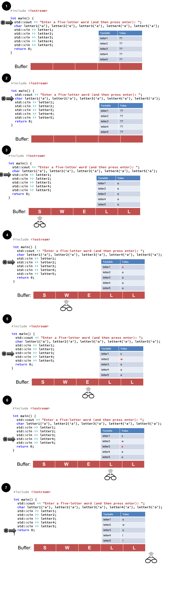
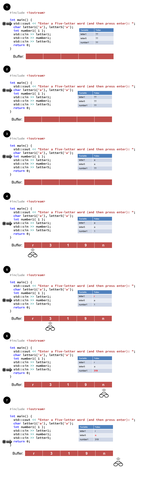
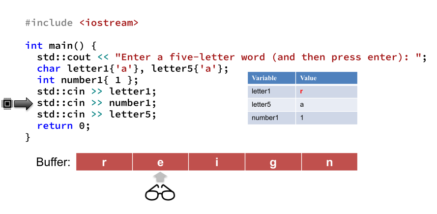
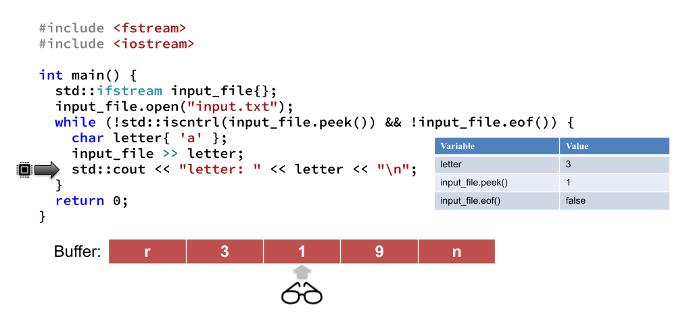
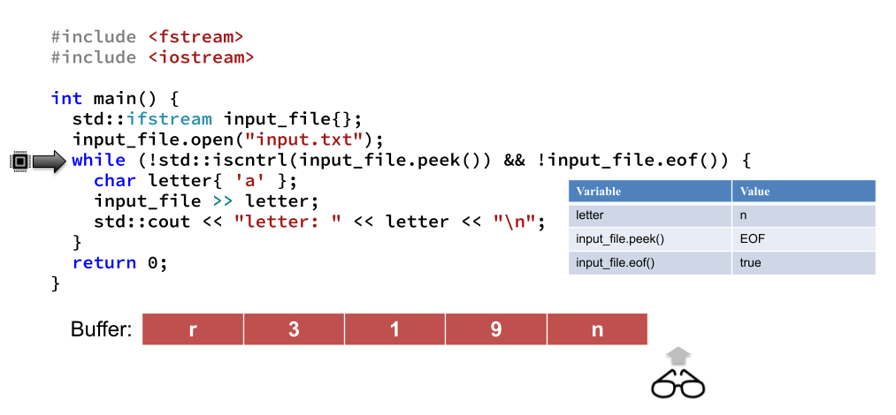

## What's News

After years of exploring the deserts of the Mt. Auburn looking for artifacts that could describe what is what like to live before the the Internet, archaeologists have found files that describe just how difficult it was in the 90s to get cookies delivered at any time of the day.

## Reading Rainbow

Every program performs exactly three tasks:

1.  Input
2.  Processing
3.  Output

So far our input and output have all gone through the screen or the keyboard. We have asked the user to type their input on the keyboard and displayed the output to the screen. Generally, input and output are known as I/O (or just IO). In programs written in industry, most of the IO is done through files on disk, connections over the network or more sophisticated user interfaces than we have learned how to write to date.

We are ready to move forward and do more sophisticated IO using files. What is really neat is that the syntax and concepts that we have learned so far to handle IO through the keyboard and screen are _almost identical_ to the syntax that we use for handling IO through files. (Note: There are many other types of IO that C++ can do using the same syntax.)

Before moving to learning how to handle file IO we can stay in our comfort zone and learn some very important concepts that we are going to rely on extensively (and I mean, _extensively_) for the remainder of the class. To reiterate, we are learning here about IO through the console (keyboard and screen) but the knowledge gained is applicable to file IO. In fact, it's almost identical!

## Keep Your Head On Straight

The IO that we will explore in this course is _sequential_. We have seen that term before -- remember how we used it to define program execution before we learned about `if` statements and loops? Well, the concept is similar with IO. With sequential IO you cannot read a particular byte of data without reading everything that comes before it. Think about what happens if you are working with a large file (say the original data files for a feature-length 3d movie) and only want to read the very last byte. Well, using sequential file access, we would have to read through the entire large file before getting to the data that we want. Compare that to _random access_. If you are performing IO with random access then your IO system gives you the power to specify access to any byte directly. So, going back to our movie file example, in a random access system we could jump directly to the end of the file and read that byte! There are benefits and drawbacks to each approach.

As we look at our code while we are debugging or writing a program, we create a mental model about the state of the computer while the program is executing. We keep track of the current line of code that is executing, the contents of variables, etc. Well, when we are working with sequential IO, there is yet another thing that we programmers need to keep track of; we will keep track of position in the data that we are reading that represents the place where we will perform our next access. There are usually two of these positions: one that represents the place where we are going to read from next and one that represents the place where we are going to write to next. Usually these two are the same, but they can be different!

These locations are variously called the read/write head or the read/get (write/put, resp.) position. There are a few ways to manipulate (advance or recall) these positions. Some of them are more technical than others. The good news is that the syntax that we have already learned (the `>>` and the `<<` stream insertion and extraction operators) handle changing the location of the head/position automatically! Very cool!

Don't panic! There is nothing sinister or occult about the head/position. In fact, it is perfectly analogous to how you keep track of exactly which statement or expression your program _just_ executed and exactly which statement or expression you program will execute next.

Take a look at the execution of the following program that reads the 5 `char`acters that the user enters on the keyboard.



It takes the program (approximately) 7 steps to read the 5 `char`acters that the user entered. Why doesn't the user's input appear in the `Buffer` as soon we print the prompt using the `std::cout`? Or, perhaps, why doesn't it appear after we declare the variables `letter1` through `letter5`? Well, the operating system helps the user by giving them the chance to modify their input before it is passed the program that will read and process it. If it were otherwise, it would be very difficult to interact with computers -- we would have to be perfect typists 100% of the time!

The buffer is filled with the input from the user only after the user presses _Enter_. At that point, if the user went wild (_CRAZY_) and disobeyed our prompt and typed 6 characters we would see all six of those characters in the buffer. Each of the numbered steps between 3 and 7 show how the `>>` operator changes the value of the variables `letter1` through `letter5` _and_ advance the read head (get/read position) at the same time. The snapshot of the program in Step 4 indicates that it is about to execute

```C++
std::cin >> letter2;
```

and the read head is pointing at character `W` in the buffer. The type of the variable `letter2` is really important here. Why? Because it tells C++ exactly how much (and what kind of) information to read from the buffer. A character is the most forgiving type of data to read. There are really no restrictions on what can be read using IO and stored into a character. The only downside is that it is limited to a single byte. The result is that in the snapshot of the program at Step 5 , `letter2` contains the single character that was "under" the read head when the `std::cin >> letter2;` statement expression was executed -- `W` -- and the read head was advanced. Just as we predicted!

## Get 1337 With Input

In so-called "1337 speak" (leet, slang for elite), the speaker goes back and forth between letters and numbers when communicating in writing. So, if a 1337 peaker wanted to say, "UC is awesome", they might type something like, "uc 15 4w350m3".

Let's write a little parser for sentences that user type in 1337 speak. What's a parser? [Merriam-Webster's dictionary](https://www.merriam-webster.com/dictionary/parse) says that parsing is a way "to divide (a sentence) into grammatical parts and identify the parts and their relations to each other." Have you ever worked with a computer program that parses text? Yes, of course you have! One of the key steps in compilation is parsing -- the compiler needs to put some structure around the statements that you type if it is going to have a chance to make sense of the code!

So, we want to write a program that will

1.  read a single character;
2.  read a number;
3.  read another single character.

In other words, we want to write a program that will parse out a string of text that consists of a single letter followed by a single character followed by a final single character.

We could easily write such a program by just reading one character at a time in a loop. However, that would be hard. We would have to check each character that we read to determine if it was a digit. Reading the first character would be easy. However, things would get significantly harder when we tried to read the number.

If the number were between 0 and 10, then, yes, things wouldn't be that hard. What would happen, however, if the user wrote something in 1337 that contained a number greater than 10? Greater than 100? Then we would have to keep track of whether we have seen more than one digit in a row. Finally, we would have to convert those individual digits to a decimal when we see the first non-digit after having seen a sequence of them. Whew. That just sounds hard.

Fortunately we don't have to do that. Remember how important it was that the type of the variables `letter1` through `letter5` were `char`acters? That's because C++ uses that type information in order to determine how to read. C++ works just as well if you use `>>` to read in to a variable whose type is something other than a character!

Check out how this works:



As before, once the user presses _Enter_ and confirms their input, the entirety of their submission appears in the buffer. As before, the first `char`acter of the input buffer is read and stored in `letter1`. The state of the program after that read is captured in Snapshot 5. At this moment, the read head is hovering over the `3` and our code is poised to use the `>>` to read data in to a variable. Just what type of variable, though? That's the important question. An `int`eger! Therefore, the `>>` operation will attempt to read as many elements from the input buffer as constitute a valid integer. As soon as it sees the first element from the buffer that could not possibly be part of a number, it stops and that's where the read head sits after the `>>`. This is shown in Snapshot 6. Now. How. Cool. Is. That?

## Not Everything Is Sunshine and Roses

That's all fine and good and works well as long as the format of the input matches exactly the format that we (the programmers!) expect. What happens when, say, our code is attempting to read an `int`eger from a buffer using the `>>` operation and there is no number there to read? This situation is exactly what is depicted below:



Here we have written code that is attempting to read a value from the buffer into an `int`eger. But, at the position of the read head there is no number to read! Fortunately our `>>` operation turns out to be an expression, in disguise!

```C++
std::cin >> variable
```

can be used where a `bool`ean is expected and, when it is, its value is `true` if the read from `std::cin` to `variable` succeeded and `false` if it failed! Really neat and powerful.

So, if we want to check whether the read of an `int`eger into `variable` declared like

```C++
    int variable{0};
```

succeeds and print out a helpful error message if it does not, we could write code like this:


```C++
#include <iostream>

int main() {
  if (!(std::cin >> variable)) {
    std::cout << "Sorry, an error occurred!\n";
  }
  return 0;
}
```

That is incredibly powerful!

## The End is Near

Let's say that we invite our user to enter an unbounded amount of data. We will need some way to write a program that continually reads the input until there is no more. Did you hear that? "until there is no more" That sounds like a condition to me. What better way to loop based on the value of a condition than a conditional loop like `while`.

But, just what are the conditions for stopping the loop? Well, we will want a condition that is `false` when we want the loop to stop. In our snapshots above we have seen the read head ends up in la-la land after we read the last element. It turns out that this fantasy world has a special name -- end of file (EOF, for short). We can always ask our input stream (for now, `std::cin` but later a variable whose type is `std::fstream`) whether it is at the end of file by calling the `eof()` method (a method is like a function -- we'll get to that soon!).

Sometimes, however, just checking whether the read head is at the end of the file is not enough. There are situations where the file has extra, hidden data at the end of the input (known as control data). We don't want to consider that part of the real input, so we want to quit if the read head is at the position where there are these control characters.

Again, we want a `false` when there is no more data to read so we will need to make extensive use of the `!`. Here's our condition in pseudocode:

_while_

1.  The read head is not hovering on a control character and
2.  The read head is not hovering over the end of file

_continue reading._

To write that statement we will need a combination of the `peek` method, the `std::iscntrl` function and the `eof()` method.

1.  `peek()`: Returns the character where the read head is hovering but _does not advance the read head_
2.  `std::iscntrl()`: Takes a character and returns `true` if that character is a control character and `false` otherwise.
3.  `eof()`: Returns true if the read head is hovering at the end of the file and `false` otherwise.

Put it all together and you have something that looks like:



Where the program is frozen, there is still more data to be read. Given the position of the read head, the return value of `peek()` is `'1'` and the return value of the `eof()` function is `false`.

But, after a little more work, the situation is different:



Here the return value of `peek()` is ..., well, something and the and the return value of the `eof()` function is `true`. Flip around that `true` because of the `!` and you will get a `false`. Anything `&&`'d with `false` is false so, therefore, the condition controlling the behavior of the loop is `false` and the loop terminates.

Great job!

## Reading From Files

So far our programs have only been able to interact with the user through the console. A program that interacts with the user (for any reason) in real time is called an _interactive_ program. But, as you know, users store their data in files and don't want to have to retype that data every time they execute a program. Programs that can execute without any user interaction are known as _batch_ programs. You have used batch programs every Monday or Tuesday or Wednesday or Thursday this semester. What is it?

Bingo, the compiler. The compiler operates without any user interaction -- it simply reads input from a file (i.e., your course code), performs some operation and generates some output. A program that transforms a Word document into a PDF is another example of a batch program.

We are going to learn how to interact with files through a _stream_ interface. You have extensive experience with stream interfaces already: our programs to this point have interacted with the user through the keyboard/screen using a stream interface. In fact, the syntax for working with files has eerie parallels to the syntax used for working with the console.

To have access to the code necessary to instantiate/use file stream objects, we have to `include` the `fstream` header instead of (or in addition to) the `iostream` header:

```C++
#include <fstream>
```

We will use a variable whose job it is to help us access or update the data in the file. The type of that variable specifies that those operations are available and makes it easier for us to recognize its meaning within our program. We will name the _variable_ `input_file`:

```C++
    std::ifstream input_file{};
```

`input_file` is a variable (technically an object -- we'll come back to the distinction later) whose type is `std::ifstream` (short for _input file stream_). The type signals that the only operations we can perform on this variable are operations that read. To be very clear, we have not yet associated the `input_file` _variable_ with any actual file! Just because you have declared a variable whose type is `std::ifstream` does not mean that you have a file with data to back it up! More importantly, the name of the _variable_ is not the same as the name of the _file_ behind it!

Given those caveats, usually the first thing that you do after declaring a `std::ifstream`-typed variable when is to open it! You choose which file to associate with the variable by specifying the name of the file as an argument to the variable's open _method_.

```C++
#include <fstream>
#include <iostream>

int main() {
  std::ifstream input_file{};
  input_file.open("input.txt");
  return 0;
}
```

Methods are like functions but are associated with a particular variable. More on this later!

That expression statement will open the file `input.txt` and specify that when we call methods on the `input_file` object they are supposed to manipulate the data in the file `input.txt`.

Unfortunately, it's possible that an error occurred attempting to open the file `input.txt` -- perhaps `input.txt` doesn't exist? Maybe someone else is accessing it? Maybe it is someone else's file and our program should not have permission to access it? The good news is that there is a method that will check for the condition -- `is_open`. The `is_open` method takes no arguments and returns `true` if the file is, well, open and `false` otherwise. This means that we can use the method in an if statement to provide some feedback to the user:

```C++
#include <fstream>
#include <iostream>

int main() {
  std::ifstream input_file{};
  if (!input_file.open("input.txt")) {
 std::cout << "The file could not be opened!\n";
    return 1;
  }
  return 0;
}
```

As we talked about in class, we will learn the `return` syntax soon. For now, just know that it is a way to halt the program's operation -- one of several reasonable behaviors for a program that is unable to open an important file.

Just like we close files in Word when we are done editing them, we also need to close file stream objects when we are done using them! We use the close method (that takes no arguments) to do so:

```C++
#include <fstream>
#include <iostream>

int main() {
  std::ifstream input_file{};
  if (!input_file.open("input.txt")) {
    std::cout << "The file could not be opened!\n";
    return 1;
  }
  input_file.close();
  return 0;
}
```

In between opening and closing the file, it makes sense that we would want to use it in some way!

Here's the big payoff: Using `input_file` is exactly the same as using `std::cin`. Anywhere that you could use `std::cin`, you can use `input_file`. How cool is that?

The behavior of the input file stream class is very complex. You do not need to remember all the details. When you encounter a programming task that requires the use of an input file stream object, you will undoubtedly consult its documentation. That's a good thing.