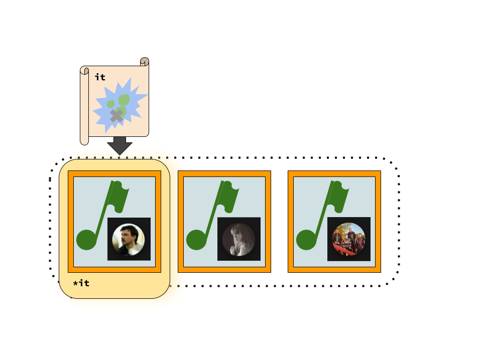
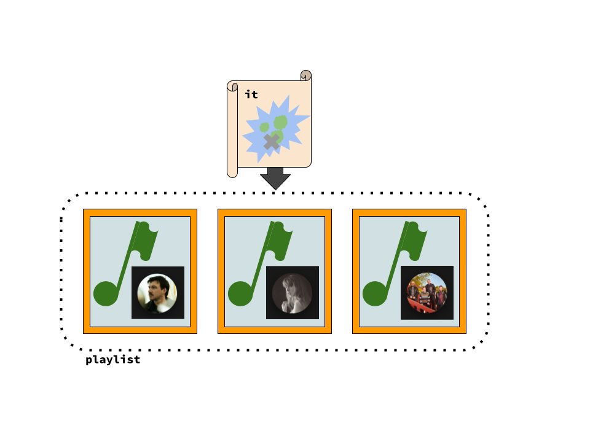
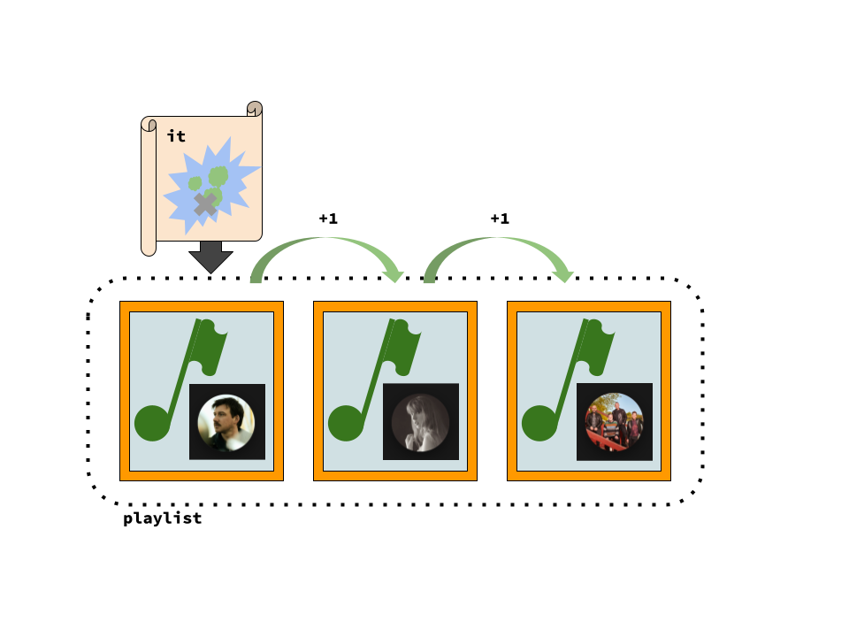
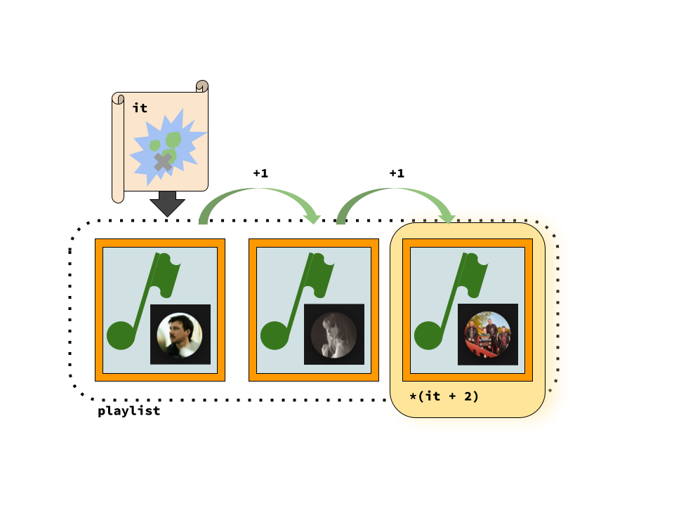

### What's News
Researchers are more optimistic than ever that they will one day find the wreckage of Amelia Earhart's plane in the Pacific. Lost at sea during her record-breaking attempt to fly around the world, ocean explorers (from government and the private-sector alike) have searched for the plane like they have searched for Atlantis. The hope now is that Earhart's Electra could be found by simply more thoroughly analyzing the reams of data that have been collected by previous search missions.

### Groups and Sequences

The programmer's life is full of toil under the load of groups of related data. In order to shoulder that burden, we often work with data structures that allow us to put those related data together so that we can refer to them all by a single name. One of the most common of those data structures is the `std::vector`, but there are others!

We use the ability to refer to groups of data with a single name in order to move the items around without having to write too much code. But, once we have the data where we want it, we usually want to perform some operations on the individual elements. 

To make the discussion a little more concrete, let's assume that the elements in our group are songs in a playlist. If we give the playlist to a DJ, there are going to be certain things that they may want to do before playing our songs: they may want to filter out songs that are really long; they may want to add up the total time of all the songs to make sure that they can all be played before the party is over; they may want to rearrange the songs so that those by the same artists are played simultaneously; or, they may want to make sure that there are no duplicates.

In each of these cases, the DJ is going to work with each song in the playlist one at a time, starting with the first and working toward the last.

Assume that we have the Song class:

```C++
class Song {
    public:
        Song(std::string name, std::string artist, int len): m_name(name), m_artist(artist), m_len(len) {}

        std::string get_name() const {
            return m_name;
        }
        std::string get_artist() const {
            return m_artist;
        }
        int get_len() const {
            return m_len;
        }

    private:
        std::string m_name;
        std::string m_artist;
        int m_len;
};
```

And we could put a bunch of them together into a vector:

```C++
int main() {
    Song wallen("Last Night", "Morgan Wallen", 163);
    Song taylor("Love Story", "Taylor Swift", 271);
    Song bnl("One Week", "Barenaked Ladies", 169)

    std::vector<Song> playlist{wallen, taylor, bnl};

    return 0;
}
```

Let's write a function to help the DJ. It will accept a playlist and then return a _new_ playlist that only contains songs that are shorter than 200 seconds:

```C++
std::vector<Song> get_short_songs(const std::vector<Song> &pl) {
    std::vector<Song> short_list{};

    for (auto i{0}; i<pl.len(); i++) {
        if (pl[i].get_len() < 200) {
            short_list.push_back(pl[i]);
        }
    }

    return short_list;
}
```

Great! Nothing surprising there -- just check the song lengths one at a time and copy the short ones to the new list. We could use it like:

```C++
auto playlist_of_short_songs{get_short_songs(playlist)};
```

Notice how the parameter to the `get_short_songs` function was the entire playlist? Notice how we had to make sure that the parameter was declared as a reference (and then a `const` reference, to add insult to injury)? We declared the parameter that way for efficiency and _not_ because it served our purposes as programmers. Why all the commotion?

Let's ask the DJ to be a little more choosy. Because of the way that our birthday party is going to go, we are okay with long songs at the beginning and the end of the playlist. In the middle of the party, and thus the playlist, we want short songs because we know that there is going to be limbo. Can we still use the `get_short_songs` function?

Well, not quite. But we could reuse it if we extended it! We could add two additional parameters -- one that said where to start (in the playlist) filtering long songs and one that said where to stop.

```C++
std::vector<Song> get_short_songs(const std::vector<Song> &pl, int start, int stop) {
    std::vector<Song> short_list{};

    for (auto i{0}; i<pl.len(); i++) {
        if (pl[i].get_len() < 200) {
            short_list.push_back(pl[i]);
        }
    }

    return short_list;
}
```

Now, we could use it like

```C++
auto playlist_of_limbo_songs{get_short_songs(playlist, 20, 30)};
```

(Of course our sample code made a playlist with far fewer songs, but you can imagine ...)

The DJ could play the first 20 songs from `playlist`, then play all the songs from `playlist_of_limbo_songs` and then play all songs after the 30th song from `playlist`. That could work.

### On Demand Disco

But, ... what if the playlist were not set in advance. What if we were using _Shuffle_ on Spotify and the only thing that we could do to build our playlist was to ask Spotify for a playlist with a certain _number_ of songs. Could we use `get_short_songs` in this scenario?

Sadly I don't think so.

Look at the code in the `get_short_songs` function. It uses the `[]` in order to peer into the playlist `pl` and determine a song at a given position (like 21: `pl[21]`). The problem is, a _Shuffle_ playlist does not let us do that! A _Shuffle_ playlist only lets us (repeatedly) ask it for the next song -- which the app determines as needed.

This situation presents us a small problem, but one that is surmountable. In fact, when we do workaround this problem, we are going to have something that is really, really powerful.

What if, instead of considering the _Shuffle_ playlist interface to be a problem, we treat it as an asset! First, let's be specific about the _Shuffle_ playlist interface. An object that implements the _Shuffle_ playlist interface has operations to

1. Get the current song, and
2. Move to the next song.

We'll also say that there is a special object to which you can compare an object that implements the _Shuffle_ playlist interface to determine whether the playlist is out of songs.

What would the _Shuffle_ interface look like in code? Assume that you have one of these objects that implements the _Shuffle_ playlist interface and that it was named `song_generator`. If you do

```C++
song_generator++
```

you are saying, "Move to the next song". The expression

```C++
*song_generator
```

is the current song. Finally, if you have that special "no more songs" object (and it is called `no_more_songs`), if 

```C++
song_generator == no_more_songs
```

is `true`, then the application cannot give you any more songs!

### Next Song. Next Song.

Assume that the _type_ of one of these objects that implements the _Shuffle_ playlist interface is `Lit`. Let's rewrite the `get_short_songs` function using only instances of `Lit` as the parameters:

```C++
std::vector<Song> get_short_songs(Lit song_generator, Lit no_more_songs) {
    std::vector<Song> short_list{};

    for (; song_generator != no_more_songs; song_generator++) {
        auto song = *song_generator;
        if (song.get_len() < 200) {
            short_list.push_back(song);
        }
    }

    return short_list;
}
```

How is this solution the same as the one before? Well, 

- when it has done its work, the output is still the same: a list of short songs;
- the person using the function gives it some information about where to find the songs to filter (`song_generator`) and some information on how to determine when to stop filtering (`no_more_songs`).

That's quite neat, but _why_ is it a better solution than the original one we built? First, and most importantly, notice how we are making very, _very_ few assumptions about how we can access the songs in the playlist. In the initial version, we used `[]` to access the songs by index -- something that can only be done if it is possible to _randomly_ access the songs in the playlist. The solution we have now makes no such assumption. When engineering software, code that makes fewer assumptions is code that is better.

In fact, in the solution above, the _only_ assumption being made is that it is possible to _traverse_ some sequence of songs in order. `get_short_songs` as it is written now will work for any sequence of songs that meets that very low bar!

### What About The Curated Playlist?

We still haven't seen whether the solution will work for the curated playlist that we created and stored in the `std::vector`. Here's my idea: why don't we build a small little adapter that will fulfill the _Shuffle_ playlist interface but, instead of actually choosing songs at random when asked (like Spotify would), it just provides the songs in the order they appear in the curated playlist?! We can just fake out the `get_short_songs` function into thinking that our curated playlist is a _Shuffle_ playlist, even though its not! 

Mind. Blown.

### X Marks The Spot

Now that we see _that_ this solution is ideal, are we stuck with having to implement these like _sequence traversal tools_ faker tools ourselves? Absolutely **not**. C++ already has support in the language to do something exactly like what we just designed. They are called _iterators_. Iterators are a powerful, powerful part of the C++ language and give us programmers the ability to reuse vast amounts of code.

According to the person who originally developed iterators Alexander Stepanov, an iterator provides the "[a]bility to refer to data through some handle". Using that handle provides for "[f]ast access to the [underlying] data" -- "[a]s fast as an access to the data as could be given."

How can we get/use an iterator with our `playlist` that contains `wallen`, `swift`, and `bnl`? 

Whatever the mechanism, we'll want to store it in a variable for reuse. So, we will need to declare that variable and initialize it. To declare it, we'll need a type ... "_iterator_ through a `std::vector` of instances of `Song`s":

```C++
std::vector<Song>::iterator
```

Now we'll name the object we are declaring:

```C++
std::vector<Song>::iterator it
```

For the initial value, let's say that we want the iterator to refer to the first song in the playlist:

```C++
std::vector<Song>::iterator it{playlist.begin()}
```


Wow!

Iterators work just like the (slightly fantastical) `song_generator` that we designed above: The expression

```C++
*it
```



is `wallen`.

Want the iterator to move from the first song to the second song?

```C++
it++
```



Or, maybe you don't want to _move_ the iterator, but you want to refer to a song later in the sequence:

```C++
it + 2
```



is an expression that is an iterator to a song two later in the playlist. And, if you want to access that song,

```C++
*(it + 2)
```



What about the special object that will let us tell when we are at the end? Let's declare another iterator and initialize it in a way that we can use it to determine when there are no more songs:

```C++
std::vector<Song> no_more_songs{playlist.end()};
```

And, if the expression

```C++
it == no_more_songs
```

is `true`, then there are no more songs in the playlist!

### All About That X 

Yes, the `Lit` type (and code that we wrote using instances of it) was a bit pseudocode-like (as we discussed earlier). So, let's rewrite `get_short_songs` with real C++ code and see if we were really off base:

```C++
std::vector<Song> get_short_songs(std::vector<Song>::iterator song_generator, std::vector<Song>::iterator no_more_songs) {
    std::vector<Song> short_list{};

    for (; song_generator != no_more_songs; song_generator++) {
        auto song = *song_generator;
        if (song.get_len() < 200) {
            short_list.push_back(song);
        }
    }

    return short_list;
}
```

Boom!

I hope by now you can see the power of iterators. But, all that you have seen so far is only the beginning. The best way to learn about the full power of iterators is simply to use them. And, as encouragement to do that exploring, let's write a very, very simple function that uses iterators to print the contents of the playlist:


```C++
void print_playlist(std::vector<Song>::iterator sit, std::vector<Song>::iterator send) {
    for (; sit != send; sit++) {
        auto song = *sit;
        std::cout << song.get_name() << "\n";
    }
}
```

If we use that with `playlist`, we get 


```console
Last Night
Love Story
One Week
```

Look very closely at the implementation of `print_playlist` and notice how the iterator is always being used to traverse the list in the forward direction using the `++`. What if we wanted `print_playlist` to be able to print the contents of the playlist backward? Would we have to rewrite the entire function?  Maybe we would have to use `--`? (Note: There are iterators that allow this type of _bidirectional_ traversal).

Oh, absolutely _not_. With a very minor tweak, we can use the function _exactly_ the way it is! Let's turn `print_playlist` into function template so that we can pass different types of iterators as arguments:

```C++
template <typename Itr>
void print_playlist(Itr sit, Itr send) {
    for (; sit != send; sit++) {
        auto song = *sit;
        std::cout << song.get_name() << "\n";
    }
}
```

and now ... let's call it with _reverse iterators_ and see what happens:

```C++
print_playlist(playlist.rbegin(), playlist.rend());
```

```console
One Week
Love Story
Last Night
```

Wow.
