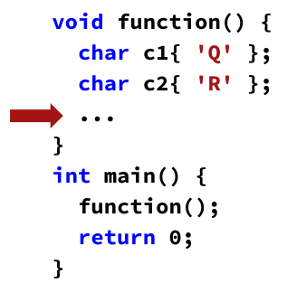
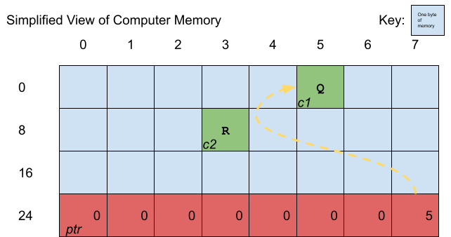

## What's News

A new government report indicates that enrollment in computer-related majors at engineering colleges throughout the country is skyrocketing. Analysts and demographers all point to the same cause: enthusiasm among high-school graduates about entering a field where problem-solving skills are paramount.

## A Paused Program

Let's mentally play the role of the computer executing the following program stopped at the spot in the code indicated by the red arrow:



What has already happened? Well, we know that the program started executing at the top of the `main` function. Then, it executed the first statement,  an invocation of `function`. We recall from earlier editions of the C++ Times that invoking a function means that the program's execution is immediately transferred to the first statement of that invoked function. Therefore, the program's next step was to execute the declaration/definition of the `c1` and `c2` variables and assign them the initial values of `'Q'` and `'R'`, respectively! When the program's execution pauses at the red arrow, here's what the computer's memory may look like (conceptually):


Here memory is visualized here as a two dimensional "spreadsheet" of cells, each of which holds a single byte. The byte at the top left of the diagram has address 0 and the byte at the bottom left has address 24 + 7 = 31 (add the value at the beginning of the row with the value at the beginning of the column).

>Note: See the C++ Times special long-form reporting on variables in memory in [previous editions](./variables-memory.md).

| Name | Scope | Type | Value | Address |
| -- | -- | -- | -- | -- |
| `c1` | `function` | `char` | `'Q'` | `5` (`0x5`) |
| `c2` | `function` | `char` | `'R'` | `11` (`0xb`) |

## Express Yourself

An _expression_ is ... anything that has a value. Remember? 

The C++ expression that gets the value of the variable `c1` is just 

```C++
c1
```

What's the expression to get the value of `c2`?

```C++
c2
```

Recall that every variable in C++ has some associated space in memory where its value is stored _and_ we can write expressions (like the ones above) to get the variable's value. But, can we write an expression to retrieve the _address of_ a variable? Yes, we can! The expressions

```C++
&c1
```

and

```C++
&c2
```

evaluate to `5` (again, `0x5`) and `11` (`0xb`), respectively, the addresses of those variables in the (conceptual) computer's memory. Because using `&` in front of a variable in an expression gets the address of the variable, the `&` is called the _address-of_ operator. The address-of operator is a _unary operator_ (an operator that takes a single operand. c.f.: binary operators like `+`, `-`) . The operand to the address-of operator must be an expression whose value identifies an object (for our purposes, this is usually a variable).

>Note: Yes, the use of `&` here may at first seem confusing -- we learned earlier about using the `&` sigil to declare/define a reference variable and the following code snippet shows both uses of `&`:

```C++
#include <iostream>

void foer(std::string &str) {
  ...
}   

int main() {
  std::string a_string;
  
  auto address_of_a_string = &a_string;
  foer(a_string);
} 
```

> Although the confusion is palpable now, as you learn more about pointers, you will see how reference variables and pointers are closely related and, therefore, understand why the language designers have chosen to reuse the `&` for reference variables.

## Storing Addresses

If we have expressions that evaluate to addresses of variables, it would be nice to be able to store them somewhere. But so far we do not have a _type_ that will hold such a value. We have types that hold integers, floating-point values and strings, but nothing that will hold an address of a variable.

Don't worry! There is a type in C++ that we can use to declare a variable that holds the address of another variable. We call a variable that holds the address of another variable a _pointer to X_, where _X_ is the type of the variable being pointed to. Why? Because we can imagine a variable with a pointer-to-X type as one that "points" to the variable storing a value whose type is `X`. 

>Note: Because "points to" and "points at" end in a preposition and it's not nice to end sentences in prepositions, some people use the synonym "targets".

Just to be extra clear, there is absolutely nothing odd or unusual about a variable that points to another variable -- it has a scope, value, type and *the pointer itself even has a place in memory*!

```C++
void function() {
  char c1{'Q'};
  char c2{'R'};
  char *ptr{&c1};
  return;
}

int main() {
  function();
  return 0;
}
```

In the snippet above, `ptr` has type *pointer to `char`* and it "points at" variable `c1`. It is really important to be aware that there is no such type in C++ as "pointer" -- the type is an entire phrase *pointer to X* where *X* is some type. That means that the type of a pointer variable specifies

1.  that the variable is a pointer, _and_
2.  the type of the variable at its target.

That's important because a variable that is a "pointer to a `char`" can only point at `char`-typed variables; a "pointer to an `int`" can only point at an `int`-typed variable; and so on.

In the example above, the scope of `ptr` is the body of `function`. 

> It is a coincidence that what `ptr` points at has the same scope as `ptr`. That does not have to be the case.

So far, we see two major similarities between pointer variables and the other kinds of variables:

1.  Both have types; and
2.  Both have scope.

Do they share anything else in common? Why, yes, they do! Both take up space and have a value. Let's start first with the values of pointers. A type defines the range of valid values for a variable of that type and pointers are no exception. Officially, there are a few "sets" of valid values for a pointer. Think conceptually about the requirements for a pointer: Most importantly, a pointer must contain enough information to uniquely identify its target. Well, what information is available that would uniquely identify a target in the least amount of memory?

The variable's name? Nope! Not all variables have names and names are not unique outside of their scope. Well, why not identify a variable by it's name _and_ its scope (in combination)? That seems rather, er, laborious and, because we can nest scopes infinitely, would require lots of space. What else could we use? I know, let's rely on the fact that _every_ variable takes up space in memory and _every_ piece of space in memory (as long as the space is at least as big as a byte!) has a _unique_ address! That means we could uniquely describe the target of a pointer using the address of the variable that it targets. Perfect!

## Optional: The size of a `pointer to _type_` variable

We know that all variables occupy space in memory. Just _how much_ space in memory do pointers-to-`X`-type variables use? To answer this question requires some advanced calculations, but I think that we can handle it.

Because the storage for variables can occur anywhere in memory, a pointer-to-`X`-type variable needs to be able to store the address of every single byte of memory in the system. Therefore, the space allocated to storage for an instance of a pointer-to-`X`-type variables must contain enough space to represent each of the possible addresses that it could hold.

Almost all of today's computers have more than $10$ gigabytes of memory. Consider the tablet computer on which I am penning this column -- it has $32$ GB of RAM! In order to uniquely identify every byte of memory on my tablet, I would need $34,359,738,368$ values. Now, here's the math!

The computer can only handle $1$s and $0$s. So, how can you use those two values to represent decimals? Let's assign $1$, $2$, $3$, $4$, $5$, ... to a unique combination of a sequence of $1$s and $0$s. For example,

$$
0000 = 0 \\
0001 = 1 \\
0010 = 2 \\
0011 = 3 \\
0100 = 4 \\
0101 = 5 \\
0110 = 6 \\
0111 = 7 \\
1000 = 8 \\
1001 = 9 \\
1010 = 10 \\
1011 = 11 \\
1100 = 12 \\
1101 = 13 \\
1110 = 14 \\
1111 = 15 \\
$$

Count up the lines above and note that there are 16 unique combinations possible of 4 `1`s/`0`s that can be used to represent the numbers $0$ through $15$. Mathematically, for a sequence of $n$ 1s and 0s, there are $2^n$ different combinations (e.g., $2^4=(2*2*2*2)=16$). So, in order to represent $34,359,738,368$ (the number of bytes of memory that my computer holds!) we would need

$$
2^n = 34359738368\\
n = log_2(34359738368)\\
n = 35
$$

$35$ $1$s and $0$s. Because that's oddly specific to my tablet and computer scientists like to make things future-proof, they specified that sequences of $64$ $1$s/$0$s are better for representing addresses of bytes in memory! That's why they say that modern computers are so-called _64-bit computers_ as opposed to the 32-bit computers of the late 1990s. Every $1$/$0$ combination is represented in hardware by a bit and, remember, there are $8$ bits per byte. So a pointer-to-`X`-type variable occupies $64 / 8 = 8$ bytes of space! How cool is that?

## Reassigning Pointers
Remember the program from above: 

```C++
void function() {
  char c1{'Q'};
  char c2{'R'};
  char *ptr{&c1};
  return;
}

int main() {
  function();
  return 0;
}
```
Here's what the computer's memory may look like (conceptually for a 64-bit computer):



Here is the relevant information about each of the variables in the `function` function:

| Name | Scope | Type | Value | Address |
| -- | -- | -- | -- | -- |
| `c1` | `function` | `char` | `'Q'` | `5` (`0x5`) |
| `c2` | `function` | `char` | `'R'` | `11` (`0xb`) |
| `ptr` | `function` | `pointer to char` | `11` | `5` (`0x5`) |
| `ptr` | `function` | `pointer to char` | `5` (`0x5`) | `24` (`0x18`) |

I hope that the visualization and the table make it obvious that a pointer variable has all the same attributes as every other variable:

1.  Type,
2.  Scope,
3.  Place in memory (an address), and
4.  Value.

What happens if the programmer inserts

```C++
ptr = &c2;
```

just before the `return` statement in `function`? What do the contents of the memory look like after that?


| Name | Scope | Type | Value | Address |
| -- | -- | -- | -- | -- |
| `c1` | `function` | `char` | `'Q'` | `5` (`0x5`) |
| `c2` | `function` | `char` | `'R'` | `11` (`0xb`) |
| `ptr` | `function` | `pointer to char` | `11` (`0xb`) | `24` (`0x18`) |

This table demonstrates the meaning of the assignment statement for pointers. Assigning a new address to a pointer changes the variable it targets. Remember that pointers store addresses, so we must use the address-of operator (`&`) on the target variable in the assignment! Frustratingly, failing to do so _may not_ cause a compilation error, but it will certainly lead to a runtime error!!

## Dereferencing Pointer-to-`X` Variables

When I was growing up, there was a game called *Chutes and Ladders*.


If you landed on a ladder, your character was able to climb to its top and advance through the board rapidly. If you landed on a chute (a slide), your character tumbled to its bottom and lost a tremendous number of places. Let's imagine that a pointer-to-`X` is like one of the spaces on the game board where there is an attached latter or slide -- the top of the ladder or the bottom of the chute is the pointer-to-`X`'s target! Landing on a space with an attached chute or ladder is like using a pointer-to-`X` variable in an expression (e.g.,

```C++
ptr
```

in the program above) but climbing up the ladder or sliding down the chute requires an additional "push". In C++ we call such a push a _dereference_ operation. An expression dereferencing a pointer-to-`X` evaluates to the value of the variable at the pointer-to-`X`'s target! Like any operation in C++, the dereference operation is denoted by an operator (the `*`) that we call either the _dereference_ or _contents-of_ operator. It is a unary operator and takes a single operand: a pointer-to-`X`-type expression.


Just before `function` completes its execution in the program above,

| | Expression | Value | Type |
| -- | -- | -- | -- |
| 1. |`c1` | `'Q'` | `char` |
| 2. |`c2`| `'R'`| `char` |
| 3. |`ptr`|`5` | pointer to `char`|
| 4. |`&c1`|`5` | pointer to `char` |
| 5. |`&c2`|`11` | pointer to `char` |
| 6. |`&ptr`|`24` | pointer to pointer to `char` |
| 7. |`*ptr`|`'Q'` | `char` |

Look carefully at rows 3, 6 and 7 and make sure you understand why those expressions have the values they do. 

Besides being useful to get the value at the target of the pointer, the dereference operator can be used in an assignment statement to _set_ the value of the variable at the target. Let's say that the programmer adds

```C++
*ptr = 'S'
```

to the program above which makes the entire program look like:

```C++
void function() {
  char c1{'Q'};
  char c2{'R'};
  char *ptr{&c1};
  *ptr = 'S'
  return;
}

int main() {
  function();
  return 0;
}
```

Just before `function` completes its execution in the program above, the variables have the following values:

| | Expression | Value |
| -- | -- | -- | 
| 1. |`c1` | `'S'` |
| 2. |`c2`| `'R'`|
| 3. |`ptr`|`5` |
| 4. |`&c1`|`5` |
| 5. |`&c2`|`11` |
| 6. |`&ptr`|`27` |

Using a dereferenced pointer-to-`X`-type variable as the place to store the value of an expression has the effect of updating the value of the variable the pointer-to-`X` targets! How cool!

## Nuts and Bolts

What, precisely, is the syntax for declaring a pointer variable?

```C++
<type> *<name>;
```
That syntax declares a variable named _name_ with the type pointer to _target type_. For example,

```C++
std::string *str_ptr;
```

declares a variable named `str_ptr` that is a pointer to a `std::string`. Or,

```C++
double *dbl_ptr;
```

declares a variable named `dbl_ptr` that is a pointer to a `double`.

## Ominous Clouds Gather

Pointers hold some hidden "gotchas" that fastidious programmers must always keep in mind.

The most common error programmers make when using pointers is trying to assign a pointer to the wrong type. Consider

```C++
int five{5};
int *ptr_to_int = &five;
```

The type of `ptr_to_int` is "pointer to `int`". Remember, the _whole phrase_ is the type. And, because C++ is strongly (and statically) typed, the compiler will complain if we try to

```C++
int five{5};
double fived{5.0};
int *ptr_to_int = &five;
ptr_to_int = &fived;
```

Can you see why?

As you continue to learn more about pointers, you will see additional common mistakes! For now, revel in your newfound power!