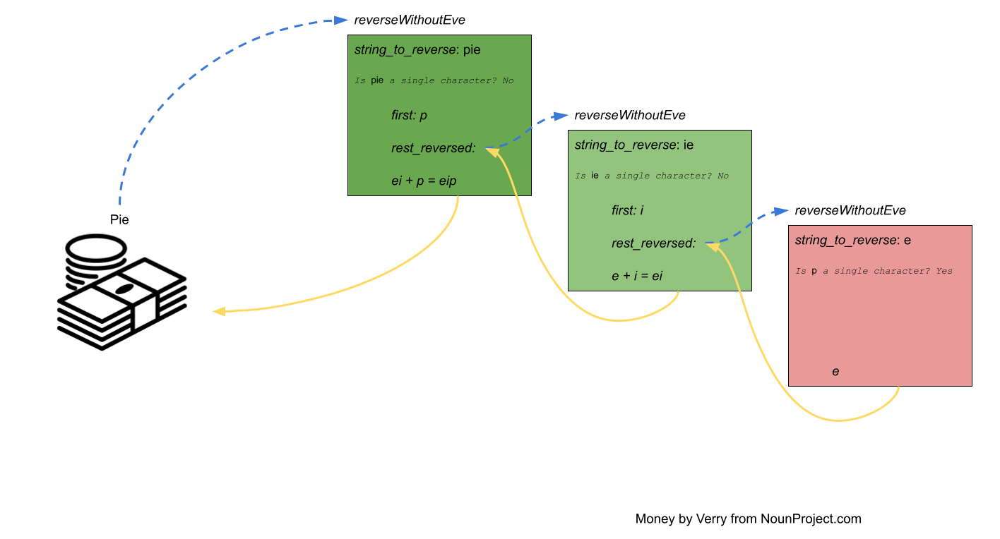

## What's News

Long the stuff of mysteries and tourist's haunted tours of Cincinnati, the team on the popular Ghost Hunters show has finally proven conclusively that pigs really can fly ... and that genies are real.

## You Can't Put the Genie Back in the Bottle

Wouldn't it be nice if we had a genie that would do our bidding? Just this once I am going to grant your wish (I'll be a kind of meta genie) and provide you with a genie. Let's call the genie Jean.

Jean will do anything that you ask and I am going to give you a chance to win a quick $50. I'll give you a string and all you have to do is reverse that string.

How would you do that? Easy. Just give the string to Jean and ask them to reverse it! You're $50 richer.

What I didn't tell you is that Jean will answer only one of your queries and now I'm going to ask you to reverse another string to gain a $5000 bounty. I bet you wish you didn't waste Jean to win $50.

I will make a deal: You can have Alladin's friend Eve. Eve is almost as good as Jean but is stubborn: Eve is omniscient and knows your motives; when you try to pawn work off on Eve they will only do a problem that is easier than the one you a trying to solve.

That said, I bet we can use Eve to make it easy to earn that payday!

## Eve's Enthusiasm to Engage

Reversing a string that is shorter than the string you were asked to reverse qualifies as an easier problem. So, Eve will execute your request should you ask them to reverse such a shorter string (try saying that three times fast) The easiest and fastest way to generate a shorter string than you were given is to remove a single character -- the first character, to be specific.

Let's say the Mega Millions is at $500000 for reversing the string "easy". Your solution would look like this:

1. Take the `e` off of easy and store it in `front`.
1. Ask Eve to reverse `asy` and store the result in `rest_reversed`.
1. Finally, create a list that is the concatenation of `rest_reversed` (i.e., `ysa`) and `front` (i.e., `e`), Call that `reversed`. In the example, `reversed` would contain `ysae`. 
1. Hand `reversed` to your interlocutor and head to the ATM to deposit your riches.

## Personal Programmer: Do the Easy Things First

> Note: This is a special periodic insert in the *C++ Times* called the *Personal Programmer*. It contains life advice for those in the business of programming.

What is the easiest string to reverse? That's right, the string with just a single character. What's the reverse of a string with just a single character?

I'll wait.

It's just the same character. As a professional, the *best* friend you can have at the office is the one with all the keys! Needless to say, Eve has quite a few keys (theirs are metaphorical, but still ...).

So, instead of burdening Eve with these trivial tasks, we can update our strategy without expending any more energy than we did earlier in our accelerated cash algorithm:

1. Check to see whether the string we are being asked to reverse is just a single character; if it is, then just hand it back to our interrogator and head to 5/3 for our money. Otherwise ...
1. *Follow the same steps as before.*

This solution is slightly better because it saves us from having to waste Eve's expensive time.

## A Review of M. Night Shamalan's new movie: We Were Really Eve The Whole Time

Look closely and you will notice something ... amazing. If you follow exactly the procedure outlined above (with one small change), you can reverse strings without Jean, Eve or any other magical power!

Let's define a function named `reverseWithoutEve` which will contain exactly the steps from above (with the exception that we will use a variable names (`string_to_reverse`) for what we are being asked to reverse and work with a little more specificity):

1. Check to see if `string_to_reverse` is a single character.
1. Take the first letter of `string_to_reverse` and store it in `front`.
1. Calculate the *rest* of `string_to_reverse` after removing the first letter and store it in `rest`.
1. Ask Eve to reverse the `rest`
1. Store the result in `rest_reversed`.
1. Finally, create a list that is the concatenation of `rest_reversed` and `front`. Call it `reversed`.
1. Hand `reversed` to our querier and head to the ATM to deposit our moolah.

Good start, but `reverseWithoutEve` is a misnomer because it still uses Eve.

My bright idea is to use `reverseWithoutEve` ... as Eve!! Woah.

Let's write our algorithm with a little formalism and see what happens:

```python
def reverseWithoutEve(string_to_reverse)
  if len(string_to_reverse) == 1:
    reversed = make_new_string(len = 2)
    reversed[0] = string_to_reverse[1]
    reversed[1] = string_to_reverse[0]
    return reversed
  front = string_to_reverse[0]
  rest = string_to_reverse[1:len(string_to_reverse)]
  rest_reversed = reverseWithoutGenie(rest_of_string_to_reverse)
  reversed = rest_reversed + front
  return reversed
```

That's amazing! We went from only profiting if we had Eve to making easy money without having to do anything more difficult than

1. Check if a string has one character.
2. Concatenate a single character with a string.

Don't believe me? Check this out:


Figure 1: Recursively reversing pie in exchange for some dough.

## Recursion

Without realizing it, you just learned *recursion*. Recursion is an advanced problem-solving technique that defines solutions to a problem in terms of smaller/different versions of the same problem.

In other words, recursion is all about solving a problem with a solution that solves a smaller problem with the same solution that solves a smaller problem with the same solution which ...

You get the idea.

Implicit in the above description of a recursive solution is the assumption that we can easily form a version of a smaller/different problem from the problem that we are given to solve. In `reverseWithoutGenie` we did this transformation simply by lopping a single character off the string that we were asked to reverse. However, building a smaller/different version of the same problem is not always so easy.

I know what you must be thinking ... "Won't a recursive solution just keep calling itself forever?"

That's where the base case makes an appearance. The *base case* of a recursive solution is the part of the recursive solution that can be calculated without relying on itself. In our recursive solution to reversing a string, we reached the base case when we reversed a string with a single character -- our function was able to calculate the reverse of such a string without having to call ourselves.

With that, we can define the three (3) characteristics/requirements of a recursive solution to a problem:

1. The problem has a base case.
1. There must be a deterministic, easy way to create a smaller/different problem.
1. That smaller/different problem must make progress toward the base case.

The third criteria is awkward to state, but easy to recognize. For example, Criteria (3) would be violated if our `reverseWithoutGenie` created a different version of the problem by recursively asking to reverse a random reshuffling of the input string that is no shorter. In this failed attempt at using recursion, Criteria (1) and (2) are met but not (3): the solution never makes progress toward the base case.

Oops.