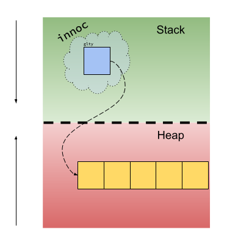

### What's News

Pressure is growing on regulators to force more transparency upon the owners of collectible Barbie dolls as a wave of disputes over who owns which doll sweeps the United States. 

### Pointers: What Could Possibly Go Wrong?
Now that you have mastered [pointers](./pointers.md), you have reached the pinnacle of programming power. Or have you? As they say, ["With great power comes great responsibility"](https://en.wikipedia.org/wiki/With_great_power_comes_great_responsibility).

Just what, exactly, is that responsibility? To fully understand all the different ways that our powerful pal the pointer can cause us provincial programmers problems, let's recall why we even needed pointers in the first place. Aren't the different types in C++ enough for all that we need to do? I mean, in C++ we can even define our [own types](./OOPIntro.md) in a way that makes them look like they were part of the language from the start! 

The space for automatic variables, (the stack, [remember](./variables-memory.md)) is managed by code that is generated by the compiler. The compiler-generated code never lets us forget about memory that we've used for automatic variables and always cleans up after us when they go out of [scope](./ScopeSupplement.md). The tradeoff for this assistance is that the compiler must be able to determine the amount of space it will need to store those automatic variables. And, because the compiler only executes one time, it must know the sizes of those variables before the program ever executes, _when the program is being compiled_. 

What if that's not possible? Say, for instance, that we need an integer for each of the days in a row that the user has gone to the gym (so that they can track their reps). Well, we don't know how long the user's streak will be when we write the code. We will need to use [_dynamic_ variables](./variables-memory.md), and their sidekick [pointers](./pointers.md), in order to handle that. So, with pointers, we get some power to handle a situation that we would otherwise be unable to handle. Unfortunately, in the process, we lose the help of our faithful friend the compiler who would normally generate code that would clean up our mess. Now _we_ have to clean up after ourselves manually, and sometimes we forget!

> Note: This is only the *first* of two (or more) problems that can arise when combining pointers and dynamic memory management. More on the others later.

### Pointers, But Smarter

Enter _smart_ _pointers_ (_smart pointers_ are _the_ thing to use when addressing dynamic variables in modern C++ code). Smart pointers combine the best of the compiler's automatic memory reclamation with the power of dynamic memory and pointers. Smart pointers put the onus back on the compiler to generate code that will properly deallocate dynamically allocated memory at the appropriate time!

Before we see how to use a smart pointer, we need to answer the question: Just when is the appropriate time for the compiler to free up memory that we manually allocated? We have talked at length about how dynamic memory would be unusable without pointers -- pointers are _the_ (only) way to refer to the (otherwise anonymous) variables created on the heap using the `new` operator. By implication, if there are no pointers to the particular chunk of memory associated with a dynamic variable, then there is 

1. no way for the programmer to access it and, therefore, 
1. no reason for it to continue to exist.

When

```C++
void inocc() {
  int *glty{new int[5]};
  ...
  return;
}

int main() {
  ...
  inocc();
  ...
}
```

is executing `inocc` (and after it has done the allocation), the contents of the program's memory look roughly like 




In the graphic, the lightly shaded blue cloud represents the space on the stack for all the variables in scope during this particular execution of the `innoc` function (remember, there is stack space for every _invocation_ of a function, not just for every function!). 

The pointer to an array of `int`s, `glty` is an _automatic_ variable. That is an important point! Even though the target of the pointer to an array of `int`s is on the heap (i.e., that's where the array itself exists), the pointer itself  is on the stack! Because it is an automatic variable, when a particular invocation of the `innoc` function terminates, the compiler will helpfully clean up all the space allocated for those variables:


Notice that there is now nothing that can be used to access the dynamically allocated memory in the heap! It seems like, when nothing can access a piece of memory, there is really no reason to keep it around! If I lost my favorite watch, would it matter if that Omega was actually sitting in the drawer or had been completely destroyed and turned to dust? No! In either case, I can't wear it!

Here's a slightly different, but related example:

```C++

void evl(int *t) {
  ...
}

void inocc() {
  int *glty{new int[5]};
  ...
  evl(glty);
  ...
  return;
}

int main() {
  ...
  inocc();
  ...
}
```

When `evl` begins executing, the contents of the program's memory will look something like 


That's right -- there are two pointers to array of `int`s that have the same target! This situation is known as _aliasing_ and is a feature and a bug of the C++ language, depending on your perspective. Confusingly, there are several places where the term _alias_ is used in the C++ community. It is _usually_ obvious to which one is being referred according to the context, but not always. 

Although not _actually_ implemented in this manner, you can think of each dynamically allocated piece of memory as having a _reference count_, the number of pointers targeting it. During the execution of `evl`, `t` points to a piece of memory with a reference count of 2!

When `evl` completes execution, `inocc` starts to run again, picking up where it left off when it called `evl`. The compiler-generated code has helped us by freeing the memory associated with the automatic variables for that particular execution of `evl`. In particular, the pointer to array of `int`s is destroyed. 

It was at this point in the previous example where we realized that it would be a good idea to deallocate the memory at the target of the just-freed pointer to array of `int`s. But can we do that _in this case_?


**NO**! If we did, then `glty` would be out of luck! It seems like our criteria for freeing the memory at the target of a pointer to some type needs to be amended slightly. Instead of freeing that memory when _a_ pointer that targets it goes out of scope, we will only free that memory when the _last_ pointer to that target goes out of scope! To say the same thing using the vocabulary of reference counts, we can only deallocate a piece of memory when its reference count goes to zero!

### Different Smart Pointers For Different Folks

That amended, but correct, algorithm we just described requires a little more information to execute -- it would need to keep track of _all_ the pointers to a particular target. To keep the simple case simple, the designers of the C++ language decided that there should be different smart pointers to handle each case: the _unique_ smart pointer and the _shared_ smart pointer. The former is to be used when you (the programmer!) can ensure that only one pointer will point to a particular target _at a time_. The latter is to be used when there may be more than one pointer to a target at a time. The former will clean up the memory at the target of the smart pointer when the smart pointer goes out of scope. The latter will clean up the memory associated with the target of the smart pointer when the last smart pointer targeting that memory that goes out of scope.

Enough theory. I think that you get the idea of when/how each one of the smart pointers should be used. Let's dig in to the details!

We declare non-smart pointers (from now on we will call these pointers _raw_ pointers) using the `*` character and we allocate/deallocate dynamic memory using the `new` and `delete` operators, respectively. 

Performing the same operations with smart pointers is different, but no harder. 

```C++
int *int_ptr{new int};
```

declares and initializes `int_ptr` as a pointer to some newly allocated space in the heap for an `int`.

Declaring/initializing a unique smart pointer that accomplishes the same thing looks like


```C++
std::unique_ptr<int> int_ptr{std::make_unique<int>()};
```

The memory-safe (and correct) way to write a function in C++ that dynamically allocates and uses an `int` looks like

```C++

void pintr() {
  int *pt{new int};
  ...

  delete pt;
  return;
}
```

The equivalent, using unique smart pointers, looks like

```C++
void pintr() {
    std::unique_ptr<int> pt{std::make_unique<int>()};
    ...
    return;
}
```

How cool is that!? We get correct code and we never have to call `delete`! Now _that_ is a powerful feature!

To declare/initialize a shared smart pointer, 

```C++
std::shared_ptr<int> shared_int_ptr{std::make_shared<int>()};
```

We can rewrite the `evl`/`innoc` example from above correctly using shared smart pointers like

```C++
void evl(std::shared_ptr<int> t) {
  ...
}

void inocc() {
  std::shared_ptr<int[5]> glty{std::make_shared<int[5]>()};
  ...
  evl(glty);
  ...
  return;
}

int main() {
  ...
  inocc();
  ...
}
```

The other _amazing_ feature of smart pointers is that you use them the exact same way that you use a raw pointer. For instance, to access the memory at the target of a raw pointer, you use the `*` dereference operator:

```C++
int *int_ptr{new int};
*int_ptr = 0;
```

You can do the same thing with smart pointers:

```C++
std::unique_ptr<int> *int_ptr{std::make_unique<int>()};
*int_ptr = 0;
```

### Change Is Good

We learned about scenarios with raw pointers where we would want to get rid of the memory they target and reassign the pointer to some newly allocated memory. One common reason to do this is to reallocate an dynamically allocated array of objects to accommodate either more or fewer elements.

```C++
int *reps_per_days = new int[day_streak];
...
delete[] reps_per_days;
day_streak++;
reps_per_days = new int[day_streak];
...
delete reps_per_days;
```

That code contains two places where we can make bone-headed mistakes (by forgetting to write a `delete` expression). Can we write the same thing using smart pointers and remove the possibility for errors? Yes, yes we can!

```C++
std::unique_ptr<int[]> reps_per_days = std::make_unique<int[]>(day_streak);
...
day_streak++;
reps_per_days = std::make_unique<int[]>(day_streak); // Previously allocated memory is deleted at this point. reps_per_days targets the newly allocated array of ints.
```

Because `reps_per_day` is a unique pointer, it is (by definition) the only pointer to address the array of `day_streak` `int`s. When that smart pointer is reassigned, the previously allocated memory is abandoned. Therefore, it is safe to deallocate and the logic underlying unique smart pointers does exactly that.

In both cases all the memory that was allocated was deleted. Great. However, in the version written using unique smart pointers, the programmer is under no obligation to make sure that they write `delete` expressions in the proper place!

What happens when we do the equivalent with shared smart pointers?

### Sharing Is Caring

Every additional pointer to a piece of dynamically allocated memory increases that memory's reference count. Previously we used the concept of a reference count as a mental model to calculate when it was okay to free memory that is targeted by two or more pointers. Shared smart pointers make those hypothetical reference counts real. Every bit of memory targeted by a smart shared pointer has some additional associated memory where it stores the reference count.

In the earlier example of `innoc`, `glty` and `evl`, we saw how passing a shared smart pointer to a function effectively increases the reference count. But that is _not_ the only way to increase a smart shared pointer's reference count. You can accomplish the same thing manually:

```C++

int main() {
  std::shared_ptr<std::string> my_name{std::make_unique<std::string>("Will")};
  // A
  std::shared_ptr<std::string> also_my_name{my_name};
  // B
  also_my_name = nullptr;
  // C
  return 0;
}
```

At `A`, the reference count for the space for the string in the heap that contains the letters of my name is 1. The only reference is `my_name`. At `B`, the reference count for that same memory is now 2! The initial value of `also_my_name` is copied from `my_name` and, kapow, now there are two shared smart pointers targeting the same memory. Then, after setting the aliasing shared smart pointer `also_my_name` back to `nullptr` (what is called _resetting_ or _replacing_ the smart pointer), the reference count is again 1. Even [Count von Count](https://en.wikipedia.org/wiki/Count_von_Count) would be able to handle those numbers.

What's amazing about the implementation of shared smart pointers is that they give you the opportunity to examine the reference count. 

```C++
int main() {
  std::shared_ptr<std::string> my_name{std::make_unique<std::string>("Will")};
  // A
  std::shared_ptr<std::string> also_my_name{my_name};
  std::cout << "also_my_name has a reference count of " << also_my_name.use_count() << "\n";
  // B
  also_my_name = nullptr;
  // C
  return 0;
}
```

will print

```
also_my_name has a reference count of 2
```

when executed.

### Initializing The Memory Targeted By A Smart Pointer

Notice above that we slipped in something new in the syntax for declaring/initializing a smart pointer -- a way to initialize the memory it is targeting. 

```C++
  std::shared_ptr<std::string> my_name{std::make_unique<std::string>("Will")};
```

While that might look confusing, if we build up from more familiar syntax, your eyes will learn how to focus on the important bits. First, if we are declaring an automatic `std::string` variable named `my_name` and we (stupidly!) do not initialize it, we would write something like

```C++
std::string my_name;
```

If we wanted to (correctly and smartly!) initialize that automatic variable with the empty string, we would write something like:

```C++
std::string my_name{};
```

Finally, if we wanted to initialize that automatic variable with the characters in my name, we would write something like:

```C++
std::string my_name{"Will"};
```

Now that we have that pattern down, uhm, pat, let's translate it to the equivalent for smart pointers (in this case, a shared smart pointer!):


```C++
std::shared_ptr<std::string> my_name{std::make_shared<std::string>()};
```

```C++
std::shared_ptr<std::string> my_name{std::make_shared<std::string>("Will")};
```

Although there are other ways to allocate memory for smart pointers other than `std::make_shared` and `std::make_unique`, what's neat about these two options is that they do not give you the option of allocating uninitialized memory:

```C++
std::shared_ptr<std::string> my_name{std::make_shared<std::string>};
```

does not compile! That feature (alone!) is worth the price of admission!