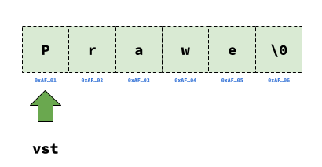
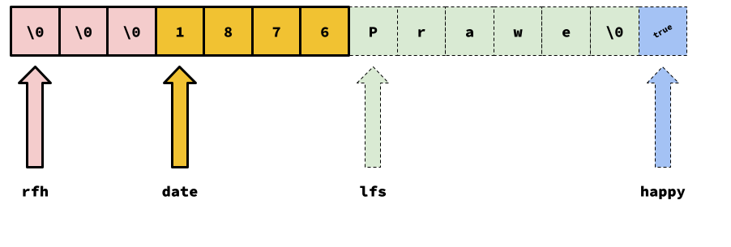
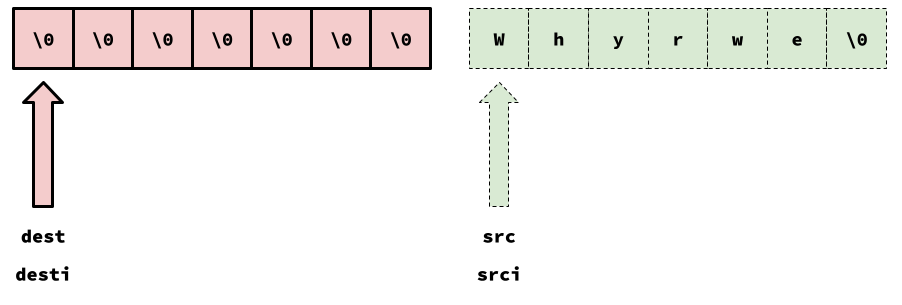
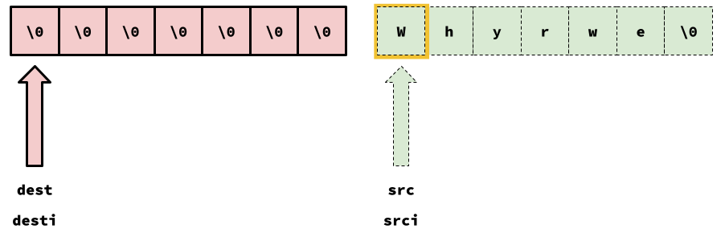
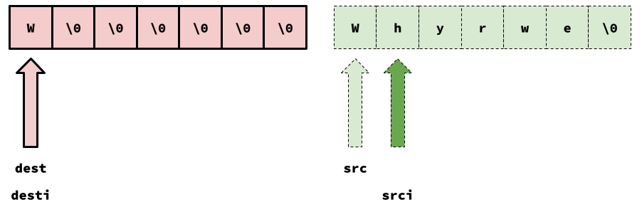
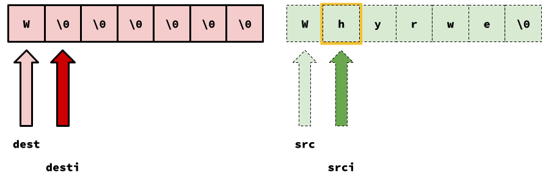
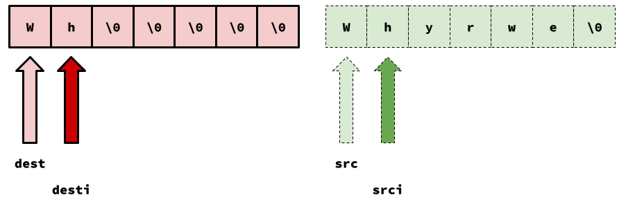
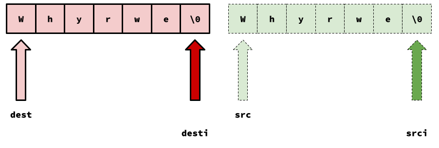
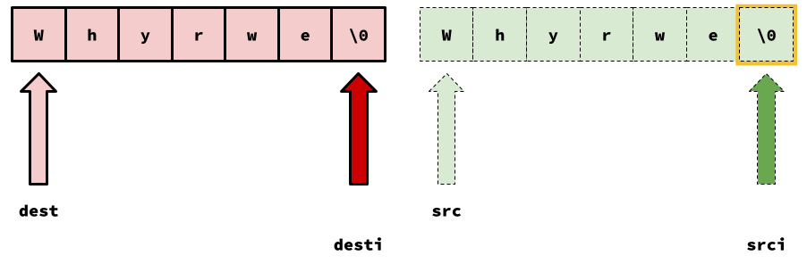

### What's News

The surge in the rate of corporate rebrandings continued today as Starbucks Coffee changed its name. In an attempt to stand out in the marketplace (the way that Häagen-Dazs founder Reuben Mattus [vocalized nonsensical words to find a combination that would make his company seem unique](https://en.wikipedia.org/wiki/H%C3%A4agen-Dazs#Origin_of_brand_name)), they will now be known as strcoffee.

## Imitation Is ...

Out on the Internet, and among the source code of some of the most famous software development efforts ever attempted, is a well known (but, in my opinion, far too clever) implementation of `strcpy`. Despite some people's skepticism about _clever_ being used as a compliment, there _is_ much to learn about C++ by looking very closely at the implementation.

In this special edition of the C++ Times, we will excavate the gems hidden within the `strcpy` tongue twister.

## `strcpy` What?

First, let's identify the purpose of `strcpy`. `strcpy` is a function inherited by C++ from C. While in C++, a string is rigorously defined (as `std::string`), in C the string data type is a convention: A string data type in C is nothing more than a pointer to the first of a sequence of contiguous `char`acters in memory, followed by a character whose value is `\0`[^not-zero]. It's like an array of characters, in that sense. Neat!

For example, assume that you wanted to write a program that manipulated the string with the contents, "Prawe".[^short] In C, that string would be represented in the computer's memory as shown in the following figure.



In C (and C++), we could refer to that string with a variable named `vst` that has the type `char *`. From now on we will say that the _contents_ of the string `vst` are "Prawe", even though that is not true in the strictest sense.

Let's get back to the type of `vst`: `char *`. Odd, right? The type of a string in C is technically _pointer to `char`_! Yes, that's how it is![^decay]

Notice that each of the characters in the string comes immediately after the previous and the individual characters that make up the contents of the string are in memory at and after the character to which `vst` points and before the first `'\0'`. What a mouthful!

With all that as background, we won't have any trouble understanding the `strX` functions, the family of functions in C that help programmers work with strings. These functions have been around since (_at least_) 1988 and each of them follow a common pattern in their implementation (which is, in fact, the subject of this entire special issue of the C++ Times, so read on!).

Some of the functions in the `strX` family are described in the table that follows (not exhaustive).

| Name | Description |
| -- | -- |
| `strcmp` | Compare two strings. |
| `strtok` | Tokenize (parse) a string into pieces. |
| `strcat` | (Con)Catenate two strings. |
| `strdup` | Duplicate a string. |
| `strcpy` | Copy a string. |

Let's focus on `strcpy` -- it's one of the members of the `strX` family of functions and is the one whose implementation we want to dissect. `strcpy` is a function that copies one string to another. It's declaration is

```C
char *strcpy(char *dst, const char *src);
```

The function will, well, copy the contents of the string `src` to the contents of the string `dst`.

The functions in the `strX` family are notorious for being the source of many security vulnerabilities.[^security] Why is that? Well, for functions in this family, the programmer has to be very careful that they have properly allocated the space required for the operations to succeed.

That sure sounds vague. Let's make it concrete by considering `strcpy`: It is your responsibility (as the person calling `strcpy`) to make sure that your code owns enough of the bytes at and consecutively following the byte pointed to by `dst` to accommodate the contents of `src`. The function will not do any memory allocation for you!

Consider a program that contains the following declarations:

```C++
int main() {
    int *date{};
    bool *happy{}
    char *lfs{};
    char *rfh{};

    ...
```

where those pointers were subsequently used in assignments so that our program's memory looks like



The image above shows that the contents of `lfs` is `Prawe` and the contents of `rfh` is ... nothing![^why-nothing] 

However, let's assume that our program "owns" the bytes to which `rfh` points, and the two after it. In other words, it is completely safe and reasonable for us to write code that treats `rfh` as a pointer to an array of _three_ characters. We can use all three of those characters or some of those characters. But, we cannot use more! 

[^why-nothing]: Yes, remember the convention: the contents of the string `rfh` is `""` because the first character at or after the character pointed to by `rfh` is `\0`!

If we wrote an assignment statement like

```C++
rfh[3] = 'f';
```

then there would be a big problem! Why? Because that would overwrite the leftmost yellow byte ... which is not "owned" by `rfh`. That byte (and the three after it) are the space where an `int`eger is stored (which we can access using the pointer `date`). The only proper way to update the value of the `int`eger stored in the four yellow bytes is using a variable with the proper type -- and that is certainly not `rfh`.

What does that have to do with `strcpy`? Well, let's take a look! If we wanted to use `strcpy` to copy the contents of `lfs` to `rfh`, we could write

```C++
strcpy(rfh, lfs);
```

Pretty cool! Or is it?

I don't want to ruin the surprise. So, we'll first look at the algorithm for `strcpy` and then come back to see whether the code we just wrote is valid or not!

## `strcpy` How?

There's really only one reasonable way to implement `strcpy`, isn't there? Yes -- don't overthink it!

### `strcpy` Algorithm:

In order to copy the contents of _source_ to the contents of _dest_, 
1. Create an "iterator" pointer to the start of _source_, _srci_.
1. Create an "iterator" pointer to the start of _dest_, _desti_.
1. While the character pointed to by _srci_ is not the `'\0'`,
    1. Copy the character pointed to by _srci_ to the space pointed to by _desti_.
    1. Move _srci_ to the next character in memory.
    1. Move _desti_ to the next character in memory.

I often find that algorithms that use pointers are easier to understand when I can visualize them. 



Let's walk through how the algorithm works when trying to copy `src` to `dest` in the image above. As you can see, Steps (1) and (2) are already complete -- the "iterator" pointers are already assigned to the proper places.



The `char` highlighted in yellow is "the character pointed to by _srci_". Is it `\0'`? Nope! So, that means we proceed from Step (3) to Step (3.i).


Now that we have copied the character pointed to by _srci_ to the space pointed to by _desti_, we will need to adjust the iterator pointers (Steps (3.ii) and (3.iii)).




We loop back to Step (3).



The `char` highlighted in yellow is "the character pointed to by _srci_". Is it `\0'`? Again, nope! So, that means we proceed from Step (3) to Step (3.i).



Around and around we will go, until ...



... and we are back at Step (3).



The `char` highlighted in yellow is "the character pointed to by _srci_". Is it `\0'`? Yes, mercifully! The algorithm terminates.

Notice that we have copied the contents of the string!! How cool is that?

> Now is a great time to think back to the code that we wrote in [_`strcpy` What?_](#strcpy-what). Is it valid?[^answer]

## `strcpy` Do It

Now that we have a grasp of the algorithm that will copy a string, let's put pen to paper and write some C++. Our first implementation of `strcpy` will be a very mechanical translation between the pseudocode above and C++.

```C++
char *strcpy(char *dest, const char *src) {
  // 1
  char *srci = (char *)src;
  // 2
  char *desti = (char *)dest;
 
  // 3
  while (*srci != '\0') {
    // 3.i
    *desti = *srci;
    // 3.ii
    desti = desti + 1;
    // 3.iii
    srci = srci + 1;
  }
  return dest;
}
```

Each of the C++ statements is labeled to match their position in the pseudocode. There is nothing sophisticated happening here!

But, you might be complaining, "I was promised clever code; that does not look clever!". 

Here. We. Go.

### Refinement 1

As you are well aware, we can write 

```C++
    desti = desti + 1;
```

using the post-increment operator as

```C++
    desti++;
```

If we apply that to our `strcmp` implementation, it now looks like

```C++
char *strcpy(char *dest, const char *src) {
  // 1
  char *srci = (char *)src;
  // 2
  char *desti = (char *)dest;
 
  // 3
  while (*srci != '\0') {
    // 3.i
    *desti = *srci;
    // 3.ii
    desti++;
    // 3.iii
    srci++;
  }
  return dest;
}
```

### Refinement 2

Alright! Before we make the next refinement, we need to get very clear on the _semantics_ of the post-increment operator.

Expressions are _everywhere_ in C++. Surprise, surprise, the post-increment operator is an expression and every expression has a value. What is the value of the post-increment expression? It is the value of the variable being incremented _before_ it is incremented. Yes, I know, an example would be easier!

Assume that the `int`-typed variable `a` has value `5` and that there is an `int`-typed variable `b` declared. After executing

```C++

b = a++;

```

what is the value of `b` and what is the value of `a`? To answer the question, recognize that `b` is being assigned the value of the _expression_ `a++`. We just said that the value of that expression is the value of the variable _before_ it is incremented. So, that would be `5`. Great. `b` is `5`. What is `a` after the assignment statement? Well, the "plus plus" happens, so, `a` is `6`. Pretty darn cool!

How can we use that to refine our implementation?

Look at

```C++
    *desti = *srci;
```

We could rewrite that as

```C++
    auto d = desti;
    auto s = srci;

    *d = *s;
```

We didn't make much progress, there, but ... given what we know about the post-increment operator, we could replace the entire body of the loop with

```C++
    auto d = desti++;
    auto s = srci++;

    *d = *s;
```

Woah! But, let's not stop there! We only use `d` and `s` once so we really don't even need them! By adding some parenthesis (to make sure that our precedences are correct), we could rewrite the above snippet of code as

```C++
    *(desti++) = *(srci++);
```

so that our implementation now looks like

```C++
char *strcpy(char *dest, const char *src) {
  // 1
  char *srci = (char *)src;
  // 2
  char *desti = (char *)dest;
 
  // 3
  while (*srci != '\0') {
    // 3.i, 3.ii, 3.iii
    *(desti++) = *(srci++);
  }
  return dest;
}
```

And now things are starting to look cleverererer.

### Refinement 3

The third refinement relies on the same _there-are-expressions-everywhere_ trick: The assignment operation is an expression! Mind. Blown.

Again, every expression has a value, so ... what is the value of the assignment operation? It is the value that was assigned! Argh. What the heck does that mean? Example time!

Assume that the `int`-typed variable `a` has value `5`, that there is an `int`-typed variable `b` declared and an `int`-typed variable `c` declared. After executing

```C++
c = (b = a);
```

what is the value of `c`? `b`? If you squint your eyes so that the value on the right hand side of the `=` is blurry,the question is not so hard.

Or, if we wrote

```C++
c = 7;
```

you would have no problem answering! `c` is the value of the expression `7`. So, in the more complicated example, `c` is the value of the expression `(b = a)` (the assignment operation) and, as we said above, the value of the assignment operation expression is the value being assigned -- in this case, `a`. So, the expression `(b = a)` is the value of `a` (i.e., `5`) and, therefore, `c` is `5`, too!

> Note: Don't forget that the assignment of the value of `a` to `b` _does_ occur. So, after the assignment of `c`, `b` has the new value `5`!

How can we use this in our implementation? Well, remember what the final step of the algorithm looked like:


Our algorithm performed a check and stopped _before_ copying the `\0` from `srci` to `desti`. But, it didn't have to! It could have done that copy _and then_ checked if the value of the `char`acter that was copied was `\0` in order to determine whether to stop. Oh, okay ...

The

```C++
    *(desti++) = *(srci++);
```

does the copy, right? Yup! And, using what we just discussed, we could put the most recently copied character into a variable, say, `c` like:


```C++
    c = *(desti++) = *(srci++);
```

So now we could rewrite our loop to terminate based on whether or not `c` is `\0`! How cool!

Let's be sloppy for a second (but just a second) and write something that we wish would compile ... but does not:

```C++
char *strcpy(char *dest, const char *src) {
  char *srci = (char *)src;
  char *desti = (char *)dest;
 
  while (c != '\0') {
    c = *(desti++) = *(srci++);
  }
  return dest;
}
```

To make that compile, we would have to declare `c`. But, that's not the end of our problems. Even after we declared `c`, we would have to determine a reasonable initial value for it (it needs some value before the first copy occurs). Argh. So, so close.

Wait! What? We don't even _need_ `c` you say? That's absolutely right!!

```C++
char *strcpy(char *dest, const char *src) {
  char *srci = (char *)src;
  char *desti = (char *)dest;
 
  while (*(desti++) = *(srci++) != '\0') {
  }

  return dest;
}
```

Oh, how sweet that is!

You said you wanted clever, well, that's pretty sharp!

### Refinement 4

[The final refinement](https://www.google.com/url?sa=t&source=web&rct=j&opi=89978449&url=https://www.youtube.com/watch%3Fv%3D9jK-NcRmVcw&ved=2ahUKEwjD8qGLsf6TAxVKkYkEHZ9BCncQtwJ6BAgVEAI&usg=AOvVaw1W9hAKdJJf7LMOqKIussAz)!! We want our loop to continue copying characters as long as the most recently copied character is not a `\0`! That's why we have the `!= '\0'` there. 

But, what if I told you that `\0` when used in a place where an expression with a `bool` type is expected evaluates to `false` and _any other_ character value evaluates to `true`?

Remember that the value of the expression `*(desti++) = *(srci++)` _is_ the most recently copied character! So, we could just do

```C++
char *strcpy(char *dest, const char *src) {
  char *srci = (char *)src;
  char *desti = (char *)dest;
 
  while (*(desti++) = *(srci++)) {
  }

  return dest;
}
```

When the most recently copied character is `\0`, then `*(desti++) = *(srci++)` is `\0` (a.k.a, `false` when used in a place where a value with `bool` type is expected) and the loop stops! When the most recently copied character is _not_ `\0`, then `*(desti++) = *(srci++)` is `true` (again, in a place where a value with `bool` type is expected) and the loop continues! 

## There You Have It

Although the final result is, well, let's just say, less than readable, the process of building it from the initial implementation was really educational! In order to get to the refined implementation, we relied on knowledge

1. that post-increment and assignment operators are expressions;
2. the values of post-increment and assignment operators; and
3. that C++ treats certain values as `true` and `false` when they are used where a value with `bool` type is expected.

Take a deep breath and celebrate -- you earned it!

[^answer]: It's not! Can you describe why?

[^security]: If you are one of those who are interested in cybersecurity, it may interest you to know that this family of functions is [notorious](https://cwe.mitre.org/data/definitions/676.html) for being exploitable by malware authors.

[^decay]: This oddity exists for other array-like data types in C. The type "array of `X`" _decays_ to "pointer to `X`". In other words, arrays in C are interoperable with pointers to `X`, where the pointer is to the first item in the array (and the programmer is responsible for keeping track of how many items it contains).


[^short]: Prawe is short for "Programming is awesome," obviously.

[^not-zero]: Note: The character with the value `'0'` is _very_ different than the character with the value `'\0'` -- the former is just the zero character but the latter is the "null" character. If you were to look up the value of these characters in an [ASCII table](https://en.wikipedia.org/wiki/ASCII), you would immediately see the difference.