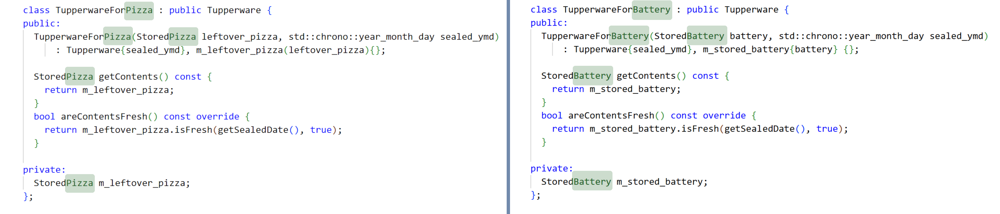

## What's News

With new, higher tariffs on goods from overseas, shoppers who would normally turn to the brand-name Tide, Cheerios and Quaker Oats have switched to Wide Out liquid detergent, Dour-Os whole-wheat cereal, and Shaker Notes steel-cut grains. To get even more value for their dollar, these bashful buyers are turning to social media to swap tips on how these products are useful for _more_ than just their intended purpose.

## Leftovers

Although controversial, there are those who say that leftovers are better than the original meal. Some say this, especially, about the turkey at Thanksgiving or Papa John’s pizza.

In the case of pizza, we order our pizza when we are really hungry and sometimes our eyes are bigger than our tummies. The result is that we have leftovers that we have to save to eat later. The best and safest way to save pizza for breakfast the next morning is to put it in an airtight container.

> Note: The use of the word container is intentional. We are using it here in the physical sense but we will return to its domain-specific definition in data structures.

Tupperware is a good, simple container for keeping food fresh and we can use it to store our leftover pizza.

Let’s translate this discussion into the world of the computer by defining a _Stored Pizza_ abstract data type (ADT) and implementing it with a data structure (using a `class`). The _Stored Pizza_ ADT will have a single characteristic -- the name of the type -- and a single behavior -- _is it fresh?_ -- that will respond with a determination of whether the leftover slice is fresh.

We can implement this _Stored Pizza_ ADT with a `StoredPizza` class in C++. The class will have a single data member – a `std::string` that holds the name of the type of pizza.[^getter] `StoredPizza` will also have a member function named `isFresh` that returns whether the pizza is still fresh (as a `bool`). The `isFresh` function will take two parameters:

1. The date the pizza was originally baked (as a `std::chrono::year_month_day`); and
2. Whether the pizza has been sealed up after being stored (as a `bool`).

[^getter]: We will write a _getter_ for that data member, too, but I bet you already thought of that!

As good C++ developers should, we separate the declaration of the `Pizza` class from its implementation:

`pizza.h`:
```C++
#ifndef TUPPERWARE_PIZZA_HPP
#define TUPPERWARE_PIZZA_HPP

#include <string>
#include <chrono>

class StoredPizza {
public:
  StoredPizza(std::string dish) : m_dish(dish){};
  std::string getDish() const;
  bool isFresh(std::chrono::year_month_day date, bool sealed) const;

private:
  std::string m_dish;
};
#endif
```

`pizza.cpp`:
```C++
#include <chrono>
#include <tupperware/pizza.hpp>

std::string StoredPizza::getDish() const {
  return m_dish;
}
bool StoredPizza::isFresh(std::chrono::year_month_day date, bool sealed) const {
  const std::chrono::time_point now{std::chrono::system_clock::now()};
  const std::chrono::year_month_day today{
      std::chrono::floor<std::chrono::days>(now)};

  auto difference = std::chrono::sys_days(today) - std::chrono::sys_days(date);
  return std::chrono::days{2} > difference;
}
```

Other than the fancy C++ _stuff_ that we need to handle dates (i.e., `std::chrono::year_month_day`), there's nothing here that we haven't already seen before! Cool!

## Nothing Outlasts the Energizer Bunny

The ADT we designed above is not _really_ an ADT for a slice of leftover Pizza -- it's much more reuseable than that. What we really designed was an ADT that can be used to store _something_ that has a type and could, after not being used for some time, go bad.

Software engineers are always attempting to make the most of the code that they have already written (software reuse), so let's see whether we can reuse the code we wrote above for other purposes.[^reuse]

[^reuse]: We will talk more about reuse when we work through C++ Interlude 5 in _Walls and Mirrors_.

I'm not sure that it's true, but I always heard that unused batteries will last longer if they are stored in a sealed container. Whether it's folklore or real science, let's assume that we might want to store excess batteries in the same way that we store excess Pizz _AA_.

Playing  a trick on ourselves will make the (soon to be revealed) dramatic conclusion of all our work so much sweeter ...  pretend that we don't remember the code that we wrote above.

To implement an object-oriented solution to storing excess batters, we'll need a _Stored Battery_ ADT that has a _type_ characteristic (i.e., AA, AAA, 9 Volt, etc.) and a _is it fresh?_ behavior. Let's implement that ADT in C++ as the `StoredBattery` class:

`battery.hpp`
```C++
#ifndef _TUPPERWARE_BATTERY_HPP
#define _TUPPERWARE_BATTERY_HPP

#include <chrono>

class StoredBattery {
  public:
    StoredBattery(std::string size): m_size(size) {};
    bool isFresh(std::chrono::year_month_day date, bool sealed) const;
  private:
    std::string m_size;
};

#endif
```

`battery.cpp`
```C++
#include <chrono>
#include <tupperware/battery.hpp>

bool StoredBattery::isFresh(std::chrono::year_month_day date, bool sealed) const {
  const std::chrono::time_point now{std::chrono::system_clock::now()};
  const std::chrono::year_month_day today{
      std::chrono::floor<std::chrono::days>(now)};

  auto difference = std::chrono::sys_days(today) - std::chrono::sys_days(date);
  return std::chrono::days{15} > difference;
}
```
Okay, wow -- are you as shocked as me at the similarities between the implementations of the _Stored Battery_ ADT and the _Stored Pizza_ ADT? It's really remarkable: they have largely the same _interface_ (an important point we will return to at the conclusion of this issue of the _C++ Times_).

## Tupperware

We can clearly see that there is _something_ that we could abstract -- it seems like what we really want to do is to, once and for all, forget about batteries and slices of pizza and start by thinking about sealable storage tools that can store _something_. There is no more well known storage technology than the reliable Tupperware container.

Let's design the _Tupperware_ ADT to be a container that could hold leftover pizza or batteries -- no, not in the same container, that would be silly!

The Tupperware ADT will support two behaviors:

1. _get contents_: Will get the contents of the Tupperware container.
2. _is it fresh?_: Will return true/false depending on whether the contents of the container are fresh.

and have one attribute:

1. _sealed date_: The date the contents were initially sealed in the Tupperware.

The algorithm for the _is it fresh?_ behavior simply relies on the fact that whatever is stored in a piece of Tupperware can determine whether it is fresh if you give it the date on which it was sealed away. Remember, what is being stored in the Tupperware is _itself_ an ADT and as long as everything stored in a piece of Tupperware has the _is it fresh?_ behavior, then we are good!

The algorithms for the _get contents_ behavior is equally straightforward: simply supply the contents of what is being stored!

Let's follow the best practices of object-oriented design and _implement_ a base class named `Tupperware` that is the data structure that implements the Tupperware ADT. Then we can create derived classes for Tupperware that hold different types of items. 

Here we go ... with a partial implementation that gets us set up with a constructor, a member variable to track the sealed date (`m_sealed_date`) and a getter function for that member variable (`getSealedDate`).

```C++
#include <chrono>

class Tupperware {
public:
  Tupperware(std::chrono::year_month_day sealed_ymd)
      : m_sealed_date{sealed_ymd} {
  }

private:
  std::chrono::year_month_day m_sealed_date{};

protected:
  std::chrono::year_month_day getSealedDate() const {
    return m_sealed_date;
  }
};
```

Great ... now, let's add a member function that will implement the _get contents_ behavior ...

```C++
#include <chrono>

class Tupperware {
public:
  Tupperware(??? contents, std::chrono::year_month_day sealed_ymd)
      : m_contents{contents}, m_sealed_date{sealed_ymd} {
  }


  ??? getContents() const {

  }

private:
  ??? m_contents{};
  std::chrono::year_month_day m_sealed_date{};

protected:
  std::chrono::year_month_day getSealedDate() const {
    return m_sealed_date;
  }
};
```

I know what you are thinking right now ... "Well, smarty, you have some `???`s there ..." 

In my defense, what _could_ I possibly write? 

The Tupperware `class` is supposed to be an implementation of the Tupperware ADT and the Tupperware ADT can _contain_ any _type_ of thing. To write down the code for the `getContents` member function, I would have to be able to write down its return type which would depend on the type of what is in the Tupperware. But, again, I want to implement the Tupperware ADT so that it can hold _any_ type. The minute I write down the declaration/definition of that `getContents` member function and specify a particular type, I've ruined our work and turned a _generic_ data structure into a bespoke data structure that cannot be as easily reused.

We could somehow create a new type that is generic and amorphous and is designed to hold _any_ type of thing. There are plenty of [languages](https://www.typescriptlang.org/docs/handbook/basic-types.html#any) that will let you do just that. But, it's really unsatisfying because the user of the implementation of the Tupperware ADT would put in an object with a specific _type_ and (through `getContents`) get back an object with a _different type_. 

If you are a gamer, this analogy might help: the solution I just described would be akin to putting a "+1 Life"-giving carrot (for instance) into our character's belt but getting back a loot box when we went to eat it. We put in a carrot and we should get back a carrot. Sure, _we_ know that the loot box holds a carrot, but no one else would -- especially the compiler! 

Once our carrot, to continue the analogy, goes into our belt, its like putting a piece of pizza in our tupperware -- the information about the type of the carrot is gone! Because the compiler would not be able to say for sure that what is in that loot box is a carrot, it would not let us write code that directed our character to eat what is in the loot box. 

We choose C++ when we start implementing object-oriented solutions because of its support for type safety and because the compiler is able to help the programmer that uses the Tupperware class. The compiler can check that the type of what the programmer puts in is the type of what the programmer gets back when they open their container. 

We've hit a roadblock. Because there is no _single_ type that can represent everything that we could possibly store in the Tupperware, we cannot declare/define a `getContents` member function in the base class.

And no, we cannot accept defeat. The style of organizing our code that we are pursuing is one of the selling points of object-oriented design and programming (moving shared functionality into base classes for reuse!). So, what are we doing here? It's an important, important problem that we have to solve.

Let's write some less-than-ideal code and see if we get any brainstorms ...

## Tupperware for Pizza

We will first code a data structure that implements the Tupperware ADT especially for containing pizza. We will call it the `TupperwareForPizza` class.

```C++
class TupperwareForPizza : public Tupperware {
public:
  TupperwareForPizza(StoredPizza leftover_pizza,
                     std::chrono::year_month_day sealed_ymd)
      : Tupperware{sealed_ymd}, m_leftover_pizza(leftover_pizza){};

  StoredPizza getContents() const {
    return m_leftover_pizza;
  }
  bool areContentsFresh() const override {
    return m_leftover_pizza.isFresh(getSealedDate(), true);
  }

private:
  StoredPizza m_leftover_pizza;
};
```

Notice how it is _only_ in the `TupperwareForPizza` class that we can correctly implement the `getContents` member function corresponding to the _get contents_  behavior of the Tupperware ADT. Why? Because it is only in this derived class that we know for sure the return type (`StoredPizza`) of that member function!

## Tupperware for Batteries

We're all charged up so let's keeping going. We will code a data structure that implements the Tupperware ADT uniquely built to hold batteries. We will call the data structure implementing the Tupperware ADT for batteries the `TupperwareForBattery` class.

```C++
class TupperwareForBattery : public Tupperware {
public:
  TupperwareForBattery(StoredBattery battery, std::chrono::year_month_day sealed_ymd)
      : Tupperware{sealed_ymd}, m_stored_battery{battery} {};

  StoredBattery getContents() const {
    return m_stored_battery;
  }
  bool areContentsFresh() const override {
    return m_stored_battery.isFresh(getSealedDate(), true);
  }

private:
  StoredBattery m_stored_battery;
};
```

## One Of These Things Is (Not) Like The Other

There's something very _odd_ about these two classes (`TupperwareForBattery` and `TupperwareForPizza`, that is). Let's put them side-by-side and see what we can see


Yes, yes, I am starting to see it. What happens if we just obscure the words `StoredPizza` and `StoredBattery`? I bet that we will start to see some more really, well, odd coincidences:



## Generic Programming

Well, what's amazing about our discovery is that the coincidence is really _no_ coincidence at all! It's actually something called *generic programming*. The person who coined the term _generic programming_ had this to say about the concept:

> "By generic programming, we mean the definition of algorithms and data structures at an abstract​ or generic level, thereby accomplishing many related programming tasks simultaneously."[^stepanov]

[^stepanov]: David R. Musser and Alexander A. Stepanov, Generic Programming, in P. Gianni, ed., _Symbolic and Algebraic Computation: International Symposium ISSAC 1988_, Lecture Notes in Computer Science v. 38, Springer-Verlag, Berlin, 1989, pp. 13-25.

The two implementations that we have written so far of the Tupperware ADT are specific to the types of objects that they contain – pizza and batteries. However, Tupperware can hold other types of contents. We could put in turkey, markers, crayons, paint, rolls of tape, etc.

Well, if we continued down the path of making a specific implementation of the Tupperware ADT for each of the types of objects that Tupperware can hold, we would get tired of copy-and-paste very quickly! More importantly, we would end up with a lot of code that looked very similar and would be very difficult to adapt – every change that we wanted to make to the algorithms that underlie our implementation of the Tupperware ADT would have to be made in several spots. Errors would multiply and be hard to fix! Nothing about that sounds good!

## Generic Programming With Templates

In C++ we can utilize the theoretical concept of generic programming through templates. You can think of a template as a generic set of code that the compiler will use to "stamp out" particular versions of that code that are customized by a set of parameters. 

You could also thinking about templates as a way to have variables whose contents are _types_ and _not_ _values_! Now _that_ is mind blowing!

Because the differences between the forms of the classes ("many forms") is based on the template parameter, the process of stamping out specialized versions of the template involves parameters which is why this type of polymorphism is known as _parametric polymorphism_. There are similarities between parametric polymorphism and function overloading. The latter (known as _ad-hoc_ polymorphism), however, is different because the functionality of each overloaded definition can be different. In parametric polymorphism, the functionality of every different form is identical -- it's just the types that change.

> Note: You can write class and function templates. We will deal primarily with class templates in this course.

Think back to when we talked about how you can instantiate objects from classes. Said another way, objects are instances of classes. In the same way, albeit with a slightly different syntax, you can instantiate class templates to get actual classes. It's like going up one level in some meta hierarchy!

Rephrasing, instantiations of class templates are instances of classes. How cool!

I know that "instantiations of class templates" is not the most sublime of English phrases. However, that’s the best that the C++ standard can do for us.

How would we phrase this relationship if we were writing a question for the SAT/ACT? 

**class : object :: class template : instantiation of class template.**

I hated those tests!

Let’s look at the syntax for writing a class template.

```C++
template <typename TYPENAME>
class CLASSNAME {
...
};
```

You can think of
```C++
template <typename TYPENAME>
```

as declaring a variable whose contents are types and whose scope is the entire declaration/definition of `CLASSNAME`. With a _variable for types_ named `TYPENAME` in scope throughout the implementation of `CLASSNAME` you can use `TYPENAME` in any place that you can use a type. When the user of that class template instantiates it, they will provide you with an actual type (what C++ calls a _template argument_).

> Note: You can specify that your class template uses additional typenames – [look up the exact syntax for declaring class templates for additional details](https://en.cppreference.com/w/cpp/language/class_template).

If the power of templates is not immediately obvious, I bet that once you see it in action you will be very impressed.

## Brand X Sealable Plastic Container

It's time to deploy our knowledge. Let's rewrite the `Tupperware` class as a class template and use generic programming. What will happen is that we can write one class template that will replace _both_ `TupperwareForPizza` _and_ `TupperwareForBattery` (and `TupperwareForPickleballs`, when we inevitably want to write that class):

```C++
#include <chrono>
#include <concepts>
#include <type_traits>

template <typename ContentType> 
class Tupperware {
public:
  Tupperware(ContentType contents, std::chrono::year_month_day sealed_ymd)
      : m_contents{contents}, m_sealed_date{sealed_ymd} {
  }

  ContentType getContents() const {
    return m_contents;
  }
  virtual bool areContentsFresh() const {
    return m_contents.isFresh(m_sealed_date, true);
  };

private:
  ContentType m_contents{};
  std::chrono::year_month_day m_sealed_date{};
};
```

Now _that_ is cool. What have we accomplished?

1. Notice that there is no longer a class hierarchy. There is only one class template for *all* Tupperware. 
2. We've reduced the amount of code by 2/3! Good code is code that is never written. The best code is code that you can remove.
3. We can now specify the implementation `getContents` of the behavior *getContents* where it should be! 

## Enough Talk. Let's Act.

We have written a class template already but we haven't used it. Don't worry -- I know that you *all* have used class templates before but probably didn't realize it.

In your C++ journeys I bet that you all have written

```C++
#include <vector>

int main() {
  std::vector<int> vis{};
  ...
  return 0;
}
```

(or at least something similar). Little did you know, but `std::vector<int>` is a way to instantiate the `std::vector` class template! Woah!

So, let's write an application that uses our class template:

```C++
#include <chrono>
#include <ios>
#include <iostream>
#include <string>

#include <tupperware/battery.hpp>
#include <tupperware/pizza.hpp>
#include <tupperware/tupperware.hpp>

/*
 * A helper function to create objects that represent some point
 * in time (on the calendar) _when_ before right now.
 */
template <typename Rep, typename Period>
auto ago(std::chrono::duration<Rep, Period> when) {
  const std::chrono::time_point now{std::chrono::system_clock::now()};
  return std::chrono::year_month_day{
      std::chrono::floor<std::chrono::days>(now - when)};
}

int main() {
  const std::chrono::year_month_day one_day_ago{ago(std::chrono::days{1})};
  const std::chrono::year_month_day one_month_ago{ago(std::chrono::months{1})};

  std::string pizza_topping{"pepperoni"};
  Pizza pepperoni_pizza{pizza_topping};
  Tupperware<StoredPizza> pizza_container{pepperoni_pizza, one_month_ago};

  std::cout << "Is my pizza still fresh? " << std::boolalpha
            << pizza_container.areContentsFresh() << "\n";
```

For the `Tupperware<StoredPizza>` instantiation of the `Tupperware` class template, think of `StoredPizza` replacing `ContentsType`. In other words, you can think of `Tupperware<Pizza>` as being a class defined like

```C++
class Tupperware8723 {
public:
  Tupperware8723(Pizza contents, std::chrono::year_month_day sealed_ymd)
      : m_contents{contents}, m_sealed_date{sealed_ymd} {
  }

  Pizza getContents() const {
    return m_contents;
  }
  virtual bool areContentsFresh() const {
    return m_contents.isFresh(m_sealed_date, true);
  };

private:
  Pizza m_contents{};
  std::chrono::year_month_day m_sealed_date{};
};
```

In fact, that’s not very different from how the compiler actually deals with class templates during the compilation process. The compiler generates unique names for each instantiation of a class template and then (literally) duplicates the class definition of the class template and replaces the template parameters with the values given. 

I know, I know ... "Will, you say these things but never give us enough information to verify that you aren't lying!" 

Well, look no further than here: [C++ Insights](https://cppinsights.io/s/f511495e). 

> Note: The code in the left pane is exactly what we have written together here, just smushed in to one file.

Press the _play_ button at the top for C++ Insights to work its magic. In particular, look at line 83 of the code that we wrote:


That code is instantiating a `Tupperware` class template with the template parameter of `StoredBattery`. Let's see what the compiler does with that:


I *told* you!!

The power of templates is incredible. Some people believe that they are hard to comprehend and use. Yes, the syntax is a bit odd and the semantics are sometimes hard to grasp, but those are complications and not complexities. You _can_ be good at using templates.

## All Is Not Happy in the Land of C++

If you look closely at the code in the `Tupperware` class template, we are making a very important assumption about the `ContentsType` type. What is it?

Well, spoiler alert: We are assuming that the `ContentsType` type is itself a class and the class contains a member function named `isFresh()`.

Instantiating this class template with `StoredBattery` or `StoredPizza` arguments will work just fine because those classes define an `isFresh()` method.

What would happen if we attempt to instantiate a `Tupperware` class template with, say, an `int` or a `double`?
