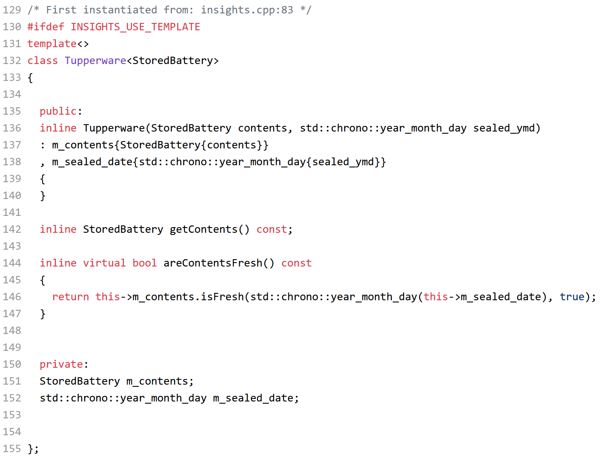

## What's News

With the rise in inflation hitting consumers hard, shoppers who would normally turn to the brand-name Tide, Cheerios and Quaker Oats are now buying Wide Out liquid detergent, Dour-Os whole-wheat cereal, and Shaker Notes steel-cut grains. But, not all is lost -- those bashful buyers are learning about how these products are useful for their original purpose and so much more.

## Leftovers

Although controversial, there are those who say that leftovers are better than the original meal. Some say this, especially, about the turkey at Thanksgiving or Papa John’s pizza.

In the case of pizza, we order our pizza when we are really hungry and sometimes our eyes are bigger than our tummies. The result is that we have leftovers that we have to save to eat later. The best and safest way to save pizza for breakfast the next morning is to put it in an airtight container.

> Note: The use of the word container is intentional. We are using it here in the physical sense but we will return to its domain-specific definition in data structures.

Tupperware is a good, simple container for keeping food fresh and we can use it to store our leftover pizza.

Let’s translate this discussion into the world of the computer by defining a `Pizza` data structure (using a `class`) to represent pizzas. `Pizza` will have a single member variable – a `std::string` that holds the name of the type of pizza. `Pizza` will have a getter member function named `getDish` that returns the type of the pizza (as a `std::string`). `Pizza` will also have a member function named `isFresh` that returns whether the pizza is still fresh (as a `bool`). The `isFresh` function will take two parameters:

1. The date the pizza was originally baked (as a `std::chrono::year_month_day`); and
2. Whether the pizza has been sealed up after being stored (as a `bool`).

We separate the declaration of the `Pizza` class from its implementation:

`pizza.h`:
```C++
#ifndef TUPPERWARE_PIZZA_HPP
#define TUPPERWARE_PIZZA_HPP

#include <string>
#include <chrono>

class Pizza {
public:
  Pizza(std::string dish) : m_dish(dish){};
  std::string getDish() const;
  bool isFresh(std::chrono::year_month_day date, bool sealed) const;

private:
  std::string m_dish;
};
#endif
```

`pizza.cpp`:
```C++
#include <chrono>
#include <tupperware/pizza.hpp>

std::string Pizza::getDish() const {
  return m_dish;
}
bool Pizza::isFresh(std::chrono::year_month_day date, bool sealed) const {
  const std::chrono::time_point now{std::chrono::system_clock::now()};
  const std::chrono::year_month_day today{
      std::chrono::floor<std::chrono::days>(now)};

  auto difference = std::chrono::sys_days(today) - std::chrono::sys_days(date);
  return std::chrono::days{2} > difference;
}
```

Other than the fancy C++ *stuff* that we need to handle dates (i.e., `std::chrono::year_month_day`), there's nothing here that we haven't already seen before! Cool!

## Nothing Outlasts the Energizer Bunny

I'm not sure that it's true, but I always heard that unused batteries will last longer if they are stored in a sealed container. Whether it's folklore or real science, let's assume that we might want to store batteries in our container. To do so we'll need a data structure representing a battery. It will have *largely* the same interface as `Pizza` (an important point we will return to at the conclusion of this issue of the *C++ Times*). 

`battery.hpp`
```C++
#ifndef _TUPPERWARE_BATTERY_HPP
#define _TUPPERWARE_BATTERY_HPP

#include <chrono>

class Battery {
  public:
    Battery(std::string size): m_size(size) {};
    bool isFresh(std::chrono::year_month_day date, bool sealed) const;
  private:
    std::string m_size;
};

#endif
```

`battery.cpp`
```C++
#include <chrono>
#include <tupperware/battery.hpp>

bool Battery::isFresh(std::chrono::year_month_day date, bool sealed) const {
  const std::chrono::time_point now{std::chrono::system_clock::now()};
  const std::chrono::year_month_day today{
      std::chrono::floor<std::chrono::days>(now)};

  auto difference = std::chrono::sys_days(today) - std::chrono::sys_days(date);
  return std::chrono::days{15} > difference;
}
```

## Tupperware

Let’s return now to the Tupperware, the container that is going to hold our leftover pizza and batteries -- no, not in the same container, that would be silly! Again, we will translate this physical concept into a computational concept by defining a Tupperware *ADT*.

The Tupperware ADT will support two behaviors:

1. *getContents*: The method will return the contents of the Tupperware container.
2. *areContentsFresh*: The method will return true/false depending on whether the contents of the container are fresh.

and have one attribute:

1. *sealed_date*: The date the contents were initially sealed in the Tupperware.

The algorithm for both methods is relatively straightforward – for *getContents* the ADT will simply supply its contents and for *areContentsFresh* the ADT will simply invoke the `isFresh` method of its contents (using the *sealed_date* and `true` as the arguments to the member function). 

We can follow the best practices of object-oriented design and *implement* a base class named `Tupperware` that is the data structure that implements the Tupperware ADT (Again, remember what our *Walls and Mirrors* authors say: a data structure is not the same as an ADT – the former implements the latter!). Then we can create derived classes for Tupperware that hold different types of items. 

Here we go ...

```C++
#include <chrono>

class Tupperware {
public:
  Tupperware(std::chrono::year_month_day sealed_ymd)
      : m_sealed_date{sealed_ymd} {
  }

  virtual bool areContentsFresh() const {
    return false;
  };

private:
  std::chrono::year_month_day m_sealed_date{};

protected:
  std::chrono::year_month_day getSealedDate() const {
    return m_sealed_date;
  }
};
```

I know what you are thinking right now ... "Well, smarty, you left out the implementation of a `getContents` member function to implement the *getContents* behavior!" You're right, I did. But, I will fire back at you ... "The Tupperware `class` is supposed to be an implementation of the Tupperware ADT; the Tupperware ADT can *contain* any *type* of thing; If it can contain any *type* of thing, what should be the return type of the `getContents` member function? 

I know, right? We've hit a roadblock. Because there is no *single* type that can represent everything that we could possibly store in the Tupperware (while maintaining type safety -- one of the reasons we chose C++ in the first place!), we cannot declare/define a `getContents` member function in the base class.

But that's one of the selling points of object-oriented design and programming -- move shared functionality into base classes for reuse! So, what are we doing here? It's an important, important problem that we have to solve.

But first, let's implement some Tupperware data structures that hold different types of items.

## Tupperware for Pizza

We will first code a data structure that implements the Tupperware ADT containing a pizza. We will it the `TupperwareForPizza` class.

```C++
class TupperwareForPizza : public Tupperware {
public:
  TupperwareForPizza(Pizza leftover_pizza,
                     std::chrono::year_month_day sealed_ymd)
      : Tupperware{sealed_ymd}, m_leftover_pizza(leftover_pizza){};

  Pizza getContents() const {
    return m_leftover_pizza;
  }
  bool areContentsFresh() const override {
    return m_leftover_pizza.isFresh(getSealedDate(), true);
  }

private:
  Pizza m_leftover_pizza;
};
```

Notice how it is *only* in the `TupperwareForPizza` class that we can correctly implement the `getContents` member function corresponding to the *getContents*  behavior of the Tupperware ADT. Why? Because it is only in this derived class that we know for sure the return type (`Pizza`) of that member function!

## Tupperware for Batteries

We're all charged up so let's keeping going. We will code a data structure that implements the Tupperware ADT that holds batteries. We will call the data structure implementing the Tupperware ADT for batteries the `TupperwareForBattery` class.

```C++
class TupperwareForBattery : public Tupperware {
public:
  TupperwareForBattery(Battery battery, std::chrono::year_month_day sealed_ymd)
      : Tupperware{sealed_ymd}, m_stored_battery{battery} {};

  Battery getContents() const {
    return m_stored_battery;
  }
  bool areContentsFresh() const override {
    return m_stored_battery.isFresh(getSealedDate(), true);
  }

private:
  Battery m_stored_battery;
};
```

## One Of These Things Is (Not) Like The Other

There's something very *odd* about these two classes (`TupperwareForBattery` and `TupperwareForPizza`, that is). Let's put them side-by-side and see what we can see


Yes, yes, I am starting to see it. What happens if we just obscure the words `Pizza` and `Battery`? I bet that we will start to see some more really, well, odd coincidences:


## Generic Programming

Well, what's amazing about our discovery is that the coincidence is really *no* coincidence at all! It's actually something called *generic programming*. The person who coined the term *generic programming* had this to say about the concept:

> “By generic programming, we mean the definition of algorithms and data structures at an abstract​ or generic level, thereby accomplishing many related programming tasks simultaneously.”

The two implementations that we have written so far of the Tupperware ADT are specific to the types of objects that they contain – pizza and batteries. However, Tupperware can hold other types of contents. We could put in turkey, markers, crayons, paint, rolls of tape, etc.

Well, if we continued down the path of making a specific implementation of the Tupperware ADT for each of the types of objects that Tupperware can hold, we would get tired of copy-and-paste very quickly! More importantly, we would end up with a lot of code that looked very similar and would be very difficult to adapt – every change that we wanted to make to the algorithms that underly our implementation of the Tupperware ADT would have to be made in several spots. Errors would multiply and be hard to fix! Nothing about that sounds good!

## Generic Programming With Templates

In C++ we can utilize the theoretical concept of generic programming through templates. You can think of a template as a generic set of code that the compiler will use to “stamp out” particular versions of that code that are customized by a set of parameters. Because the process of stamping out specialized versions of the template involves parameters, this type of polymorphism is known as *parametric polymorphism*.

> Note: You can write class and function templates. We will deal primarily with class templates in this course.

Think back a few classes where we talked about how you instantiate objects from classes. Said another way, objects are instances of classes. In the same way, albeit with a slightly different syntax, you can instantiate class templates to get actual classes. Rephrasing, instantiations of class templates are instances of classes. How cool!

I know that “instantiations of class templates” is not the most sublime of English phrases. However, that’s the best that the C++ standard can do for us.

How would we phrase this relationship if we were writing a question for the SAT/ACT? 

*class : object :: class template : instantiation of class template.*

I hated those tests!

Let’s look at the syntax for writing a class template.

```C++
template <typename TYPENAME>
class CLASSNAME {
...
};
```

Conceptually (although not always practically), throughout the implementation of `CLASSNAME` you can use `TYPENAME` in any place that you can use a type. When the user of that class template instantiates it, they will provide you with an actual type.

> Note: You can specify that your class template uses additional typenames – [look up the exact syntax for declaring class templates for additional details](https://en.cppreference.com/w/cpp/language/class_template).

## Brand X Sealable Plastic Container

It's time to deploy our knowledge. Let's rewrite the `Tupperware` class as a class template and use generic programming:

```C++
#include <chrono>
#include <concepts>
#include <type_traits>

template <typename ContentType> class Tupperware {
public:
  Tupperware(ContentType contents, std::chrono::year_month_day sealed_ymd)
      : m_contents{contents}, m_sealed_date{sealed_ymd} {
  }

  ContentType getContents() const {
    return m_contents;
  }
  virtual bool areContentsFresh() const {
    return m_contents.isFresh(m_sealed_date, true);
  };

private:
  ContentType m_contents{};
  std::chrono::year_month_day m_sealed_date{};
};
```

Now *that* is cool. What have we accomplished?

1. Notice that there is no longer a class hierarchy. There is only one class template for *all* Tupperware. 
2. We've reduced the amount of code by 2/3! Good code is code that is never written. The best code is code that you can remove.
3. We can now specify the implementation `getContents` of the behavior *getContents* where it should be! 

## Enough Talk. Let's Act.

We have written a class template already but we haven't used it. Don't worry -- I know that you *all* have used class templates before but probably didn't realize it.

In C++ journeys I bet that you all have written

```C++
#include <vector>

int main() {
  std::vector<int> vis{};
  ...
  return 0;
}
```

(or at least something similar). Little did you know, but `std::vector<int>` is a way to instantiate the `std::vector` class template! Woah!

So, let's write an application that uses our `Tupperware` class template:

```C++
#include <chrono>
#include <ios>
#include <iostream>
#include <string>

#include <tupperware/battery.hpp>
#include <tupperware/pizza.hpp>
#include <tupperware/tupperware.hpp>

/*
 * A helper function to create objects that represent some point
 * in time (on the calendar) _when_ before right now.
 */
template <typename Rep, typename Period>
auto ago(std::chrono::duration<Rep, Period> when) {
  const std::chrono::time_point now{std::chrono::system_clock::now()};
  return std::chrono::year_month_day{
      std::chrono::floor<std::chrono::days>(now - when)};
}

int main() {
  const std::chrono::year_month_day one_day_ago{ago(std::chrono::days{1})};
  const std::chrono::year_month_day one_month_ago{ago(std::chrono::months{1})};

  std::string pizza_topping{"pepperoni"};
  Pizza pepperoni_pizza{pizza_topping};
  Tupperware<Pizza> pizza_container{pepperoni_pizza, one_month_ago};

  std::cout << "Is my pizza still fresh? " << std::boolalpha
            << pizza_container.areContentsFresh() << "\n";
```

For the `Tupperware<Pizza>` instantiation of the `Tupperware` class template, think of `Pizza` replacing `ContentsType`. In other words, you can think of `Tupperware<Pizza>` as being a class defined like

```C++
class Tupperware8723 {
public:
  Tupperware8723(Pizza contents, std::chrono::year_month_day sealed_ymd)
      : m_contents{contents}, m_sealed_date{sealed_ymd} {
  }

  Pizza getContents() const {
    return m_contents;
  }
  virtual bool areContentsFresh() const {
    return m_contents.isFresh(m_sealed_date, true);
  };

private:
  Pizza m_contents{};
  std::chrono::year_month_day m_sealed_date{};
};
```

In fact, that’s not very different than how the compiler actually deals with class templates during the compilation process. The compiler generates unique names for each instantiation of a class template and then (literally) duplicates the class definition of the class template and replaces the template parameters with the values given. 

I know, I know ... "Will, you say these things but never give us enough information to verify that you aren't lying!" 

Well, look no further than here: [C++ Insights](https://cppinsights.io/s/7e5ca240). 

> Note: The code in the left pane is exactly what we have written together here, just smushed in to one file.

Press the *play* button at the top for C++ Insights to work its magic and then look at the code in the right pane. In particular, look at lines 98 to 156:




I *told* you!!

The power of templates is incredible. Some people believe that they are hard to comprehend and use. Yes, the syntax is a bit odd and the semantics are sometimes hard to grasp, but those are complications and not complexities. You *can* be good at using templates and we will use them to our advantage throughout the course!

## All Is Not Happy in the Land of C++

Not Everything Is Generic

If you look closely at the code in the `Tupperware` class template, we are making a very important assumption about the `ContentsType` type. What is it? We are assuming that the `ContentsType` type is itself a class and the class contains a member function named `isFresh()`.

Instantiating this class template with `Battery` or `Pizza` will work just fine because those classes define an `isFresh()` method.

What will happen if we attempt to instantiate a `Tupperware` class template with, say, an `int` or a `double`?
