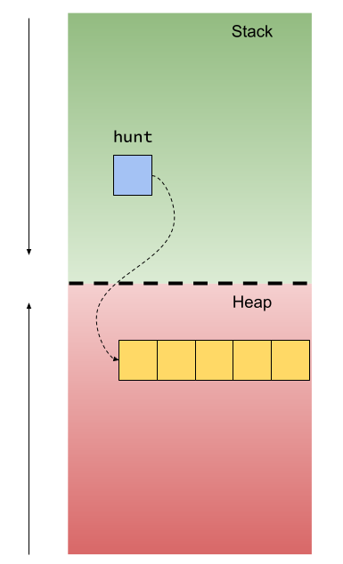

## What's News

The zoning commission for Stroustroupville has formalized a proposal for new procedures on determining how to adjudicate *wasted* property. After a public comment period, the commissioners will vote to adopt the rules which are intended to disource property profligacy.

## Dynamic Memory -- Leaky, Leaky

Dynamic memory is a powerful tool for programmers. There are some times where it is just impossible to know the amount of memory that a task will require until the task is already in process. But by the time the task has started executing, it's way too late for the compiler to be able to safely generate code that will automatically handle memory allocation and deallocation.

Here is a completely fictional, useless function named `liddy` that 

1. takes a `size` parameter (as an `int`)

and

1. allocates a `size`-sized array of `int`egers, and
1. `return`s that to the caller for their use.

```C++
int *liddy(int size) {
    int *dynamic_integer_array{new int[size]};
    return dynamic_integer_array;
}
```

> *Note: Be sure that you are familiar with the syntax of this function before reading further in this edition of the C++ Times. In particular, make sure that you are comfortable with the [`new` operator](https://eel.is/c++draft/basic.stc.dynamic#def:allocation_function) that forms the [`new` expression](https://eel.is/c++draft/expr.new) that performs the memory allocation.*

As you can see from the implementation of the `liddy` function, the caller is the entity responsible for handling the deallocation of the memory from the function.

## Use It Or (And?) Lose It

Here's a (yes, again, *simple*) example of code that would use the `liddy` function:

```C++
int main() {
    auto *hunt{liddy(5)};
    std::cout << "I made space!\n";

    hunt = liddy(7);
    std::cout << "I made (more) space!\n";

    return 0;
}
```

The code really doesn't do *anything* but ask for memory from `liddy`. And `liddy` is only too happy to oblige. 

Depending on how good your eyes are tuned for spotting memory leaks, you may already see the problem.

## One If By Stack, Two If By Heap

We have looked at length at the difference between the stack and the heap and where a variable's space for its values is created. All automatic variables' space for their values are on the heap and all dynamic variables's space for their values are on the heap.

But that's really only half the story. In *most* cases, when a programmer uses dynamic memory, there are really *two* variables that are created. There is the *anonymous* variable whose space for its values is allocated on the heap (the result of the function call to `liddy` in this case) and then there is the named variable (`hunt` in this example) whose space for its values is allocated on the stack. Programmers usually think that the former is the most important piece. However, without the latter variable (`hunt`, the variable that provides the programmer the link with that variable in the heap), the programmer would be unable to use their newly acquired resource.

(Again, what we are describing here is what happens in *most* cases -- there are plenty of exotic ways to use pointers.)



The space for the value of the former variable, what programmers call the *pointer* variable, is actually on the stack (again, `hunt` in this example). The latter is, obviously, on the heap. That's great, but does it matter?

It matters a great deal. The compiler automatically manages the space for storing values of automatic variables. When an automatic variable goes out of scope, the space that variable uses to hold its values is cleaned by the compiler.

If the automatic variable that the compiler cleans holds the only link to a dynamic variable, then, when the compiler deallocates it, you will lose all access to the space in memory and, therefore, 

1. have no way to use it and, more importantly,
2. have no way to release its space back to the operating system.

In other words, you get a memory leak!

## Plug The Leak

Memory leaks are relatively easy to fix but that's only if you can find them! And finding them is sometimes nearly impossible!

Enter `valgrind`, an amazing tool that you can use to help you find the source of memory leaks. 

`valgrind` is incredibly powerful *and* easy to use.

For the remainder of this edition of the C++ Times, we will assume that entering

```console
$ ./liddy
```

will execute the program that we wrote above and that we have entered all the code in a file named `liddy.cpp`.

For example, 

```console
$ ./liddy
I made space!
I made (more) space!
```

The program *looks* like it runs okay, but we suspect a massive memory leak. Let's use `valgrind` to confirm. Running `valgrind` could not be easier:

```console
$ valgrind ./liddy
==2989== Memcheck, a memory error detector
==2989== Copyright (C) 2002-2017, and GNU GPL'd, by Julian Seward et al.
==2989== Using Valgrind-3.18.1 and LibVEX; rerun with -h for copyright info
==2989== Command: ./liddy
==2989== 
I made space!
I made (more) space!


==2989== 
==2989== HEAP SUMMARY:
==2989==     in use at exit: 48 bytes in 2 blocks
==2989==   total heap usage: 4 allocs, 2 frees, 73,776 bytes allocated
==2989== 
==2989== LEAK SUMMARY:
==2989==    definitely lost: 48 bytes in 2 blocks
==2989==    indirectly lost: 0 bytes in 0 blocks
==2989==      possibly lost: 0 bytes in 0 blocks
==2989==    still reachable: 0 bytes in 0 blocks
==2989==         suppressed: 0 bytes in 0 blocks
==2989== Rerun with --leak-check=full to see details of leaked memory
==2989== 
==2989== For lists of detected and suppressed errors, rerun with: -s
==2989== ERROR SUMMARY: 0 errors from 0 contexts (suppressed: 0 from 0)
```

The most important piece of that output is

```
==2989==    definitely lost: 48 bytes in 2 blocks
```

This output confirms our suspicision that we have a memory leak!

> Note: We leak 48 bytes because we call `liddy` twice. The first time we call it with a `size` argument of 5 -- which ultimately allocates 20 bytes (four bytes for each of the `5` `int`egers in the array that `liddy` allocates). The second time we call it with a `size` argument of `7` -- which ultimately allocates `28` bytes (four bytes for each of the `7` `int`egers in the array that `liddy` allocates).

## Knowing Is Half The Battle

In a program larger than the one that we are debugging here, it is possible that the spot of the allocation of the memory being leaked is harder to find (more code gives more places for errors to hide out!). 

But, don't worry, `valgrind` can (in cases where our programs contain so-called debugging symbols) tell us where the leaking allocation occurs. To have `valgrind` tell us that information, we use a slightly more complicated invocation:


```console
$ valgrind --leak-check=full ./liddy
```

When we run that command, we see

```console
$ valgrind --leak-check=full ./liddy
==3013== Memcheck, a memory error detector
==3013== Copyright (C) 2002-2017, and GNU GPL'd, by Julian Seward et al.
==3013== Using Valgrind-3.18.1 and LibVEX; rerun with -h for copyright info
==3013== Command: ./liddy
==3013== 
I made space!
I made (more) space!
==3013== 
==3013== HEAP SUMMARY:
==3013==     in use at exit: 48 bytes in 2 blocks
==3013==   total heap usage: 4 allocs, 2 frees, 73,776 bytes allocated
==3013== 
==3013== 20 bytes in 1 blocks are definitely lost in loss record 1 of 2
==3013==    at 0x48462F3: operator new[](unsigned long) (in /usr/libexec/valgrind/vgpreload_memcheck-amd64-linux.so)
==3013==    by 0x1091FE: liddy(int) (liddy.cpp:4)
==3013==    by 0x10921E: main (liddy.cpp:9)
==3013== 
==3013== 28 bytes in 1 blocks are definitely lost in loss record 2 of 2
==3013==    at 0x48462F3: operator new[](unsigned long) (in /usr/libexec/valgrind/vgpreload_memcheck-amd64-linux.so)
==3013==    by 0x1091FE: liddy(int) (liddy.cpp:4)
==3013==    by 0x109245: main (liddy.cpp:13)
==3013== 
==3013== LEAK SUMMARY:
==3013==    definitely lost: 48 bytes in 2 blocks
==3013==    indirectly lost: 0 bytes in 0 blocks
==3013==      possibly lost: 0 bytes in 0 blocks
==3013==    still reachable: 0 bytes in 0 blocks
==3013==         suppressed: 0 bytes in 0 blocks
==3013== 
==3013== For lists of detected and suppressed errors, rerun with: -s
==3013== ERROR SUMMARY: 2 errors from 2 contexts (suppressed: 0 from 0)
```

Again, there is one section of output more important than the others:

```console
==3013== 20 bytes in 1 blocks are definitely lost in loss record 1 of 2
==3013==    at 0x48462F3: operator new[](unsigned long) (in /usr/libexec/valgrind/vgpreload_memcheck-amd64-linux.so)
==3013==    by 0x1091FE: liddy(int) (liddy.cpp:4)
==3013==    by 0x10921E: main (liddy.cpp:9)
```

Interpret this output as if it were an outline of the runtime stack (recall: *stack frames* [a.k.a. *activation records*]) at the moment the leaking allocation occurs:

1. `main` is paused at line 9
2. `liddy` is paused at line 4

We can interpret that as a treasure map where x marks the spot, in the source code, of the allocation that is being leaked:

```C++
    int *dynamic_integer_array{new int[size]};
```

from the body of the `liddy` function! Wow, how cool!!

## Doing Is The Other Half

Now that we have found the allocation that is the source of the leak, let's clean it up. Even though the example code in `main` does not actually do anything with the memory allocated by the `liddy` function, it *could*. If we cleaned up that allocation before we were completely done using it, that would cause a *use-after-free error* -- a serious bug and potential security vulnerability.

It's fairly reasonable to assume that we are done using the memory allocated by the *first* call to `liddy` at the time that we make the *second* call to `liddy`. We are, after all, intentionally overwriting the value of the pointer to that memory. So, let's add some code to clean up the memory allocated in the first `liddy` call right before the second `liddy` call:

```C++
int main() {
    auto *hunt{liddy(5)};
    std::cout << "I made space!\n";

    delete[] hunt;

    hunt = liddy(7);
    std::cout << "I made (more) space!\n";

    return 0;
}
```

The `delete[]` syntax deallocates the memory allocated *for an array*. Note that caveat -- *for an array*. The `[]` after the `delete` keyword is required when you are freeing space allocated for an array. It is omitted when you are freeing space allocated for anything else (even a `std::vector`).

And we certainly know that the memory from the second allocation is no longer needed at the time that the program completes. So, let's free the memory allocated in the second call to `liddy` right before the program ends:

```C++
int main() {
    auto *hunt{liddy(5)};
    std::cout << "I made space!\n";

    delete[] hunt;

    hunt = liddy(7);
    std::cout << "I made (more) space!\n";

    return 0;
}
```

To confirm that we successfully plugged the leak, let's run `valgrind` again and check its output:

```console
$ valgrind ./liddy
==2835== Memcheck, a memory error detector
==2835== Copyright (C) 2002-2017, and GNU GPL'd, by Julian Seward et al.
==2835== Using Valgrind-3.18.1 and LibVEX; rerun with -h for copyright info
==2835== Command: ./a.out
==2835== 
I made space!
I made (more) space!
==2835== 
==2835== HEAP SUMMARY:
==2835==     in use at exit: 0 bytes in 0 blocks
==2835==   total heap usage: 4 allocs, 4 frees, 73,776 bytes allocated
==2835== 
==2835== All heap blocks were freed -- no leaks are possible
==2835== 
==2835== For lists of detected and suppressed errors, rerun with: -s
==2835== ERROR SUMMARY: 0 errors from 0 contexts (suppressed: 0 from 0)
```

Now. That. Is. Cool!

## BONUS: Detecting That Nasty Use-After-Free

Okay, true confession: I am not always the most careful programmer. Sometimes I commit the dreaded use-after-free error. Let's say that I make such a mistake in the application we are writing. What would that error look like? Something like this:

```C++
int main() {
    auto *hunt{liddy(5)};
    std::cout << "I made space!\n";

    delete[] hunt;

    std::cout << "The value of the 0th element in the hunt array is " << hunt[0] << ".\n";

    hunt = liddy(7);
    std::cout << "I made (more) space!\n";

    return 0;
}
```

See it? I am accessing the memory allocated by the first call to the `liddy` function *after* I have released it! That's not good!

Yes, it is *very* hard to spot these types of errors. Fortunately, `valgrind` helps us in these cases, too:

```console
$ valgrind ./liddy
==3014== Memcheck, a memory error detector
==3014== Copyright (C) 2002-2017, and GNU GPL'd, by Julian Seward et al.
==3014== Using Valgrind-3.18.1 and LibVEX; rerun with -h for copyright info
==3014== Command: ./a.out
==3014== 
I made space!
==3014== Invalid read of size 4
==3014==    at 0x1092AF: main (liddy.cpp:14)
==3014==  Address 0x4db4c80 is 0 bytes inside a block of size 20 free'd
==3014==    at 0x4848A8F: operator delete[](void*) (in /usr/libexec/valgrind/vgpreload_memcheck-amd64-linux.so)
==3014==    by 0x10928E: main (liddy.cpp:13)
==3014==  Block was alloc'd at
==3014==    at 0x48462F3: operator new[](unsigned long) (in /usr/libexec/valgrind/vgpreload_memcheck-amd64-linux.so)
==3014==    by 0x10923E: liddy(int) (liddy.cpp:4)
==3014==    by 0x10925E: main (liddy.cpp:9)
==3014== 
The value of the 0th element of hunt is 0
I made (more) space!
==3014== 
==3014== HEAP SUMMARY:
==3014==     in use at exit: 0 bytes in 0 blocks
==3014==   total heap usage: 4 allocs, 4 frees, 73,776 bytes allocated
==3014== 
==3014== All heap blocks were freed -- no leaks are possible
==3014== 
==3014== For lists of detected and suppressed errors, rerun with: -s
==3014== ERROR SUMMARY: 1 errors from 1 contexts (suppressed: 0 from 0)
```

As usual with `valgrind`, one bit of the output is more important than the rest:

```
==3014== Invalid read of size 4
==3014==    at 0x1092AF: main (liddy.cpp:14)
==3014==  Address 0x4db4c80 is 0 bytes inside a block of size 20 free'd
==3014==    at 0x4848A8F: operator delete[](void*) (in /usr/libexec/valgrind/vgpreload_memcheck-amd64-linux.so)
==3014==    by 0x10928E: main (liddy.cpp:13)
==3014==  Block was alloc'd at
==3014==    at 0x48462F3: operator new[](unsigned long) (in /usr/libexec/valgrind/vgpreload_memcheck-amd64-linux.so)
==3014==    by 0x10923E: liddy(int) (liddy.cpp:4)
==3014==    by 0x10925E: main (liddy.cpp:9)
```

Would you look at that? It tells us *exactly* what we did wrong and where we did it!! Wow. Talk about a super tool!

