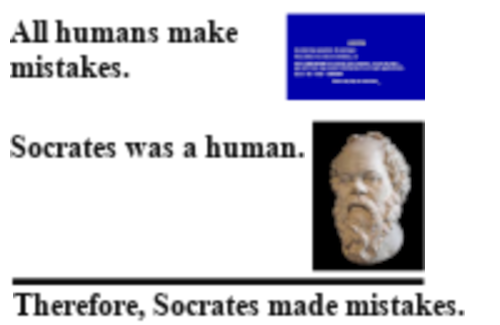

### What's News

While consumers have always held the [power of the purse](https://en.wikipedia.org/wiki/Power_of_the_purse), these days they are going farther than ever in an attempt to direct the behavior of corporate entities. They are using Instagram, TikTok and other social media to name and shame the corporate actors who are not aligned with their values.

## Variables

Variables are a deceptively simple concept in programming languages. By definition, variables are nothing more than the name of a location in memory that holds a _changeable_ value (emphasis intended -- see below). That simple explanation belies their importance in writing good, self-documenting code.

> Until further notice, we will consider the case of true variables and omit the semantics of so-called constant variables (which is a bit of an oxymoron). We will return to constant variables later.

Programmers use variables as [expressions (remember the definition of an expression?)](./expressions-types.md) whose value is the contents of the variable's associated memory at the time of access. That is a mouthful. Let's take it piece by piece:

1. Variables are expressions and, therefore, have a value.
2. The memory associated with a variable is where the variable's value is stored while the program executes.
3. Accessing the variable's value during program execution is simply reading the value of that memory and interpreting that data according to the variable's type!

Left to its own devices, compilers are only aware of the language's reserved words (e.g., `return`, `int`, `if`, etc). The process of making the compiler aware of a word that we (the programmer) use to name a place in memory is known as declaring a variable.

> Note: As we go throughout the semester, we will learn how to declare things other than variables. Just remember that a declaration is nothing more than a way to introduce a name into a program and telling the language how to interpret that name.

Asking the compiler to set aside some memory for a variable we declare is known as defining a variable. Although variable declaration and definition in can happen separately in C++, they most often occur simultaneously.

Because every value in C++ has a type, and variables have values, it stands to reason that variables have types.



And, yes, that is what happens in C++. Therefore, a variable declaration _also_ associates a type with a variable in addition to introducing that variable's name to the compiler. This additional utility of the declaration is what we described above when we said that a declaration also tells the language how to interpret the name.

When a variable is defined, the compiler turns to the variable's type to determine how much memory to set aside for its value.

Future editions of the C++ Times will discuss the role of types in programming languages, in general, and C++, specifically.

### Naming

Names are intensely personal. They help us build an identity. The names for our program's variables are no different. They help us programmers identify how a variable is used in the context of the program's actions. For instance, a variable named `duration_of_spring` likely holds the length (in some units) of the season of spring. A reasonable programmer reading code with a variable with that name would be surprised if they found out that it, in fact, holds the height of an elephant.

The more descriptive a variable's name, the better. That said, there are a few limitations that C++ puts on valid variable names:

1. A variable cannot have the same name as a reserved word.
2. A variable's name can consist solely of letters, numbers and `_`s.
3. A variable's name cannot start with a number.

Valid variable names in C++ include: `testing`, `costOfHouse`, `final_grade`, and `numbers_over_14`.

Invalid variable names in C++ include `1st_President`, `best-friends`, and `#ofPets`.

### Unchanging Variables

Even (especially?) good programmers know that it is hard to remember the meaning of their code from one day to the next. The task of remembering the point of a snippet of code is all that much harder when there are strange numbers littered throughout the code. 

For instance, consider the code below:

```C++
cupsOfMilk*0.00834540445;
```

It's _obvious_ that `0.00834540445` is the number of ounces per cup and we are using that as a scaling factor to write an expression that calculates the number of ounces of milk used in a recipe![^1]

[^1]: Please be aware that I was being completely facetious -- I had _no_ idea that special value is the number of ounces per cup!

If we gave `0.00834540445` a name, by using a variable (say, `ouncesPerCup`), our expression is much more readable:


```C++
cupsOfMilk*ouncesPerCup
```

Great! There's only one problem: We said that a variable is, uhm, _changeable_. That means that other programmers who edit our code are free to come along and change the number of ounces per cup. Reality says that is absolutely not okay but variables do not offer us any protection. The variables have given us a way to document the value's use but nothing else.

Enter _constant variables_. These are variables whose value cannot change during the course of the program's execution (after they are first assigned a value) -- in a way, we shouldn't really consider them variables at all (they don't vary, after all!). 

In future editions of the C++ Times where the syntax of variables is introduced, we will explore the `const` keyword that is used to denote a constant variable in its declaration.