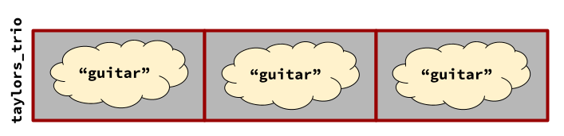
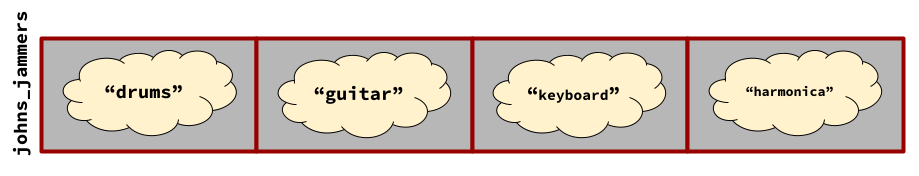
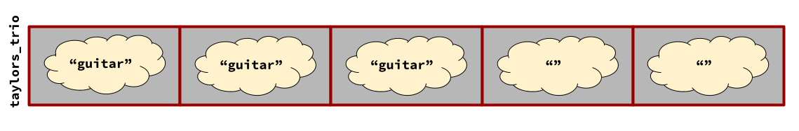
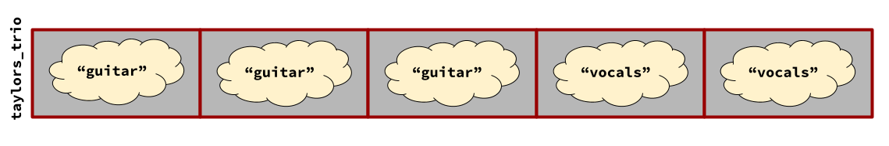
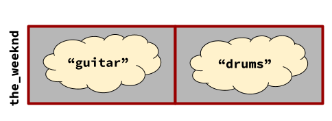
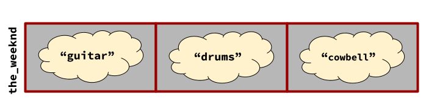

## What's News

A committee on academic misconduct has dismissed a tenure-track professor who claimed that they were able to resize an array without resorting to metaphysics. Amateur sleuths who keep their eyes peeled for scientific misconduct immediately dug into their research when it was first published and determined that, no, the professor's conclusions were not valid.

## Vectors - Arrays' Friendlier Twin

Arrays are a powerful Swiss Army Knife that all programmers enjoy having at their disposal. They give us an incredibly flexible way to organize data because they allow us to refer programmatically to an entire group of elements (each of which has the same type, remember?) and to refer programmatically to individual elements within that group. In other words, the array itself is a variable just as much as each of the elements in an array is a variable.

Each of the elements of an array is accessible with a combination of the name of the group and an _index_ into that group. Accessing an individual element of the array using the group's name and an index yields a real, live, in-the-flesh variable. 

```C++
int main() {
    int ages[5]{};
    int my_age{};
    ...
}

```

Both 

```C++
    ages[3]
```

and

```C++
    my_age
```

are `int`-typed variables. Just as it is possible to write

```C++
    my_age += 1;
```

on my birthday, it is possible to write

```C++
    ages[3] += 1;
```

One of the superpowers of an array is that it gives programmers the power to write code that generates accesses to variables. 

If we tried to recreate the above code without arrays ...

```C++
int main() {
    int ages0{};
    int ages1{};
    int ages2{};
    int ages3{};
    int ages4{};
    int my_age{};
    ...
}
```

... it would require lots of copying and pasting to calculate an average age:

```C++
    int total_age{};

    total_age += ages0;
    total_age += ages1;
    total_age += ages2;
    total_age += ages3;
    total_age += ages4;

    double average_age{total_age / 5.0};
```

Ugh. However, with arrays (and the original code), we can use a loop to programmatically generate accesses to each of the five `int`-typed variables:

```C++
    int total_age{};
    for (int i{0}; i<5; i++) {
        total_age += ages[i];
    }
    double average_age{total_age / 5.0};
```

>Note: Yes, you're right, there are _way_ better ways to write a loop that calculates an average, but I wrote it this way intentionally so that we can see ...

When writing code that accesses the elements of an array, good programmers often mentally "unroll" their loops to make sure that they have calculated accesses correctly. For example, in the loop shown above, a programmer might unroll the loop and jot down some notes that look like:

```C++
total_age += ages[0]; // 0 here because that is where i starts.
total_age += ages[1]; // 1 < 5
total_age += ages[2]; // 2 < 5
total_age += ages[3]; // 3 < 5
total_age += ages[4]; // 4 < 5
                      // We would stop before we get here, because 
                      // 5 is not < 5.
```

Look at how similar that looks to the code that we wrote by hand above. Only this time we didn't have to write it by hand!

Oh, and there's another huge advantage: the loop/array-based code is far more extensible. If there were more ages that we wanted to include in the average calculation, there is far less copy/paste required.

### Uh Oh Spaghettio

That's the bright side of arrays. Not everything with arrays is sunshine and roses. They do have a dark side. The size of an array must be fixed at the time the program is compiled and it is entirely up to the programmer to make sure that they are accessing elements within the array's bounds. 

> Note: As you dig more deeply into C++, especially dynamic memory management, you will learn how to build arrays that seem as though they are not subject to these restrictions. Those skills needed to work with arrays in this manner are incredibly powerful _and_ require great care if they are to be used "safely". Instead of attempting to use those advanced techniques, C++ gives us ... just a second, we are almost there.

In order to remedy those shortcomings, C++'s standard library gives programmers ...

## V is for ~~Victory~~ Vectors

The vector (usually written `std::vector`) gives programmers all the powers of the array, plus a few more! Like the array, the vector allows us to store groups of elements that we can access as a group and individually. Like the array, the vector must contain elements that all have the same type.

_Unlike_ the array, the vector gives the programmer the power to 1) change the number of elements that can be stored in the group, 2) interrogate the size of the group, and 3) check whether or not an access is within bounds -- all while the program is executing. That's really powerful. 

> The remainder of this edition of the C++ Times is devoted to exploring the operations on a vector to manipulate its size as the program runs. For more information about the basics of vectors (and arrays), check out a previous edition of the [C++ Times](./arrays-and-vectors.md).

### Getting the Band Together

Everyone wants to be a rockstar and programmers are no different. Once we have decided who will join our band, we'll need to keep track of each instrument that we play.

Let's make a vector that can keep track of the instrument that each member of our band plays. The easiest format for storing the names of instruments is the string. Therefore, our `band` will need to be a vector of `std::string`s:

```C++
    std::vector<std::string> band{};
```

That's great. That band has exactly 0 members in it. We could confirm that is the case by verifying that

```C++
    if (band.size() == 0) {
        std::cout << "We are a 0tet.\n";
    }
```

displays

```
We are a 0tet.
```

The `std::vector` also allows us to ask whether it is `empty`:

```C++
    if (band.empty()) {
        std::cout << "We are a 0tet.\n";
    }
```


Most bands, however, start with several founding members. So, instead, it might make sense to construct the vector so that it has some initial elements:

```C++
    std::vector<std::string> taylors_trio(3);
```

`taylors_trio`, naturally, is a `std::vector` of `std::string`s that initially has three `std::string` elements, each of which is the `""`.


Now that there are three members of the band, we could assign instruments to each of those individuals using the `[]` or `at`[^previous].

[^previous]: For additional information about those operations on a `std::vector`, please see the previous edition of the [C++ Times](./arrays-and-vectors.md).

As we all know, the best bands are the ones that have as many guitarists as possible. Because that's the case, the three founding members of Taylor's Trio all play the guitar and, therefore, it would be good if we could specify the _default value_ of each of the three `std::string`s inside the `std::vector` as `"guitar"`. And, indeed, we can:

```C++
    std::vector<std::string> taylors_trio(3, "guitar");
```



Well, maybe all those guitars aren't as good of an idea as we really thought. Let's make sure that the band starts with a more well-rounded mix of people. Instead of declaring/defining a `std::vector` by giving its initial size, we can simply give it a list of the initial elements (and the vector will be automatically created with the proper size):

```C++
    std::vector<std::string> johns_jammers{"drums", "guitar", "keyboard", "harmonica"};
```



Notice that the size of the vector declared/defined using this syntax matches the number of elements between the `{}`s! Even cooler: The values in between the `{}s` are the initial value of the elements of the vector!

### Let Me In

With success, all bands expand. Everyone wants their time in the sun. 

As we know, resizing an array is impossible. For vectors, it's easy! Let's say that the three guitarists in Taylor's Trio decide that they want to expand and inaugurate two new members. That would bring the total size of the band to five members:

```C++
    taylors_trio.resize(5);
```



The three existing members of the band are _not_ removed. They are still members. It's just that there are now two new members and the initial value for the two new `std::string`s added to the vector to bring its size to 5 is `""`:

Notice the symmetry in the syntax and the semantics between the resize operation and how we can declare/define a vector. In the declaration/definition of a `std::vector`, when only the size is provided, each of the elements of the vector initially contains the default value appropriate to the type of element. That is _exactly_ the same behavior as when a vector is resized -- when a vector is resized using the syntax above so that elements are added, each of those new elements has the default value for the appropriate type.

Oh, but, wait. Instead of expanding with just _any_ new members, Taylor instead decided to expand by adding two vocalists.

```C++
    taylors_trio.resize(5, "vocals");
```



There's more symmetry! In the declaration/definition of a `std::vector`, when the size and a default initial value are specified, each of the elements of the vector starts with a copy of that value. That is _exactly_ the same behavior as when a vector is resized using the syntax above when elements are added: each of those elements added to the vector to make it as big as the programmer requested takes its value from a copy of the specified value.

### Going Solo

There is always at least one member of the band that thinks _they_ are the reason for the group's success. They inevitably quit the band and produce a solo album[^timberlake].

[^timberlake]: Yes, I'm looking at your Justin Timberlake.

Let's assume that John's Jammers has had the same four members for its entire existence:


When Mr. Dylan decides that he wants to go and make his own album, the band needs to only have four members:

```C++
    johns_jammers.resize(4);
```


Notice that the items that remain after the resize operation retain their values. That's really neat. 

> Note: If you resize a vector by making it smaller, it is absolutely a-okay to use the syntax where an initial value for new elements is provided. C++ will simply not use that value. No problem.

### A Thousand Cuts

Resizing a vector is a very common operation, especially when programmers don't know the current size of the vector and just want it become a certain size (and they want C++ to "do the right thing" by either adding or removing elements). However, it is very often the case that programmers want to add a new element (with a certain value) to the vector. Of course, the programmer could

1) Find out the vector's size (using the `size` operation)
2) Resize the vector (using the `resize` operation) to one more than that value
3) Update the value of new element to be the desired value

But, why take three steps when it can be done in one? Let's assume that `the_weeknd` has two members (`"guitar"` and `"drums"`) and we want them to be more like a long weekend (by adding a `"cowbell"`)



```C++
    the_weeknd.push_back("cowbell");
```



## Vectors, Please

When C++ programmers have the chance to write new code (and do not have to worry about _legacy code_, it is generally considered best practice to use vectors rather than arrays. After reading this edition of the C++ Times I am sure that you can see the neat features of vectors that are just not available for arrays. Although there _can_ be some performance implications as a result of choosing to use vectors instead of arrays, the performance is usually equivalent. When it doubt? Choose vectors!
